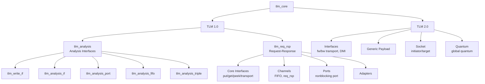

# TLM Core - Transaction-Level Modeling Core Library

TLM (Transaction-Level Modeling) is the standard abstraction layer in SystemC for inter-component communication. The `tlm_core` directory contains the core interfaces and implementations for both TLM 1.0 and TLM 2.0.

## Everyday Analogy

Imagine you're shopping online:

- **TLM 1.0** is like traditional mail order—you write a letter (request) and send it out, then wait for a reply (response) to come back. There are two communication styles: "send and wait for reply" (blocking) and "send without waiting, get notified when reply arrives" (non-blocking).
- **TLM 2.0** is like a modern courier system—there's a standardized package format (generic payload), a tracking system (phase), and you can even go directly to the warehouse to pick up goods (DMI, Direct Memory Interface) without going through the courier.

## TLM 1.0 vs TLM 2.0 Comparison

| Feature | TLM 1.0 | TLM 2.0 |
|------|---------|---------|
| Transport Model | Generic put/get/peek | Optimized for memory-mapped bus |
| Data Format | User-defined template types | Standardized `tlm_generic_payload` |
| Interface Style | FIFO / req-rsp channels | Forward/Backward transport interfaces |
| Timing Abstraction | No special support | Global quantum / temporal decoupling |
| Direct Memory Access | Not supported | DMI supported |
| Socket | None (uses port/export) | Standardized initiator/target socket |

## Directory Structure

```
tlm_core/
├── tlm_1/                    # TLM 1.0
│   ├── tlm_analysis/         # Analysis interfaces (broadcast, observer pattern)
│   │   ├── tlm_analysis.h          # Master header file
│   │   ├── tlm_analysis_if.h       # Analysis interface definition
│   │   ├── tlm_analysis_port.h     # Analysis port (one-to-many broadcast)
│   │   ├── tlm_analysis_fifo.h     # Analysis FIFO
│   │   ├── tlm_analysis_triple.h   # Timestamped transaction triple
│   │   └── tlm_write_if.h          # Write interface
│   └── tlm_req_rsp/          # Request-response communication
│       ├── tlm_1_interfaces/ # Core interfaces (put/get/peek/transport)
│       ├── tlm_channels/     # Channel implementations (FIFO, req-rsp channel)
│       ├── tlm_ports/        # Non-blocking ports and event finders
│       └── tlm_adapters/     # Interface adapters
│
└── tlm_2/                    # TLM 2.0
    ├── tlm_2_interfaces/     # Forward/backward transport interfaces, DMI
    ├── tlm_generic_payload/  # Generic payload, phase, extensions, endian conversion
    ├── tlm_sockets/          # Initiator/Target socket
    └── tlm_quantum/          # Global quantum time management
```



## Related Files

- `tlm_utils/` - Convenience utilities: simplified sockets, PEQ, quantum keeper, etc.
- `sysc/` - SystemC core library (port, export, module, and other foundational components)
