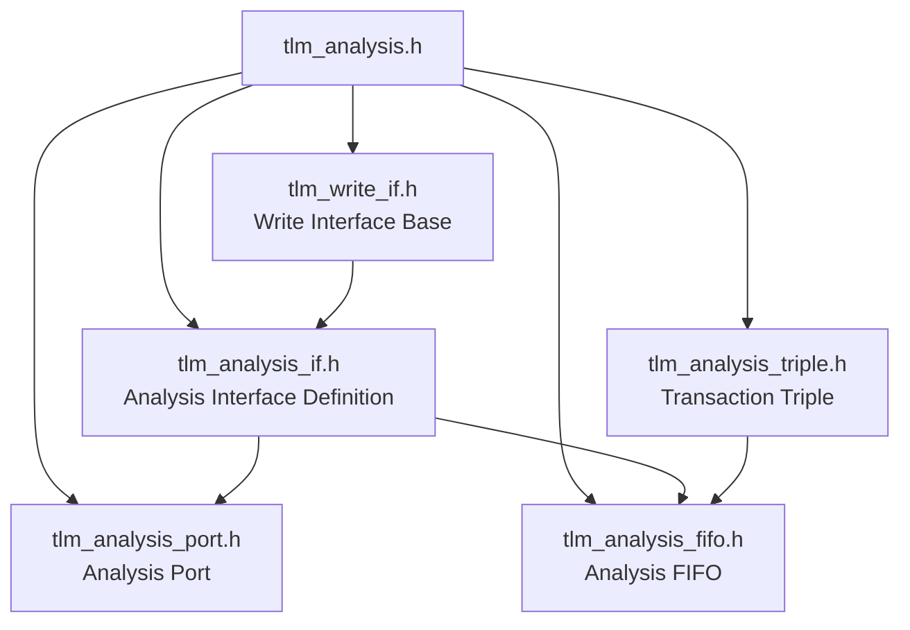

# tlm_analysis.h - Master Header for TLM 1.0 Analysis Subsystem

## Overview

`tlm_analysis.h` is the master entry header for the TLM 1.0 analysis subsystem. It does not contain any actual class definitions; it simply aggregates all analysis-related headers via `#include`, so users only need to include this single file to access the entire analysis functionality.

## Everyday Analogy

Think of it as a table of contents in a book -- it contains no actual content itself, but tells you where to find every chapter. When you `#include "tlm_analysis.h"`, you are effectively opening all chapters of the analysis functionality at once.

## Included Files

## Design Considerations for Include Order

The include order is carefully arranged:

1. First include `tlm_write_if.h` (base write interface)
2. Then `tlm_analysis_if.h` (inherits from write_if)
3. Then `tlm_analysis_triple.h` (data structure)
4. Finally `tlm_analysis_port.h` and `tlm_analysis_fifo.h` (components that use the above interfaces)

This ensures correct dependency ordering at compile time.

## Source Location

`ref/systemc/src/tlm_core/tlm_1/tlm_analysis/tlm_analysis.h`

## Related Files

- [tlm_write_if.md](tlm_write_if.md) - Write interface
- [tlm_analysis_if.md](tlm_analysis_if.md) - Analysis interface
- [tlm_analysis_port.md](tlm_analysis_port.md) - Analysis port
- [tlm_analysis_fifo.md](tlm_analysis_fifo.md) - Analysis FIFO
- [tlm_analysis_triple.md](tlm_analysis_triple.md) - Transaction triple
