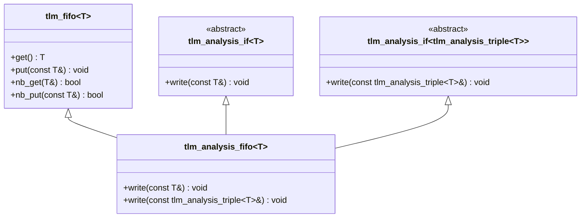
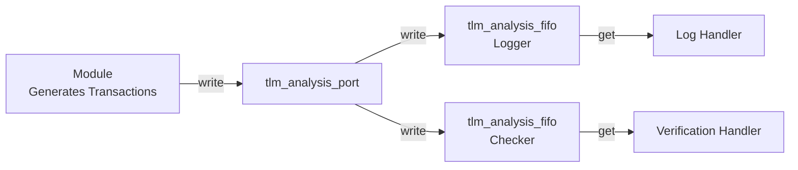

# tlm_analysis_fifo.h - Analysis FIFO

## Overview

`tlm_analysis_fifo` is a special FIFO designed specifically to receive broadcast data from an analysis port (`tlm_analysis_port`). It implements both `tlm_analysis_if<T>` and `tlm_analysis_if<tlm_analysis_triple<T>>`, meaning it can receive either plain data or timestamped data.

## Everyday Analogy

Imagine you subscribe to a YouTube channel:
- **Analysis port** = the YouTube channel (publisher)
- **Analysis FIFO** = your "Watch Later" list
- Whenever the channel publishes a new video, it is automatically added to your list
- You can take videos out of the list to watch at any time
- The list has no size limit (unlimited capacity) -- you will never miss a video because "the list is full"

## Class Details

### `tlm_analysis_fifo<T>`

```cpp
template<typename T>
class tlm_analysis_fifo :
  public tlm_fifo<T>,
  public virtual tlm_analysis_if<T>,
  public virtual tlm_analysis_if<tlm_analysis_triple<T>>
```

### Inheritance Hierarchy



### Key Design: Unlimited Capacity

```cpp
tlm_analysis_fifo(const char* nm) : tlm_fifo<T>(nm, -16) {}
tlm_analysis_fifo() : tlm_fifo<T>(-16) {}
```

The constructor passes `-16` to `tlm_fifo`. A negative value means unlimited capacity (unbounded), and `16` is the initial buffer size. This ensures that `write()` will never fail or block because the FIFO is full.

### `write()` Methods

```cpp
void write(const T& t) {
  this->nb_put(t);
}

void write(const tlm_analysis_triple<T>& t) {
  this->nb_put(t);
}
```

Both `write()` methods use `nb_put()` (non-blocking put). Since the FIFO has unlimited capacity, `nb_put()` will always succeed.

## Usage Scenario



Typical flow:
1. A module broadcasts transactions through an analysis port
2. Multiple analysis FIFOs subscribe to that analysis port
3. Each FIFO buffers the received transactions independently
4. Backend handlers retrieve transactions from each FIFO using `get()` in their own threads for further processing

## Source Location

`ref/systemc/src/tlm_core/tlm_1/tlm_analysis/tlm_analysis_fifo.h`

## Related Files

- [tlm_analysis_port.md](tlm_analysis_port.md) - Analysis port (data source)
- [tlm_analysis_triple.md](tlm_analysis_triple.md) - Timestamped transaction triple
- [tlm_req_rsp.md](tlm_req_rsp.md) - Detailed description of `tlm_fifo`
