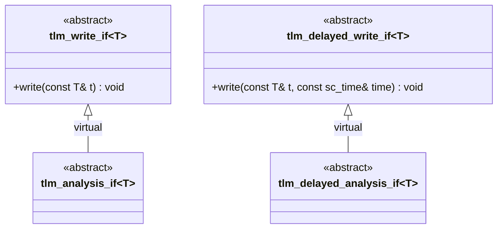

# tlm_analysis_if.h - Analysis Interface Definition

## Overview

`tlm_analysis_if.h` defines the analysis interfaces `tlm_analysis_if` and `tlm_delayed_analysis_if`. These interfaces are essentially semantic aliases for `tlm_write_if` and `tlm_delayed_write_if`, providing more descriptive type names for the analysis subsystem.

## Everyday Analogy

Think of "letter" and "notification letter" -- they are both essentially a piece of paper with words on it, but using different names makes their purpose clear. `tlm_analysis_if` is saying: "This write operation is used for analysis broadcast, not for ordinary data transfer."

## Class Details

### `tlm_analysis_if<T>`

```cpp
template <typename T>
class tlm_analysis_if : public virtual tlm_write_if<T> {};
```

- Fully inherits from `tlm_write_if<T>` without adding any new methods
- Inherits the `write(const T& t)` method
- Its purpose is type differentiation -- letting the compiler and users know this is an interface for "analysis" purposes

### `tlm_delayed_analysis_if<T>`

```cpp
template <typename T>
class tlm_delayed_analysis_if : public virtual tlm_delayed_write_if<T> {};
```

- The corresponding delayed version, inheriting `write(const T& t, const sc_time& time)`

## Why Create an Empty Derived Class?

Although `tlm_analysis_if` and `tlm_write_if` are functionally identical, defining them separately offers the following benefits:

1. **Type safety**: A port expecting `tlm_analysis_if` will not accept an object that only implements `tlm_write_if` (unless it also implements `tlm_analysis_if`), providing compile-time checking.
2. **Semantic clarity**: Using `tlm_analysis_if` in code makes it immediately clear that this is for observer-pattern analysis broadcast.
3. **Extensibility**: If the analysis interface needs additional methods in the future, they can be added without affecting `tlm_write_if`.



## Source Location

`ref/systemc/src/tlm_core/tlm_1/tlm_analysis/tlm_analysis_if.h`

## Related Files

- [tlm_write_if.md](tlm_write_if.md) - Parent interface
- [tlm_analysis_port.md](tlm_analysis_port.md) - Analysis port that uses this interface
- [tlm_analysis_fifo.md](tlm_analysis_fifo.md) - Analysis FIFO that implements this interface
