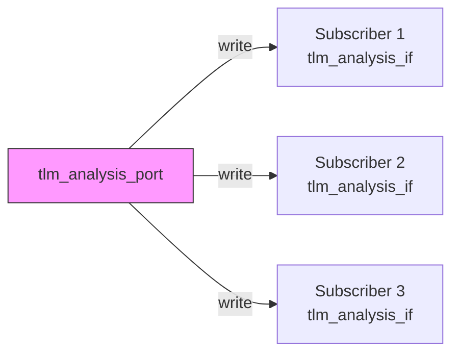

# tlm_analysis_port.h - Analysis Port (One-to-Many Broadcast)

## Overview

`tlm_analysis_port` implements the Observer Pattern broadcast mechanism. A single analysis port can be connected to multiple subscribers, and when `write()` is called, the data is broadcast to all connected interfaces. This is the core mechanism in TLM for monitoring and debugging.

## Everyday Analogy

Imagine a group chat:
- **Analysis port** = the person sending messages in the group
- **`bind()` method** = adding someone to the group
- **`write()` method** = sending a message in the group
- When you send a message in the group, all members (subscribers) receive the same content
- You can add (`bind`) or remove (`unbind`) people from the group at any time

## Class Details

### `tlm_analysis_port<T>`

```cpp
template <typename T>
class tlm_analysis_port :
  public sc_core::sc_object,
  public virtual tlm_analysis_if<T>
```

Inherits from `sc_object` (provides naming) and `tlm_analysis_if<T>` (provides the `write` interface).

### Key Methods

| Method | Description |
|--------|-------------|
| `bind(tlm_analysis_if<T>& _if)` | Add an interface to the broadcast list |
| `operator()(tlm_analysis_if<T>& _if)` | Shorthand syntax for `bind()` |
| `unbind(tlm_analysis_if<T>& _if)` | Remove an interface from the broadcast list; returns `true` on success |
| `write(const T& t)` | Broadcast data `t` to all bound interfaces |

### How `write()` Works

```cpp
void write(const T& t) {
  for (auto i = m_interfaces.begin(); i != m_interfaces.end(); i++) {
    (*i)->write(t);
  }
}
```

Iterates over all bound interfaces and calls their `write()` method one by one. Notes:
- The calls are **synchronous** -- all subscribers' `write()` methods complete within the same delta cycle
- If any subscriber's `write()` blocks (e.g., writing to a full FIFO), the entire broadcast is blocked
- In practice, subscribers' `write()` should be non-blocking (complete quickly)

### Internal Structure

Uses `std::deque<tlm_analysis_if<T>*>` to store all bound interface pointers. `deque` is chosen over `vector` because `deque` is more efficient for insertion and deletion at the front.



## Differences from `sc_port`

| Feature | `tlm_analysis_port` | `sc_port` |
|---------|---------------------|-----------|
| Number of connections | 0 to many | Typically 1 |
| Inheritance base | `sc_object` | `sc_port_base` |
| Dynamic binding | Yes (even during simulation) | Only during construction |
| Supports unbind | Yes | No |

`tlm_analysis_port` inherits from `sc_object` rather than `sc_port` because it needs a more flexible binding strategy -- supporting zero or more connections with the ability to dynamically unbind.

## Source Location

`ref/systemc/src/tlm_core/tlm_1/tlm_analysis/tlm_analysis_port.h`

## Related Files

- [tlm_analysis_if.md](tlm_analysis_if.md) - Analysis interface
- [tlm_analysis_fifo.md](tlm_analysis_fifo.md) - Analysis FIFO that can serve as a subscriber
- [tlm_analysis_triple.md](tlm_analysis_triple.md) - Timestamped transaction that can be used with the port
