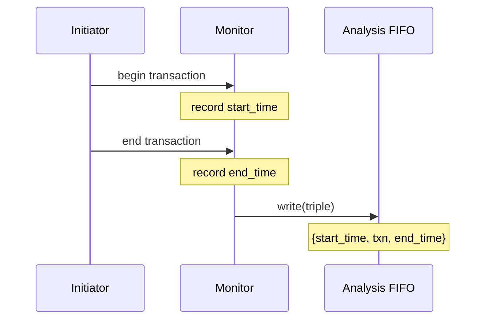

# tlm_analysis_triple.h - Transaction Triple (with Timestamps)

## Overview

`tlm_analysis_triple` is a simple data structure that bundles a transaction with its start time and end time. It is commonly used for analysis and performance measurement, allowing observers to see not only the transaction content but also when the transaction started and ended.

## Everyday Analogy

Imagine a shipping label on a package:
- **Transaction** = the contents of the package
- **Start time** = the time it was sent
- **End time** = the time it was delivered

With these three pieces of information, you can tell what the package is, when it was sent, and when it arrived -- very useful for analyzing system performance.

## Class Details

### `tlm_analysis_triple<T>`

```cpp
template<typename T>
struct tlm_analysis_triple {
  sc_core::sc_time start_time;
  T transaction;
  sc_core::sc_time end_time;
};
```

### Member Variables

| Member | Type | Description |
|--------|------|-------------|
| `start_time` | `sc_time` | Start time of the transaction |
| `transaction` | `T` | The transaction object itself |
| `end_time` | `sc_time` | End time of the transaction |

### Constructors

| Constructor | Description |
|-------------|-------------|
| `tlm_analysis_triple()` | Default constructor |
| `tlm_analysis_triple(const tlm_analysis_triple&)` | Copy constructor |
| `tlm_analysis_triple(const T& t)` | Construct from a transaction; only sets `transaction` |

### Implicit Type Conversion

```cpp
operator T() { return transaction; }
operator const T&() const { return transaction; }
```

Provides implicit conversion to `T`, allowing `tlm_analysis_triple<T>` to be used directly wherever a `T` is expected. For example:

```cpp
tlm_analysis_triple<int> triple;
triple.transaction = 42;
int value = triple;  // value == 42, implicit conversion
```

## Usage Scenario



## Source Location

`ref/systemc/src/tlm_core/tlm_1/tlm_analysis/tlm_analysis_triple.h`

## Related Files

- [tlm_analysis_fifo.md](tlm_analysis_fifo.md) - Analysis FIFO that can receive triples
- [tlm_analysis_port.md](tlm_analysis_port.md) - Analysis port that can broadcast triples
