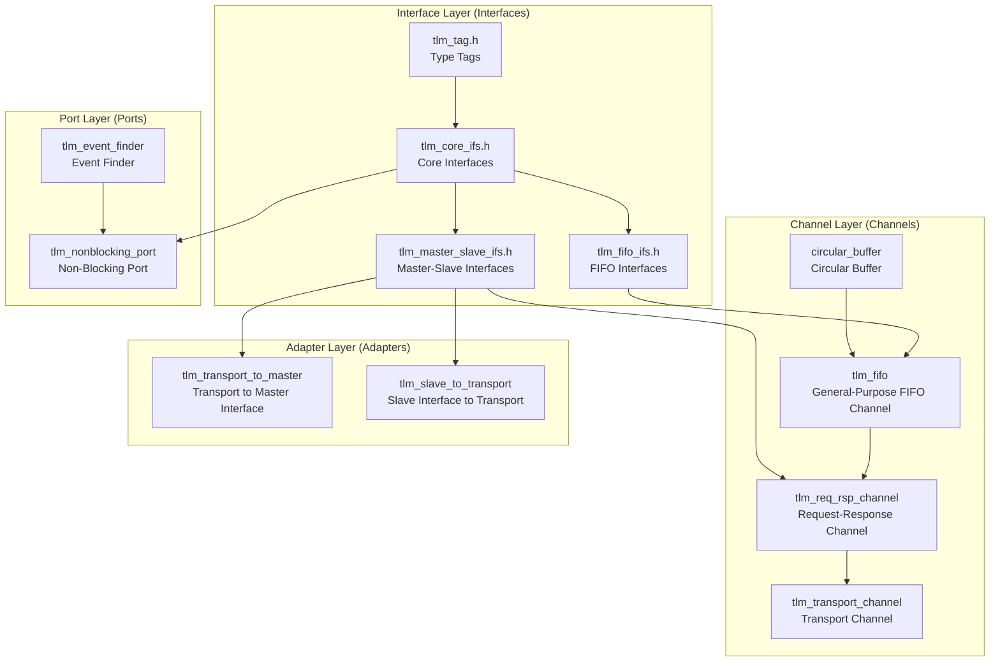
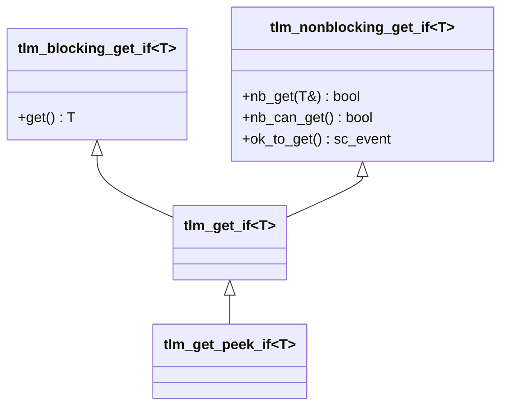
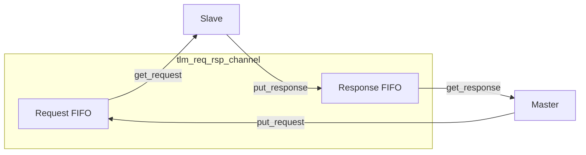

# TLM 1.0 Request-Response Subsystem

## Overview

The `tlm_req_rsp` subsystem is the core framework in TLM 1.0 for bidirectional communication between components. It provides a complete set of interfaces, channels, ports, and adapters that allow an initiator to send a request and receive a response from a target.

## Everyday Analogy

Imagine a restaurant ordering system:
- **Initiator (customer)** sends a **Request (order)** to the kitchen
- **Target (kitchen)** processes it and returns a **Response (dish)**
- The **Channel (serving window)** in between is responsible for passing orders and dishes
- **Blocking mode** = the customer places the order and waits at the table until the food arrives
- **Non-blocking mode** = the customer places the order and goes to do something else, coming back to pick up the food when it is ready

## Architecture Overview



---

## 1. Core Interfaces (`tlm_core_ifs.h`)

This is the most fundamental file in TLM 1.0, defining all basic communication interfaces.

### Bidirectional Interfaces

| Interface | Method | Description |
|-----------|--------|-------------|
| `tlm_transport_if<REQ, RSP>` | `RSP transport(const REQ&)` | Synchronous request-response; completes the entire transaction in one call |

### Unidirectional Blocking Interfaces

| Interface | Method | Description |
|-----------|--------|-------------|
| `tlm_blocking_get_if<T>` | `T get()` | Blocking get; waits when FIFO is empty |
| `tlm_blocking_put_if<T>` | `void put(const T&)` | Blocking put; waits when FIFO is full |
| `tlm_blocking_peek_if<T>` | `T peek() const` | Blocking peek; does not remove the element |

### Unidirectional Non-Blocking Interfaces

| Interface | Method | Description |
|-----------|--------|-------------|
| `tlm_nonblocking_get_if<T>` | `bool nb_get(T&)` | Non-blocking get; returns `true` on success |
| | `bool nb_can_get() const` | Check if data is available |
| | `const sc_event& ok_to_get() const` | Get the "can get" event |
| `tlm_nonblocking_put_if<T>` | `bool nb_put(const T&)` | Non-blocking put; returns `true` on success |
| | `bool nb_can_put() const` | Check if put is possible |
| | `const sc_event& ok_to_put() const` | Get the "can put" event |
| `tlm_nonblocking_peek_if<T>` | `bool nb_peek(T&) const` | Non-blocking peek |

### Combined Interfaces



### `tlm_tag<T>`

```cpp
template<class T> class tlm_tag {};
```

An empty template class used purely to distinguish types in function overloading. For example, in `get(tlm_tag<T>*)`, the `tlm_tag` helps the compiler deduce the return type.

---

## 2. FIFO Interfaces (`tlm_fifo_ifs.h`)

Extended interfaces on top of the core interfaces for FIFO-specific functionality.

### `tlm_fifo_debug_if<T>`

Provides debug methods:
- `int used() const` - Number of used slots
- `int size() const` - Total FIFO size
- `void debug() const` - Print debug information
- `bool nb_peek(T&, int n) const` - Peek at the n-th element
- `bool nb_poke(const T&, int n)` - Directly modify the n-th element

### `tlm_fifo_config_size_if`

Dynamically resize the FIFO:
- `void nb_expand(unsigned int n)` - Expand capacity
- `void nb_unbound(unsigned int n)` - Set to unlimited capacity
- `bool nb_reduce(unsigned int n)` - Reduce capacity
- `bool nb_bound(unsigned int n)` - Set an upper limit

---

## 3. Master-Slave Interfaces (`tlm_master_slave_ifs.h`)

Combines put and get interfaces into complete master-slave interfaces.

| Interface | Inherits From | Description |
|-----------|---------------|-------------|
| `tlm_blocking_master_if<REQ,RSP>` | `blocking_put<REQ>` + `blocking_get_peek<RSP>` | Blocking master interface |
| `tlm_blocking_slave_if<REQ,RSP>` | `blocking_put<RSP>` + `blocking_get_peek<REQ>` | Blocking slave interface |
| `tlm_master_if<REQ,RSP>` | All put + get_peek interfaces | Complete master interface |
| `tlm_slave_if<REQ,RSP>` | All put + get_peek interfaces | Complete slave interface |

Note that the master and slave interfaces are symmetric in direction: Master "put REQ, get RSP"; Slave "get REQ, put RSP."

---

## 4. FIFO Channel (`tlm_fifo.h` and Related Files)

### `tlm_fifo<T>`

The most important channel implementation, similar to a standard FIFO queue.

**Features:**
- Supports both bounded and unbounded capacity (negative value in constructor means unbounded)
- Implemented on top of `circular_buffer<T>`, an efficient circular buffer
- Implements all blocking and non-blocking get/put/peek interfaces
- Supports dynamic resizing

**Capacity rules:**
- `size > 0`: Fixed capacity; `put()` waits when full, `nb_put()` returns `false`
- `size < 0`: Unlimited capacity; `abs(size)` is the initial buffer size
- `size == 0`: Zero capacity; simultaneously full and empty

**Update mechanism:**
```
put/get operation -> request_update() -> update() fires event notification on the next delta cycle
```

### `circular_buffer<T>`

The underlying circular buffer implementation, using raw memory (`unsigned char[]`) and placement new to manage object lifetimes. Supports dynamic resizing.

---

## 5. Request-Response Channels

### `tlm_req_rsp_channel<REQ, RSP>`

Uses two FIFOs to form a bidirectional channel: one for requests and one for responses.



Provided exports:
- `put_request_export` / `get_request_export`
- `put_response_export` / `get_response_export`
- `master_export` / `slave_export` (combined interfaces)

### `tlm_transport_channel<REQ, RSP>`

Adds `tlm_transport_if` (synchronous transport interface) on top of `tlm_req_rsp_channel`. Through the `tlm_transport_to_master` adapter, a synchronous `transport()` call is decomposed into `put()` + `get()` operations.

---

## 6. Adapters (`tlm_adapters.h`)

### `tlm_transport_to_master<REQ, RSP>`

Converts `tlm_transport_if` (synchronous call) into `tlm_master_if` (put + get):

```cpp
RSP transport(const REQ& req) {
  mutex.lock();
  master_port->put(req);
  rsp = master_port->get();
  mutex.unlock();
  return rsp;
}
```

Uses a mutex to ensure thread safety.

### `tlm_slave_to_transport<REQ, RSP>`

Reverse conversion: transforms the slave interface's get/put pattern into transport calls. In a loop, it continuously gets requests, calls transport, and writes back responses.

---

## 7. Non-Blocking Ports (`tlm_nonblocking_port.h`)

### `tlm_nonblocking_get_port<T>` / `tlm_nonblocking_put_port<T>` / `tlm_nonblocking_peek_port<T>`

These ports provide `ok_to_get()` / `ok_to_put()` / `ok_to_peek()` methods that return an `sc_event_finder`. This allows SystemC's static sensitivity mechanism to be used with `SC_METHOD`:

```cpp
SC_METHOD(my_method);
sensitive << my_port.ok_to_get();
```

### `tlm_event_finder_t<IF, T>`

The event finder implementation. It wraps an interface method pointer and retrieves the corresponding event through the interface when needed.

---

## 8. Helper Implementation (`tlm_put_get_imp.h`)

### `tlm_put_get_imp<PUT_DATA, GET_DATA>`

Combines a standalone `tlm_put_if` and `tlm_get_peek_if` into a single object. Used internally in `tlm_req_rsp_channel` to wrap two FIFOs into a unified master/slave interface.

### `tlm_master_imp` / `tlm_slave_imp`

Each inherits from `tlm_put_get_imp` and implements `tlm_master_if` / `tlm_slave_if`, adjusting the put/get directions:
- `tlm_master_imp`: put REQ, get RSP
- `tlm_slave_imp`: put RSP, get REQ (direction reversed)

## Source Location

- `ref/systemc/src/tlm_core/tlm_1/tlm_req_rsp/`
  - `tlm_1_interfaces/` - All interface definitions
  - `tlm_channels/tlm_fifo/` - FIFO and circular buffer
  - `tlm_channels/tlm_req_rsp_channels/` - Request-response channels
  - `tlm_ports/` - Non-blocking ports and event finders
  - `tlm_adapters/` - Interface adapters

## Related Files

- [tlm_analysis.md](tlm_analysis.md) - Analysis subsystem (observer pattern broadcast mechanism)
- [../tlm_2/tlm_fw_bw_ifs.md](../tlm_2/tlm_fw_bw_ifs.md) - TLM 2.0 interface design (replaces the req-rsp pattern)
