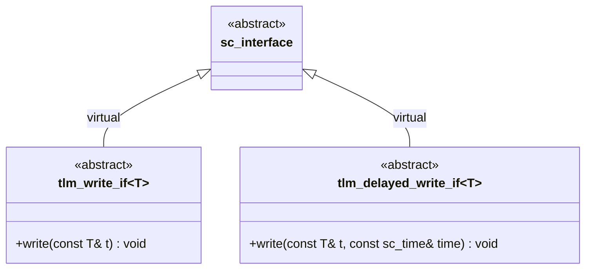

# tlm_write_if.h - Write Interface Definition

## Overview

`tlm_write_if.h` defines the most fundamental write interfaces in TLM: `tlm_write_if` and `tlm_delayed_write_if`. These two interfaces form the foundation of the entire analysis subsystem, providing the abstract behavior of "writing data to a target."

## Everyday Analogy

- **`tlm_write_if`**: Like sending a message in an instant messaging app -- you press "Send" and the other party receives it immediately. There is no concept of delay.
- **`tlm_delayed_write_if`**: Like scheduling an email -- you specify not only the content but also "what time to send it." It includes an additional time parameter.

## Class Details

### `tlm_write_if<T>`

```cpp
template <typename T>
class tlm_write_if : public virtual sc_core::sc_interface {
public:
  virtual void write(const T& t) = 0;
};
```

- Inherits from `sc_interface`, the standard SystemC interface base class
- Has only one pure virtual function `write(const T& t)`
- The parameter is passed by `const` reference, meaning the write operation will not modify the data passed in
- The template parameter `T` can be any type -- transaction objects, simple data, etc.

### `tlm_delayed_write_if<T>`

```cpp
template <typename T>
class tlm_delayed_write_if : public virtual sc_core::sc_interface {
public:
  virtual void write(const T& t, const sc_core::sc_time& time) = 0;
};
```

- Similar to `tlm_write_if`, but with an additional `sc_time` parameter
- Allows specifying at what point in time the write operation should take effect
- In practice, this is rarely used in the existing codebase

## Design Considerations

### Why Use Virtual Inheritance?

```cpp
class tlm_write_if : public virtual sc_core::sc_interface
```

Virtual inheritance is used to solve the diamond inheritance problem. When a class inherits from multiple interfaces (e.g., both `tlm_write_if` and `tlm_get_if`), and these interfaces all inherit from `sc_interface`, using `virtual` ensures there is only one copy of `sc_interface`.



## Source Location

`ref/systemc/src/tlm_core/tlm_1/tlm_analysis/tlm_write_if.h`

## Related Files

- [tlm_analysis_if.md](tlm_analysis_if.md) - Analysis interface (inherits from `tlm_write_if`)
- [tlm_analysis_port.md](tlm_analysis_port.md) - Analysis port (implements `tlm_analysis_if`)
