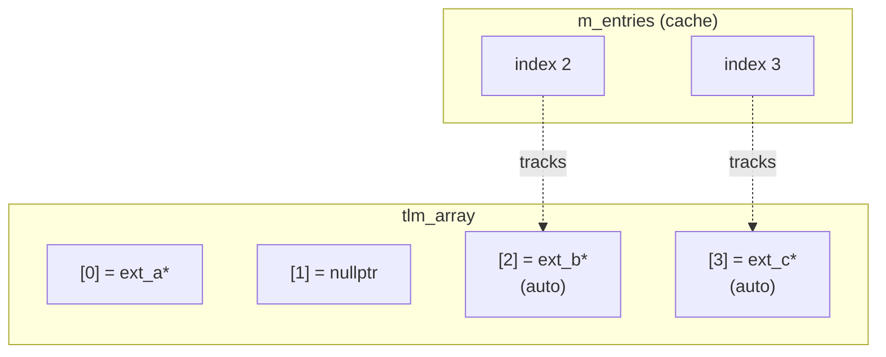

# tlm_array.h - Extension Array Container

## Overview

`tlm_array` is a lightweight dynamic array specifically designed for storing extension pointers in `tlm_generic_payload`. It inherits from `std::vector` and adds `expand` (grow-only expansion) and cache management features.

## Everyday Analogy

Imagine a row of numbered storage compartments:
- Each compartment corresponds to one extension type
- A compartment can hold something (set extension) or be empty (clear extension)
- The number of compartments only grows (expand), never shrinks
- **Cache mechanism**: A list tracks "which compartments are auto-managed"; when a transaction completes, the contents of those compartments are automatically freed

## Class Details

### `tlm_array<T>`

```cpp
template <typename T>
class tlm_array : private std::vector<T> {
public:
  tlm_array(size_type size = 0);

  using base_type::operator[];  // array access
  using base_type::size;        // get size

  void expand(size_type new_size);         // grow if needed
  void insert_in_cache(T* p);             // mark slot for auto-cleanup
  void free_entire_cache();               // free all cached slots
};
```

### `expand(new_size)`

```cpp
void expand(size_type new_size) {
  if (new_size > size()) {
    base_type::resize(new_size);
  }
}
```

Only grows when needed, never shrinks. This ensures that already-allocated ID indices remain valid.

### Cache Mechanism

`m_entries` tracks which index positions contain "auto-managed" extensions (set via `set_auto_extension`).

```cpp
void insert_in_cache(T* p) {
  m_entries.push_back(p - &(*this)[0]);
}

void free_entire_cache() {
  while (m_entries.size()) {
    if ((*this)[m_entries.back()])
      (*this)[m_entries.back()]->free();
    (*this)[m_entries.back()] = 0;
    m_entries.pop_back();
  }
}
```



When `free_entire_cache()` is called:
1. Calls `free()` on ext_c at index 3, sets it to nullptr
2. Calls `free()` on ext_b at index 2, sets it to nullptr
3. `m_entries` is cleared

## Design Considerations

### Why private inheritance from `std::vector`?

- Only exposes the needed methods (`operator[]`, `size`)
- Hides `push_back`, `erase`, and other methods that should not be called directly
- The extension array's size should only be controlled through `expand()`

### Why grow-only?

Extension IDs are globally assigned static constants. Once ID = 5 is assigned, all GP arrays must have at least 6 elements. Shrinking the array would cause out-of-bounds access.

## Source Location

`ref/systemc/src/tlm_core/tlm_2/tlm_generic_payload/tlm_array.h`

## Related Files

- [tlm_generic_payload.md](tlm_generic_payload.md) - Uses this array to store extensions
