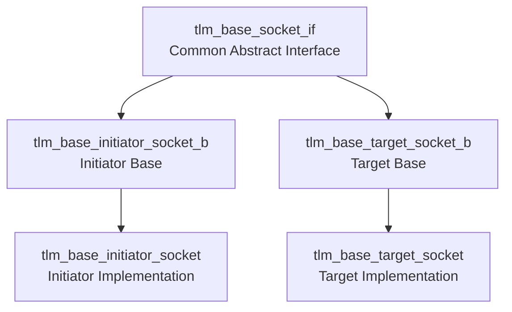

# tlm_base_socket_if.h - Socket Base Interface

## Overview

`tlm_base_socket_if` defines the common abstract interface shared by all TLM 2.0 sockets, along with the `tlm_socket_category` enum. This interface allows tools and infrastructure to query a socket's basic properties without knowing its concrete type.

## Everyday Analogy

Like the nameplate on an appliance -- whether it is a refrigerator, microwave, or TV, the nameplate shows "voltage," "frequency," "type," and other information. `tlm_base_socket_if` is the "nameplate interface" for every socket.

## Socket Category Enum

```cpp
enum tlm_socket_category {
  TLM_UNKNOWN_SOCKET        = 0,
  TLM_INITIATOR_SOCKET      = 0x1,
  TLM_TARGET_SOCKET         = 0x2,
  TLM_MULTI_SOCKET          = 0x10,
  TLM_MULTI_INITIATOR_SOCKET = TLM_INITIATOR_SOCKET | TLM_MULTI_SOCKET,  // 0x11
  TLM_MULTI_TARGET_SOCKET    = TLM_TARGET_SOCKET | TLM_MULTI_SOCKET      // 0x12
};
```

Uses a bitmask design:
- Bit 0: whether it is an initiator
- Bit 1: whether it is a target
- Bit 4: whether it is a multi-socket

## Interface Methods

```cpp
class tlm_base_socket_if {
public:
  virtual sc_port_base&       get_base_port() = 0;
  virtual sc_port_base const& get_base_port() const = 0;
  virtual sc_export_base&       get_base_export() = 0;
  virtual sc_export_base const& get_base_export() const = 0;

  virtual unsigned int      get_bus_width() const = 0;
  virtual std::type_index   get_protocol_types() const = 0;
  virtual tlm_socket_category get_socket_category() const = 0;
  virtual bool              is_multi_socket() const = 0;

protected:
  virtual ~tlm_base_socket_if() {}
};
```

| Method | Return Type | Description |
|--------|-------------|-------------|
| `get_base_port()` | `sc_port_base&` | Get the underlying port |
| `get_base_export()` | `sc_export_base&` | Get the underlying export |
| `get_bus_width()` | `unsigned int` | Bus width (bits) |
| `get_protocol_types()` | `std::type_index` | Protocol types in use |
| `get_socket_category()` | `tlm_socket_category` | Socket category |
| `is_multi_socket()` | `bool` | Whether it is a multi-socket |

## Position in the Socket Hierarchy



## Source Location

`ref/systemc/src/tlm_core/tlm_2/tlm_sockets/tlm_base_socket_if.h`

## Related Files

- [tlm_initiator_socket.md](tlm_initiator_socket.md) - Initiator socket
- [tlm_target_socket.md](tlm_target_socket.md) - Target socket
