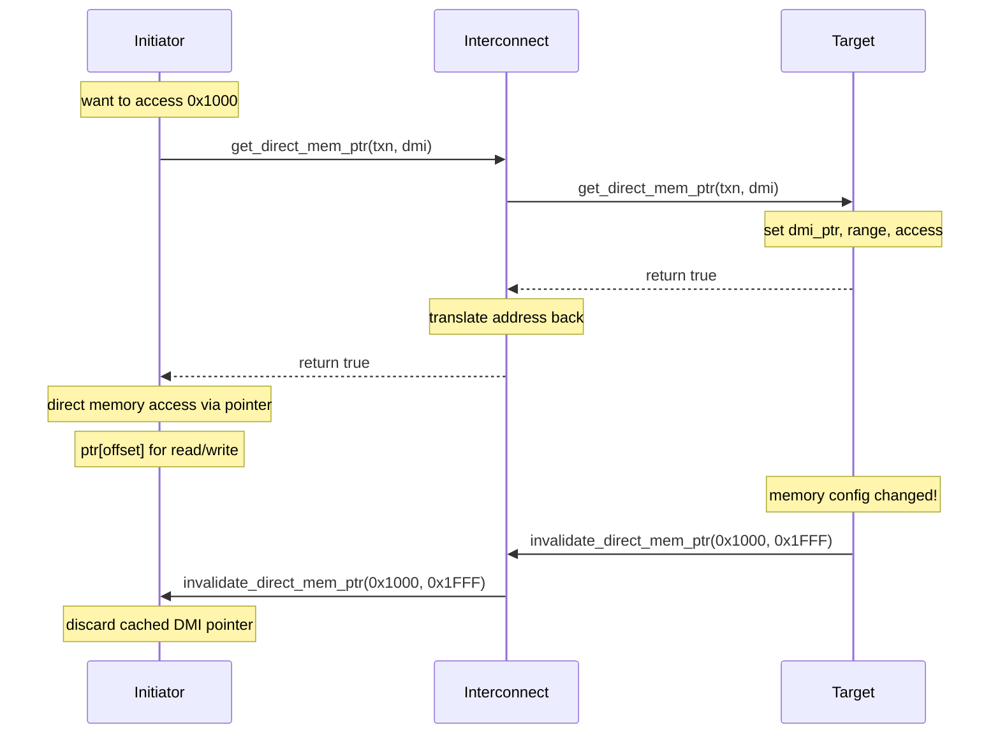

# tlm_dmi.h - Direct Memory Interface (DMI)

## Overview

The `tlm_dmi` class encapsulates DMI (Direct Memory Interface) information, allowing an initiator to bypass the normal transport path and directly access a target's memory via a pointer. This is one of the most important performance optimizations in TLM 2.0.

## Everyday Analogy

Imagine you go to the same convenience store every day to buy milk:
- **Normal transport** = Every time you have to walk to the counter, wait in line, pay, and pick up the milk
- **DMI** = The store owner recognizes you, gives you a warehouse key, and you go in and grab it yourself
- **DMI invalidation** = The warehouse has moved, and the owner notifies you: "The old key no longer works; you need to re-apply"

## Class Details

### Access Permission Enum

```cpp
enum dmi_access_e {
  DMI_ACCESS_NONE       = 0x00,  // no access
  DMI_ACCESS_READ       = 0x01,  // read only
  DMI_ACCESS_WRITE      = 0x02,  // write only
  DMI_ACCESS_READ_WRITE = 0x03   // read and write
};
```

Uses a bitmask design: `READ_WRITE = READ | WRITE`.

### Member Variables

| Member | Type | Description |
|--------|------|-------------|
| `m_dmi_ptr` | `unsigned char*` | Pointer to the target's memory |
| `m_dmi_start_address` | `uint64` | Start address of the DMI region |
| `m_dmi_end_address` | `uint64` | End address of the DMI region |
| `m_dmi_access` | `dmi_access_e` | Granted access permissions |
| `m_dmi_read_latency` | `sc_time` | Read latency |
| `m_dmi_write_latency` | `sc_time` | Write latency |

### Initialization

```cpp
void init() {
  m_dmi_ptr           = 0x0;
  m_dmi_start_address = 0x0;
  m_dmi_end_address   = (uint64)(-1);  // 0xFFFFFFFFFFFFFFFF
  m_dmi_access        = DMI_ACCESS_NONE;
  m_dmi_read_latency  = SC_ZERO_TIME;
  m_dmi_write_latency = SC_ZERO_TIME;
}
```

Note that `m_dmi_end_address` defaults to the maximum value, representing "the entire address space."

### Getter / Setter Methods

Provides complete getter/setter pairs and convenient permission-checking methods:

```cpp
bool is_read_allowed() const;
bool is_write_allowed() const;
bool is_read_write_allowed() const;
bool is_none_allowed() const;

void allow_read();
void allow_write();
void allow_read_write();
void allow_none();
```

## DMI Usage Flow



## Design Key Points

### Address Space

- `m_dmi_ptr` points to the data corresponding to `m_dmi_start_address`
- To access data at address `addr`: `m_dmi_ptr[addr - m_dmi_start_address]`
- The interconnect is responsible for translating addresses from the initiator's address space to the target's address space

### Latency

- `m_dmi_read_latency` and `m_dmi_write_latency` allow the initiator to still simulate correct timing when using DMI
- The interconnect can add its own latency on top of the target's latency

### Global Invalidation

```cpp
invalidate_direct_mem_ptr(0x0, (uint64)-1)
```

Setting the address range to `0x0` through `0xFFFFFFFFFFFFFFFF` indicates a global invalidation -- all DMI pointers must be discarded.

## Source Location

`ref/systemc/src/tlm_core/tlm_2/tlm_2_interfaces/tlm_dmi.h`

## Related Files

- [tlm_fw_bw_ifs.md](tlm_fw_bw_ifs.md) - DMI-related interface definitions
- [tlm_generic_payload.md](tlm_generic_payload.md) - `is_dmi_allowed()` hint
- [tlm_initiator_socket.md](tlm_initiator_socket.md) - Socket that initiates DMI requests
