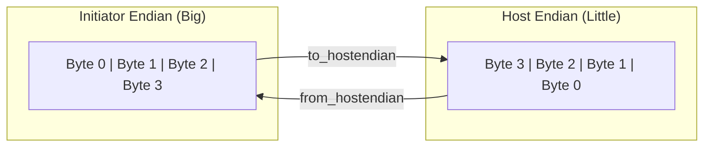

# tlm_endian_conv.h - Endian Conversion Helper Functions

## Overview

`tlm_endian_conv.h` provides a set of template functions for automatically converting the data layout in a `tlm_generic_payload` when the initiator's endianness differs from the host's endianness. These functions are used internally by initiator models to ensure correct simulation results on systems with different byte orders.

## Everyday Analogy

Imagine you are a translator converting between two writing directions:
- **Big-endian** = Writing left to right (like English), most significant byte first
- **Little-endian** = Writing right to left (like Arabic), least significant byte first
- **Endian conversion** = Translating a document from one writing direction to the other

If your computer is little-endian (x86) but the hardware being simulated is big-endian (certain ARM configurations), you need these functions to perform the conversion.

## Function Group Overview

All functions come in pairs -- `to_hostendian_xxx` converts before sending, `from_hostendian_xxx` converts back after receiving the response:

| Function Group | Use Case | Restrictions | Performance |
|---------------|----------|-------------|-------------|
| `generic` | Almost all scenarios | Power-of-2 bus width | Slowest |
| `word` | Non-aligned, non-streaming | No streaming width support | Medium |
| `aligned` | Word-aligned transactions | Address and length must be aligned | Faster |
| `single` | Single-word transfers | Must not cross bus word boundary | Fastest |

### Unified Response Entry Point

```cpp
void tlm_from_hostendian(tlm_generic_payload* txn);
```

If unsure which `from_` function to use, this unified entry point automatically finds the correct conversion function (but cannot be inlined, so slightly slower).

## Usage Pattern

```cpp
// In initiator:
template<class DATAWORD>
void do_transaction(tlm_generic_payload& txn) {
  // 1. Convert to host endianness before sending
  tlm_to_hostendian_generic<DATAWORD>(&txn, BUS_WIDTH);

  // 2. Send transaction
  socket->b_transport(txn, delay);

  // 3. Convert back after response
  tlm_from_hostendian_generic<DATAWORD>(&txn, BUS_WIDTH);

  // 4. Now data in txn is in initiator's endianness
}
```

## Internal Mechanism

### `tlm_endian_context`

An extension class attached to the GP to preserve the original state before conversion:

```cpp
class tlm_endian_context : public tlm_extension<tlm_endian_context> {
  uint64 address;          // original address
  uchar* data_ptr;         // original data pointer
  int length;              // original length
  int stream_width;        // original stream width
  uchar* new_dbuf;         // new data buffer
  uchar* new_bebuf;        // new byte-enable buffer
  void (*from_f)(...);     // matching from_ function
  int sizeof_databus;      // bus width
};
```

### Conversion Principle (generic version)



Steps:
1. Calculate the new data length and address (may grow due to alignment requirements)
2. Allocate new data buffer and byte-enable buffer
3. Rearrange bytes according to endian rules
4. Update the GP's fields

### Object Pool

```cpp
static tlm_endian_context_pool global_tlm_endian_context_pool;
```

`tlm_endian_context` uses an object pool to avoid frequent `new`/`delete` calls, improving performance.

## Design Notes

- These functions are **only used inside the initiator** -- they must not be used in interconnects or targets
- The functions modify multiple GP fields (data ptr, byte enable, etc.) and do not follow GP mutability rules
- The `tlm_endian_context` extension is not removed and persists with the GP
- Only needed when the initiator's endianness differs from the host's endianness

## Source Location

`ref/systemc/src/tlm_core/tlm_2/tlm_generic_payload/tlm_endian_conv.h`

## Related Files

- [tlm_generic_payload.md](tlm_generic_payload.md) - The payload being converted
- [tlm_helpers.md](tlm_helpers.md) - Endianness detection helper functions
