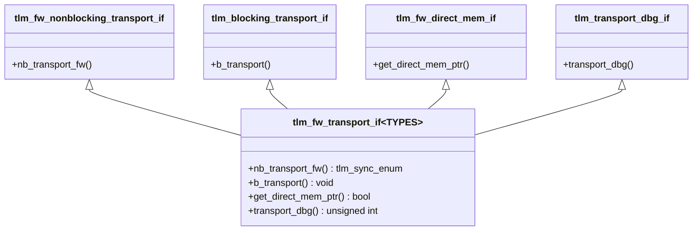
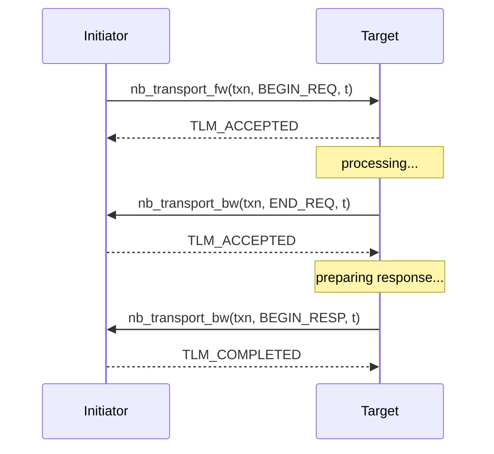
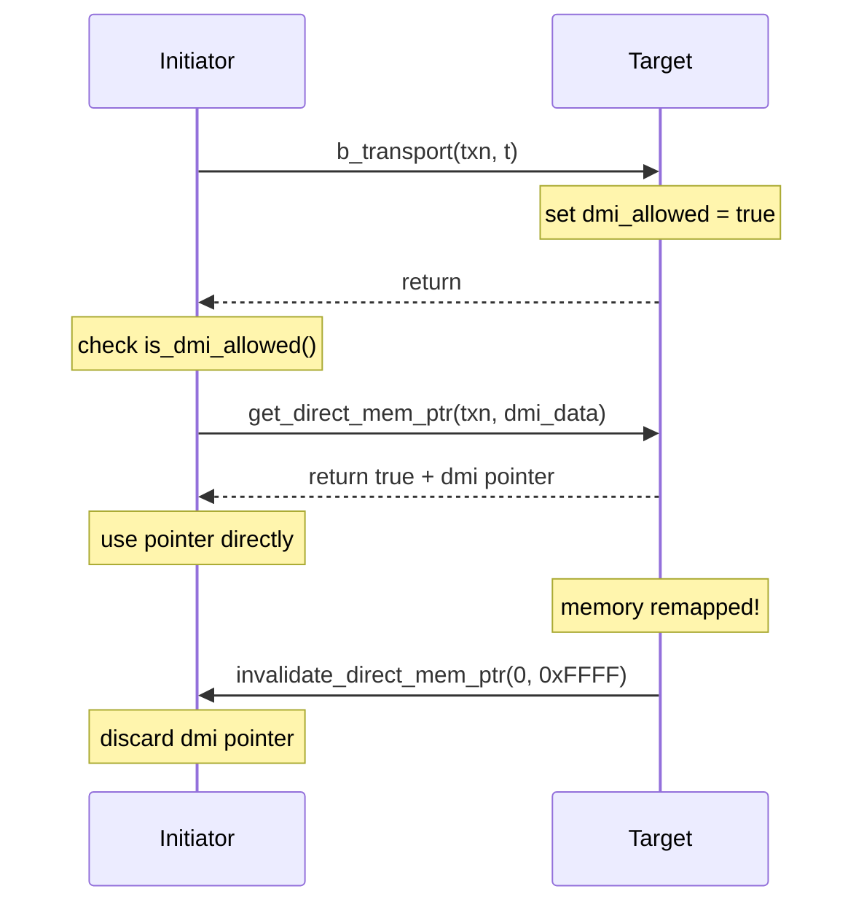

# tlm_fw_bw_ifs.h - Forward/Backward Transport Interfaces

## Overview

`tlm_fw_bw_ifs.h` defines the core communication interfaces of TLM 2.0 -- the Forward Interface and the Backward Interface. These form the foundation of the entire TLM 2.0 socket communication mechanism, including blocking/non-blocking transport, DMI (Direct Memory Interface), and debug transport.

## Everyday Analogy

Imagine a customer service system:
- **Forward Interface** = A customer calls the service center (initiator -> target)
  - **`b_transport`**: Stay on the line until the issue is resolved (blocking)
  - **`nb_transport_fw`**: Leave a message, the agent calls back when done (non-blocking)
  - **`get_direct_mem_ptr`**: Get VIP access to go directly backstage
  - **`transport_dbg`**: Peek at internal data without affecting any state
- **Backward Interface** = The service center calls the customer back (target -> initiator)
  - **`nb_transport_bw`**: The agent proactively calls back with the result
  - **`invalidate_direct_mem_ptr`**: Notification that VIP access has been revoked

## Core Enums

### `tlm_sync_enum`

Return value for non-blocking transport, indicating the processing status of the transaction:

| Value | Meaning | Analogy |
|-------|---------|---------|
| `TLM_ACCEPTED` | Accepted; a follow-up notification will come later | "Got it, I'll call you back when I'm done" |
| `TLM_UPDATED` | Partially processed; phase has been updated | "Completed one step, moving to the next stage" |
| `TLM_COMPLETED` | The entire transaction is complete | "All done" |

## Base Interfaces

### Non-blocking Transport

```cpp
// Forward: initiator -> target
template <typename TRANS, typename PHASE>
class tlm_fw_nonblocking_transport_if {
  virtual tlm_sync_enum nb_transport_fw(TRANS& trans, PHASE& phase, sc_time& t) = 0;
};

// Backward: target -> initiator
template <typename TRANS, typename PHASE>
class tlm_bw_nonblocking_transport_if {
  virtual tlm_sync_enum nb_transport_bw(TRANS& trans, PHASE& phase, sc_time& t) = 0;
};
```

Non-blocking transport uses a "ping-pong" pattern: the initiator calls `nb_transport_fw`, and the target can call back via `nb_transport_bw`.

### Blocking Transport

```cpp
template <typename TRANS>
class tlm_blocking_transport_if {
  virtual void b_transport(TRANS& trans, sc_time& t) = 0;
};
```

Completes the entire transaction in a single call. `sc_time& t` is the annotation time; the target can modify it to indicate latency.

### DMI Interface

```cpp
// Forward: request direct memory access
template <typename TRANS>
class tlm_fw_direct_mem_if {
  virtual bool get_direct_mem_ptr(TRANS& trans, tlm_dmi& dmi_data) = 0;
};

// Backward: notify that DMI pointer is invalidated
class tlm_bw_direct_mem_if {
  virtual void invalidate_direct_mem_ptr(uint64 start, uint64 end) = 0;
};
```

### Debug Interface

```cpp
template <typename TRANS>
class tlm_transport_dbg_if {
  virtual unsigned int transport_dbg(TRANS& trans) = 0;
};
```

Returns the number of bytes successfully transferred. Must not have any side effects and cannot call `wait()`.

## Combined Interfaces

### `tlm_base_protocol_types`

```cpp
struct tlm_base_protocol_types {
  typedef tlm_generic_payload tlm_payload_type;
  typedef tlm_phase           tlm_phase_type;
};
```

Defines the type combination for the base protocol. This is the default TYPES parameter.

### `tlm_fw_transport_if<TYPES>`

Combines all forward interfaces:



### `tlm_bw_transport_if<TYPES>`

Combines all backward interfaces: `nb_transport_bw` + `invalidate_direct_mem_ptr`

## Non-blocking Transport Flow



## DMI Flow



## Source Location

`ref/systemc/src/tlm_core/tlm_2/tlm_2_interfaces/tlm_fw_bw_ifs.h`

## Related Files

- [tlm_dmi.md](tlm_dmi.md) - DMI data structure
- [tlm_generic_payload.md](tlm_generic_payload.md) - Generic payload
- [tlm_phase.md](tlm_phase.md) - Transaction phase
- [tlm_initiator_socket.md](tlm_initiator_socket.md) - Initiator socket
- [tlm_target_socket.md](tlm_target_socket.md) - Target socket
