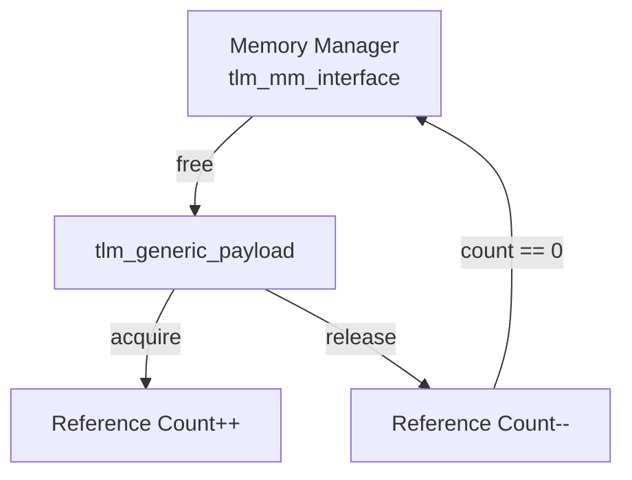
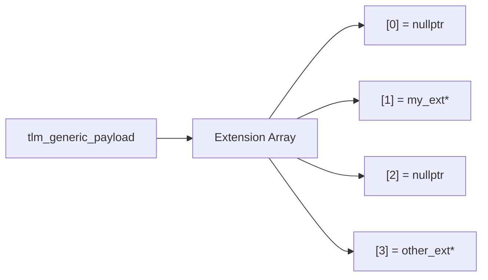

# tlm_generic_payload - Generic Payload

## Overview

`tlm_generic_payload` is the core data structure of TLM 2.0, representing a bus transaction. It defines standardized fields to describe read/write commands, addresses, data, response status, and more, and provides an extensible extension mechanism.

File distribution:
- `tlm_generic_payload.h` - Master header file
- `tlm_gp.h` - Class definition
- `tlm_gp.cpp` - Implementation

## Everyday Analogy

`tlm_generic_payload` is like a standardized delivery package:

| Package Element | Corresponding GP Field | Description |
|----------------|----------------------|-------------|
| Recipient address | `m_address` | Where the data should go |
| "Send" or "Pick up" | `m_command` | READ or WRITE |
| Package contents | `m_data` | The actual data |
| Package size | `m_length` | Data length (bytes) |
| Return receipt | `m_response_status` | Whether delivery succeeded |
| Special handling label | `m_byte_enable` | Which bytes are valid |
| Streaming width | `m_streaming_width` | Width for cyclic access |
| VIP mark | `m_dmi` | Whether DMI is recommended |
| Extra attachments | `m_extensions` | Extension data |

## Main Enums

### `tlm_command`

```cpp
enum tlm_command {
  TLM_READ_COMMAND,    // read from target
  TLM_WRITE_COMMAND,   // write to target
  TLM_IGNORE_COMMAND   // no operation
};
```

### `tlm_response_status`

```cpp
enum tlm_response_status {
  TLM_OK_RESPONSE = 1,              // success
  TLM_INCOMPLETE_RESPONSE = 0,      // not yet processed
  TLM_GENERIC_ERROR_RESPONSE = -1,
  TLM_ADDRESS_ERROR_RESPONSE = -2,
  TLM_COMMAND_ERROR_RESPONSE = -3,
  TLM_BURST_ERROR_RESPONSE = -4,
  TLM_BYTE_ENABLE_ERROR_RESPONSE = -5
};
```

Positive values indicate success, zero indicates unprocessed, and negative values indicate various errors.

### `tlm_gp_option`

```cpp
enum tlm_gp_option {
  TLM_MIN_PAYLOAD,           // minimum fields only
  TLM_FULL_PAYLOAD,          // all fields valid
  TLM_FULL_PAYLOAD_ACCEPTED  // full payload accepted by target
};
```

## Class: `tlm_generic_payload`

### Core Fields and API

```cpp
// Command
void set_read();
void set_write();
bool is_read() const;
bool is_write() const;
tlm_command get_command() const;

// Address
void set_address(uint64 address);
uint64 get_address() const;

// Data
void set_data_ptr(unsigned char* data);
unsigned char* get_data_ptr() const;
void set_data_length(unsigned int length);
unsigned int get_data_length() const;

// Response
void set_response_status(tlm_response_status);
tlm_response_status get_response_status() const;
bool is_response_ok() const;

// Byte enable
void set_byte_enable_ptr(unsigned char* be);
void set_byte_enable_length(unsigned int len);

// Streaming
void set_streaming_width(unsigned int width);

// DMI hint
void set_dmi_allowed(bool);
bool is_dmi_allowed() const;
```

### Memory Management



```cpp
class tlm_mm_interface {
  virtual void free(tlm_generic_payload*) = 0;
};

// Usage
gp->set_mm(&my_mm);
gp->acquire();   // ref_count++
gp->release();   // ref_count--, if 0 -> mm->free(gp)
```

The memory manager is optional. If an MM is set, reference counting can be used to manage the GP's lifetime.

### Deep Copy and Update

```cpp
// deep copy all fields and extensions
void deep_copy_from(const tlm_generic_payload& other);

// update original from a deep copy (for reads: copy back data)
void update_original_from(const tlm_generic_payload& other,
                          bool use_byte_enable_on_read = true);

// copy only extensions
void update_extensions_from(const tlm_generic_payload& other);
```

## Extension Mechanism

### Defining a Custom Extension

```cpp
class my_extension : public tlm::tlm_extension<my_extension> {
public:
  int custom_field;

  tlm_extension_base* clone() const override {
    auto* ext = new my_extension;
    ext->custom_field = custom_field;
    return ext;
  }
  void copy_from(const tlm_extension_base& other) override {
    custom_field = static_cast<const my_extension&>(other).custom_field;
  }
};
```

`tlm_extension<T>` uses CRTP (Curiously Recurring Template Pattern) to automatically assign a unique ID to each extension class during C++ static initialization.

### Using Extensions

```cpp
// Set
my_extension* ext = new my_extension;
ext->custom_field = 42;
gp->set_extension(ext);

// Get
my_extension* got_ext;
gp->get_extension(got_ext);
// got_ext->custom_field == 42

// Auto extension (MM will free it)
gp->set_auto_extension(new my_extension);

// Clear (just remove, don't free)
gp->clear_extension<my_extension>();

// Release (remove + free via MM or directly)
gp->release_extension<my_extension>();
```

### Extension Array



Each extension type obtains its index via `tlm_extension<T>::ID`, providing direct array access with O(1) time complexity.

## RTL Background

In hardware design, bus transactions (e.g., AXI, AHB) have fixed signal definitions. The fields of `tlm_generic_payload` correspond to common bus attributes:

| GP Field | AXI Equivalent | Description |
|----------|---------------|-------------|
| `m_address` | AWADDR / ARADDR | Address |
| `m_command` | Read/write channel selection | Access direction |
| `m_data` | WDATA / RDATA | Data |
| `m_length` | AxLEN * AxSIZE | Transfer length |
| `m_byte_enable` | WSTRB | Byte mask |
| `m_response_status` | BRESP / RRESP | Response status |

## Source Location

- `ref/systemc/src/tlm_core/tlm_2/tlm_generic_payload/tlm_generic_payload.h`
- `ref/systemc/src/tlm_core/tlm_2/tlm_generic_payload/tlm_gp.h`
- `ref/systemc/src/tlm_core/tlm_2/tlm_generic_payload/tlm_gp.cpp`

## Related Files

- [tlm_phase.md](tlm_phase.md) - Transaction phase
- [tlm_array.md](tlm_array.md) - Underlying container for the extension array
- [tlm_fw_bw_ifs.md](tlm_fw_bw_ifs.md) - Transport interfaces that use GP
- [tlm_endian_conv.md](tlm_endian_conv.md) - Endian conversion for GP
