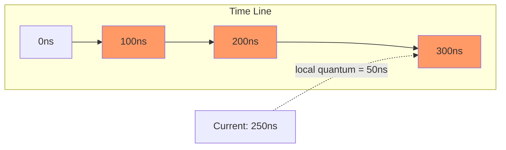
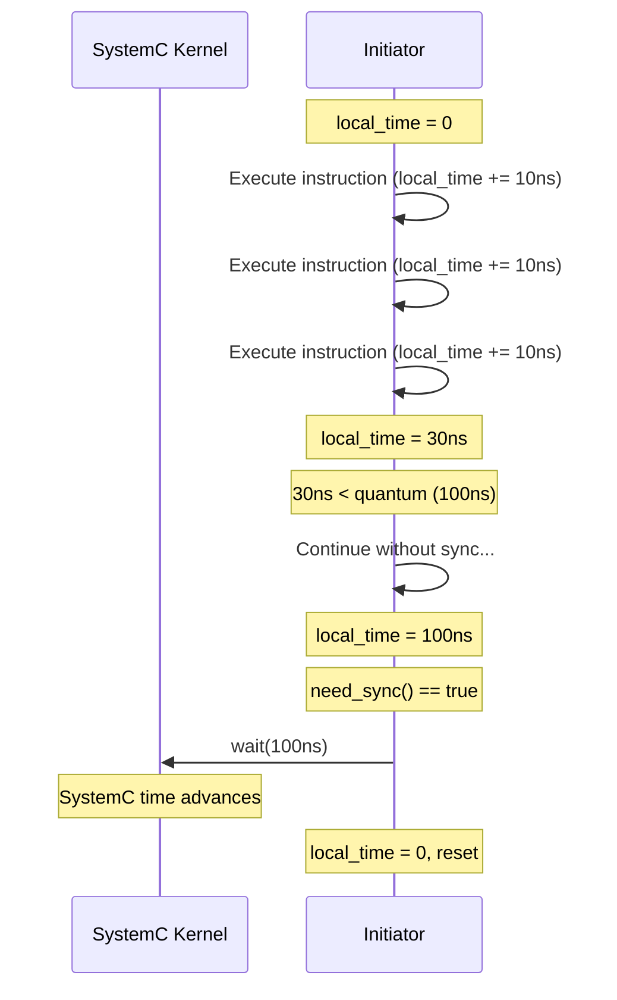

# tlm_global_quantum - Global Quantum Time Management

## Overview

`tlm_global_quantum` defines the upper limit on how far ahead of SystemC time any initiator can run -- known as the Global Quantum. In loosely-timed models with temporal decoupling, an initiator does not need to synchronize with SystemC time at every step; instead, it accumulates local time and synchronizes periodically. The global quantum is the upper limit on this ahead-of-time window.

## Everyday Analogy

Imagine a timing system in a marathon race:
- **SystemC time** = The official clock
- **Local time** = Each runner's personal stopwatch
- **Global quantum** = The rule that "a runner can go at most this far from the checkpoint before having to report back"
- For example, global quantum = 1 km: a runner can run freely for 1 km, but must synchronize with the official clock at the checkpoint

If the global quantum is too large, simulation is fast but timing accuracy is poor; if too small, accuracy is good but simulation is slow.

## Class: `tlm_global_quantum`

### Singleton Pattern

```cpp
static tlm_global_quantum& instance();
```

Only one instance exists globally; all initiators share the same quantum value.

### Main Methods

```cpp
void set(const sc_time& t);           // set global quantum
const sc_time& get() const;           // get global quantum
sc_time compute_local_quantum();       // compute next sync point
```

### How `compute_local_quantum()` Works

```cpp
sc_time compute_local_quantum() {
  if (m_global_quantum != SC_ZERO_TIME) {
    const sc_time current = sc_time_stamp();
    const sc_time g_quant = m_global_quantum;
    return g_quant - (current % g_quant);
  }
  return SC_ZERO_TIME;
}
```

Returns the distance from the current SystemC time to the next quantum boundary.

**Example:**
- Global quantum = 100ns
- Current time = 250ns
- `250 % 100 = 50`
- Returns `100 - 50 = 50ns` (next sync point is at 300ns)



## Temporal Decoupling Concept



## Source Location

- `ref/systemc/src/tlm_core/tlm_2/tlm_quantum/tlm_global_quantum.h`
- `ref/systemc/src/tlm_core/tlm_2/tlm_quantum/tlm_global_quantum.cpp`

## Related Files

- [../../tlm_utils/tlm_quantumkeeper.md](../../tlm_utils/tlm_quantumkeeper.md) - Local time manager that uses the global quantum
