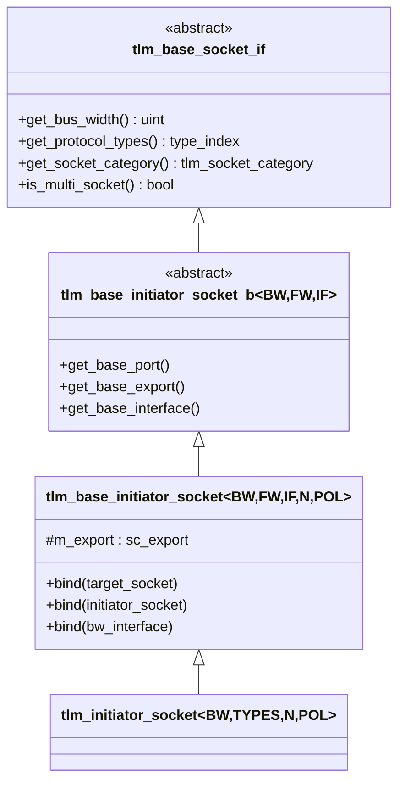
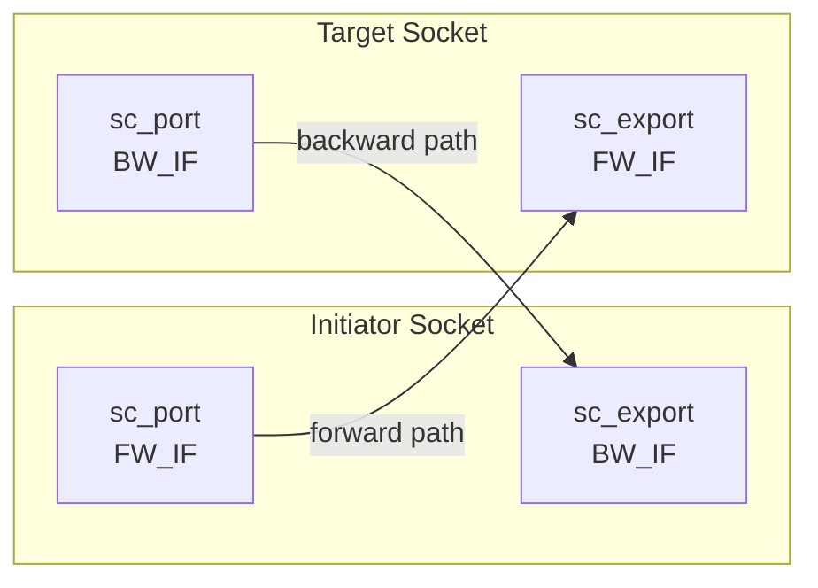

# tlm_initiator_socket.h - Initiator Socket

## Overview

`tlm_initiator_socket` is the socket on the initiator side in TLM 2.0. It encapsulates an `sc_port` (for sending forward calls to the target) and an `sc_export` (for receiving backward callbacks from the target). It is one end of a TLM 2.0 point-to-point connection.

## Everyday Analogy

Think of an initiator socket as a telephone:
- **Port (sc_port)** = The dialing function, used to actively call the target
- **Export (sc_export)** = The answering function, allowing the target to call back
- **bind()** = Exchanging phone numbers to establish a communication link

A telephone can both make and receive calls; similarly, an initiator socket can both send and receive.

## Class Hierarchy



## Template Parameters

| Parameter | Default | Description |
|-----------|---------|-------------|
| `BUSWIDTH` | 32 | Bus width (bits) |
| `TYPES` | `tlm_base_protocol_types` | Protocol type set |
| `N` | 1 | Maximum number of connections |
| `POL` | `SC_ONE_OR_MORE_BOUND` | Binding policy |

## Binding Operations

### 1. Binding to a Target Socket

```cpp
virtual void bind(base_target_socket_type& s) {
  // initiator.port -> target.export (forward path)
  (get_base_port())(s.get_base_interface());
  // target.port -> initiator.export (backward path)
  (s.get_base_port())(get_base_interface());
}
```



### 2. Hierarchical Bind

```cpp
virtual void bind(base_type& s) {
  // port chain
  (get_base_port())(s.get_base_port());
  // export chain
  (s.get_base_export())(get_base_export());
}
```

Used to connect a sub-module's socket to an outer socket within a module.

### 3. Binding an Interface

```cpp
virtual void bind(bw_interface_type& ifs) {
  (get_base_export())(ifs);
}
```

Directly binds a backward interface implementation to the export.

## Convenience Class `tlm_initiator_socket`

```cpp
template <unsigned int BUSWIDTH = 32,
          typename TYPES = tlm_base_protocol_types,
          int N = 1,
          sc_core::sc_port_policy POL = sc_core::SC_ONE_OR_MORE_BOUND>
class tlm_initiator_socket :
  public tlm_base_initiator_socket<BUSWIDTH,
    tlm_fw_transport_if<TYPES>,
    tlm_bw_transport_if<TYPES>, N, POL>
```

Automatically expands `TYPES` into `tlm_fw_transport_if<TYPES>` and `tlm_bw_transport_if<TYPES>`, simplifying usage.

## Usage Example

```cpp
class MyInitiator : public sc_module {
  tlm_utils::simple_initiator_socket<MyInitiator> socket;

  void thread() {
    tlm_generic_payload txn;
    sc_time delay = SC_ZERO_TIME;

    txn.set_command(TLM_WRITE_COMMAND);
    txn.set_address(0x100);
    txn.set_data_ptr(data);
    txn.set_data_length(4);

    socket->b_transport(txn, delay);  // forward call via port
  }
};
```

## Source Location

`ref/systemc/src/tlm_core/tlm_2/tlm_sockets/tlm_initiator_socket.h`

## Related Files

- [tlm_target_socket.md](tlm_target_socket.md) - The corresponding target socket
- [tlm_base_socket_if.md](tlm_base_socket_if.md) - Socket base interface
- [tlm_fw_bw_ifs.md](tlm_fw_bw_ifs.md) - Transport interface definitions
