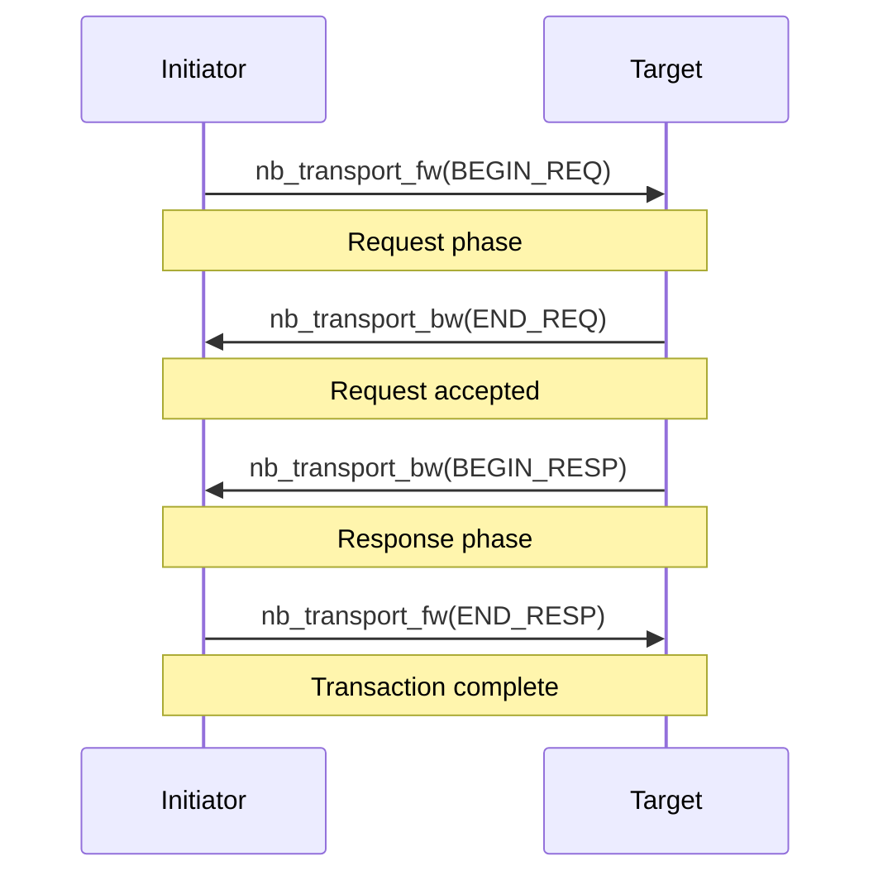
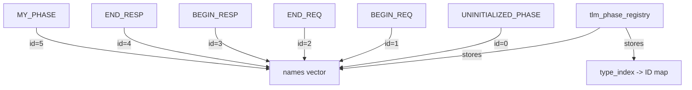

# tlm_phase - Transaction Phase

## Overview

`tlm_phase` defines the stages of a transaction's progress in TLM 2.0 non-blocking transport. Each call to `nb_transport_fw` or `nb_transport_bw` carries a phase parameter indicating which stage the transaction is currently in. The system provides four standard phases by default, and users can also define custom phases.

## Everyday Analogy

Imagine the ordering process at a restaurant:
1. **BEGIN_REQ** (begin request) = The customer raises their hand to order
2. **END_REQ** (end request) = The waiter finishes writing down the order
3. **BEGIN_RESP** (begin response) = The kitchen brings out the dish
4. **END_RESP** (end response) = The customer confirms receipt of the dish

Each stage is a phase, indicating how far the overall transaction has progressed.

## Standard Phases

```cpp
enum tlm_phase_enum {
  UNINITIALIZED_PHASE = 0,  // not yet set
  BEGIN_REQ = 1,             // begin request
  END_REQ,                   // end request
  BEGIN_RESP,                // begin response
  END_RESP                   // end response
};
```

### Standard Four-Phase Protocol



## Class: `tlm_phase`

```cpp
class tlm_phase {
public:
  tlm_phase();                          // default: UNINITIALIZED_PHASE
  tlm_phase(tlm_phase_enum standard);   // from standard enum
  tlm_phase& operator=(tlm_phase_enum);

  operator unsigned int() const;        // get phase ID
  const char* get_name() const;         // get phase name string

protected:
  // for extended phases
  tlm_phase(const std::type_info& type, const char* name);
private:
  unsigned int m_id;
};
```

### Design Key Points

- `m_id` is an `unsigned int`; standard phases use values 0-4
- Supports implicit conversion to `unsigned int`, convenient for use in `switch` statements
- Supports `operator<<` for printing the name

## Custom Phases

### Declaration

```cpp
TLM_DECLARE_EXTENDED_PHASE(MY_PHASE);
```

This macro:
1. Creates an anonymous class that inherits from `tlm_phase`
2. Automatically registers with the global registry during construction
3. Produces a `const` static object `MY_PHASE`

### Registry Mechanism



`tlm_phase_registry` is a singleton that manages the mapping between all phase IDs and names. It uses `std::type_index` to prevent duplicate registration.

## Usage in Non-blocking Transport

```cpp
tlm_phase phase = tlm::BEGIN_REQ;
sc_time delay = SC_ZERO_TIME;

tlm_sync_enum status = init_socket->nb_transport_fw(txn, phase, delay);

switch (status) {
  case TLM_ACCEPTED:
    // target accepted, will call nb_transport_bw later
    break;
  case TLM_UPDATED:
    // target updated phase (e.g., phase == END_REQ now)
    break;
  case TLM_COMPLETED:
    // transaction done in one call
    break;
}
```

## Source Location

- `ref/systemc/src/tlm_core/tlm_2/tlm_generic_payload/tlm_phase.h`
- `ref/systemc/src/tlm_core/tlm_2/tlm_generic_payload/tlm_phase.cpp`

## Related Files

- [tlm_fw_bw_ifs.md](tlm_fw_bw_ifs.md) - Transport interfaces that use phase
- [tlm_generic_payload.md](tlm_generic_payload.md) - The payload used alongside phase
