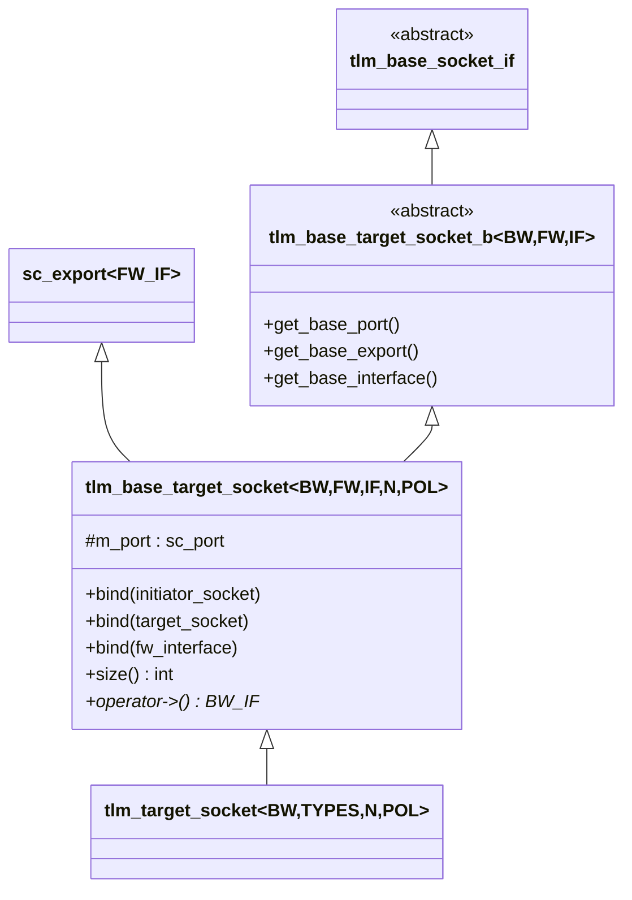
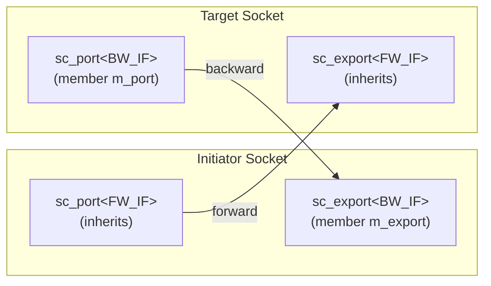

# tlm_target_socket.h - Target Socket

## Overview

`tlm_target_socket` is the socket on the target side in TLM 2.0. Symmetrical to the initiator socket, it encapsulates an `sc_export` (for receiving forward calls) and an `sc_port` (for sending backward callbacks). The target socket itself inherits from `sc_export`, so it can be used directly to bind a forward interface implementation.

## Everyday Analogy

If the initiator socket is "the party making the call," then the target socket is "the party receiving the call":
- **Export (sc_export, i.e., itself)** = The phone line for receiving incoming calls
- **Port (sc_port)** = The dialing function for actively calling back
- When the initiator calls `nb_transport_fw` or `b_transport`, the target socket receives the incoming call
- When the target needs to call back via `nb_transport_bw` or `invalidate_direct_mem_ptr`, it uses its internal port to call back

## Class Hierarchy



## Template Parameters

| Parameter | Default | Description |
|-----------|---------|-------------|
| `BUSWIDTH` | 32 | Bus width (bits) |
| `FW_IF` | `tlm_fw_transport_if<>` | Forward interface type |
| `BW_IF` | `tlm_bw_transport_if<>` | Backward interface type |
| `N` | 1 | Maximum number of connections |
| `POL` | `SC_ONE_OR_MORE_BOUND` | Binding policy |

## Symmetrical Structure with Initiator Socket



| Aspect | Initiator Socket | Target Socket |
|--------|------------------|---------------|
| Inherits | `sc_port<FW_IF>` | `sc_export<FW_IF>` |
| Member | `m_export` (BW_IF) | `m_port` (BW_IF) |
| Forward call | Sends via port | Receives via export |
| Backward call | Receives via export | Sends via port |

## Binding Operations

### Binding to an Initiator Socket

```cpp
virtual void bind(base_initiator_socket_type& s) {
  // initiator.port -> target.export (forward)
  (s.get_base_port())(get_base_interface());
  // target.port -> initiator.export (backward)
  get_base_port()(s.get_base_interface());
}
```

### Hierarchical Bind

```cpp
virtual void bind(base_type& s) {
  // check for illegal multi-socket hierarchical bind
  if (s.get_socket_category() == TLM_MULTI_TARGET_SOCKET) {
    if (TLM_MULTI_TARGET_SOCKET != get_socket_category()) {
      SC_REPORT_ERROR(...);
    }
  }
  (get_base_export())(s.get_base_export());
  (s.get_base_port())(get_base_port());
}
```

Note: During hierarchical binding, multi-socket legality is checked -- a multi-target socket cannot be hierarchically bound to a non-multi-target socket.

### Additional Convenience Methods

```cpp
int size() const;           // number of bound initiators
bw_interface_type* operator->();   // access backward interface
bw_interface_type* operator[](int i); // access i-th backward interface
```

## Source Location

`ref/systemc/src/tlm_core/tlm_2/tlm_sockets/tlm_target_socket.h`

## Related Files

- [tlm_initiator_socket.md](tlm_initiator_socket.md) - The corresponding initiator socket
- [tlm_base_socket_if.md](tlm_base_socket_if.md) - Socket base interface
- [tlm_fw_bw_ifs.md](tlm_fw_bw_ifs.md) - Transport interface definitions
