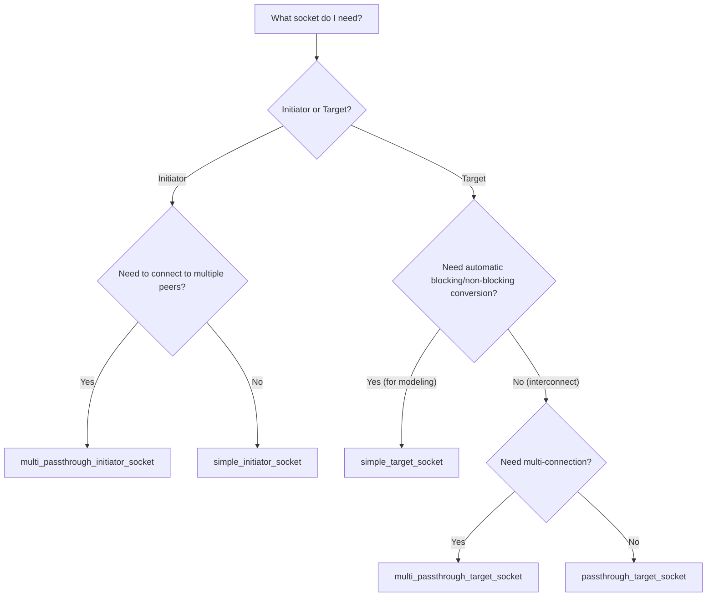

# TLM Utils - TLM Utility Library

## Overview

`tlm_utils` provides a set of convenience utilities built on top of `tlm_core`, making it easier for users to build TLM 2.0 models. These utility classes are not part of the core TLM standard, but in practice almost every TLM model uses them.

## Everyday Analogy

If `tlm_core` is the basic LEGO bricks (port, export, socket, generic payload), then `tlm_utils` is the pre-assembled LEGO kits — packaging the most common combinations so you don't have to build everything from scratch every time.

## Utility Categories

### Convenience Sockets

| Utility | Purpose | Use Case |
|---------|---------|----------|
| `simple_initiator_socket` | Simplified initiator socket | Most commonly used; automatically manages backward callbacks |
| `simple_target_socket` | Simplified target socket | Most commonly used; supports automatic blocking/non-blocking conversion |
| `passthrough_target_socket` | Passthrough target socket | Interconnect components; directly forwards calls |
| `multi_passthrough_initiator_socket` | Multi-connection initiator socket | Connects to multiple targets |
| `multi_passthrough_target_socket` | Multi-connection target socket | Accepts connections from multiple initiators |

### Time Management

| Utility | Purpose |
|---------|---------|
| `tlm_quantumkeeper` | Manages local time and global quantum synchronization |

### Event Queues

| Utility | Purpose |
|---------|---------|
| `peq_with_get` | Event queue using `get_next_transaction()` polling |
| `peq_with_cb_and_phase` | Event queue using callback functions and phase |

### Extension Mechanism

| Utility | Purpose |
|---------|---------|
| `instance_specific_extensions` | Per-module-instance private extensions |

### Base Helpers

| Utility | Purpose |
|---------|---------|
| `convenience_socket_bases` | Base classes for all convenience sockets |
| `multi_socket_bases` | Base classes and callback binders for multi-sockets |

## Architecture Relationships

```mermaid
graph TD
    subgraph "tlm_core (Standard)"
        IS[tlm_initiator_socket]
        TS[tlm_target_socket]
        GP[tlm_generic_payload]
        GQ[tlm_global_quantum]
    end

    subgraph "tlm_utils (Convenience)"
        CSB[convenience_socket_bases]
        MSB[multi_socket_bases]

        SIS[simple_initiator_socket]
        STS[simple_target_socket]
        PTS[passthrough_target_socket]
        MPIS[multi_passthrough_initiator_socket]
        MPTS[multi_passthrough_target_socket]

        QK[tlm_quantumkeeper]
        PEQ1[peq_with_get]
        PEQ2[peq_with_cb_and_phase]
        ISE[instance_specific_extensions]
    end

    IS --> SIS
    IS --> MPIS
    TS --> STS
    TS --> PTS
    TS --> MPTS

    CSB --> SIS
    CSB --> STS
    CSB --> PTS
    MSB --> MPIS
    MSB --> MPTS

    GQ --> QK
    GP --> PEQ1
    GP --> PEQ2
    GP --> ISE
```



## Selection Guide



## Directory Structure

```
tlm_utils/
├── convenience_socket_bases.h/.cpp    # Base helper classes
├── simple_initiator_socket.h          # Simplified initiator socket
├── simple_target_socket.h             # Simplified target socket
├── passthrough_target_socket.h        # Passthrough target socket
├── multi_passthrough_initiator_socket.h # Multi-connection initiator socket
├── multi_passthrough_target_socket.h    # Multi-connection target socket
├── multi_socket_bases.h               # Multi-socket base classes
├── peq_with_get.h                     # Event queue (polling-based)
├── peq_with_cb_and_phase.h            # Event queue (callback-based)
├── tlm_quantumkeeper.h                # Quantum time management
├── instance_specific_extensions.h/.cpp # Instance-specific private extensions
└── instance_specific_extensions_int.h  # Internal implementation
```

## Related Files

- [../tlm_core/_index.md](../tlm_core/_index.md) - TLM Core Library
