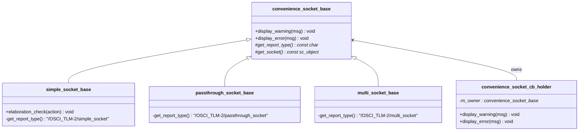

# convenience_socket_bases - Convenience Socket Base Classes

## Overview

`convenience_socket_bases.h/cpp` defines the shared base classes for all convenience sockets (simple, passthrough, multi). They primarily provide a unified error reporting and warning mechanism, as well as elaboration-phase checking functionality.

## Everyday Analogy

Just like all household appliances share common safety standards — overload protection, circuit breakers, and so on. `convenience_socket_base` is the "safety standard foundation" for convenience sockets, ensuring that all sockets report problems in a unified, clear manner when errors occur.

## Class Hierarchy



## Main Classes

### `convenience_socket_base`

The root base class for all convenience sockets.

```cpp
class convenience_socket_base {
public:
  void display_warning(const char* msg) const;
  void display_error(const char* msg) const;
private:
  virtual const char* get_report_type() const = 0;
  virtual const sc_object* get_socket() const = 0;
};
```

- `display_warning` / `display_error`: Output in `socket_name: message` format
- `get_report_type()`: Returns the SystemC report category name
- `get_socket()`: Returns the `sc_object` corresponding to the socket, used to retrieve the name

### `simple_socket_base`

```cpp
class simple_socket_base : public convenience_socket_base {
  void elaboration_check(const char* action) const;
};
```

`elaboration_check()` verifies whether the system is still in the elaboration phase. Callback registration for simple sockets must be completed before elaboration finishes; otherwise an error is reported.

report type: `"/OSCI_TLM-2/simple_socket"`

### `passthrough_socket_base`

report type: `"/OSCI_TLM-2/passthrough_socket"`

### `multi_socket_base`

report type: `"/OSCI_TLM-2/multi_socket"`

### `convenience_socket_cb_holder`

The base class for callback objects (callback binders). It holds a `convenience_socket_base*` pointer and delegates warnings/errors to the socket itself.

```cpp
class convenience_socket_cb_holder {
public:
  void display_warning(const char* msg) const;
  void display_error(const char* msg) const;
protected:
  explicit convenience_socket_cb_holder(convenience_socket_base* owner);
private:
  convenience_socket_base* m_owner;
};
```

## Source Location

- `ref/systemc/src/tlm_utils/convenience_socket_bases.h`
- `ref/systemc/src/tlm_utils/convenience_socket_bases.cpp`

## Related Files

- [simple_initiator_socket.md](simple_initiator_socket.md)
- [simple_target_socket.md](simple_target_socket.md)
- [passthrough_target_socket.md](passthrough_target_socket.md)
- [multi_socket_bases.md](multi_socket_bases.md)
