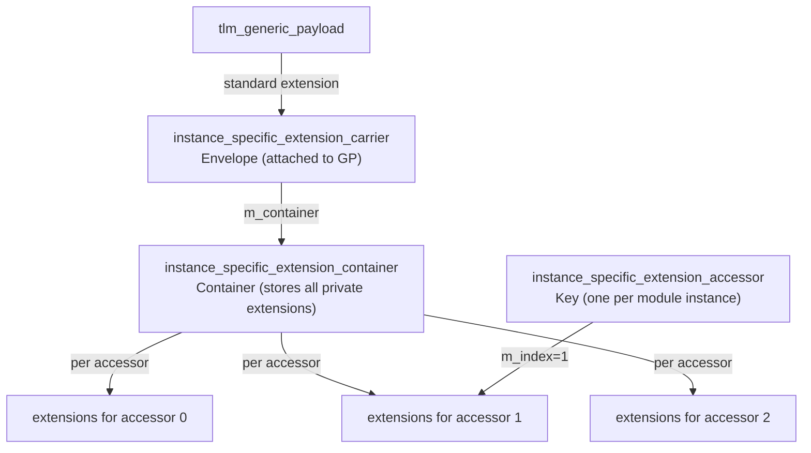
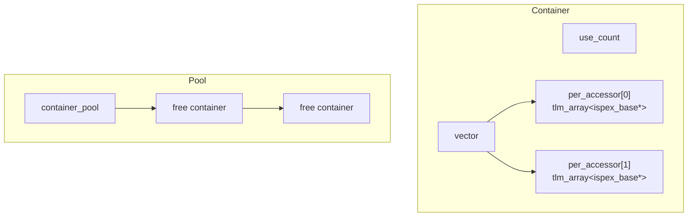

# instance_specific_extensions - Instance-Specific Private Extensions

## Overview

Instance Specific Extensions are a supplement to the TLM standard extension mechanism. Standard extensions (`tlm_extension`) are globally visible — any module that can access the GP can see the extensions. Instance-specific extensions, on the other hand, can only be accessed by module instances that own the corresponding `accessor`; they are completely invisible to other modules.

File distribution:
- `instance_specific_extensions.h` - Public API
- `instance_specific_extensions_int.h` - Internal implementation
- `instance_specific_extensions.cpp` - Implementation

## Everyday Analogy

Imagine a shared notebook (`tlm_generic_payload`) being passed around the office:
- **Standard extensions**: Writing on a blank page of the notebook — anyone who flips to it can read it
- **Instance-specific extensions**: Sticking a note on the notebook that can only be unlocked with a specific password — others can see the note but cannot open it; only you can read and write it with your own key (accessor)

## Core Concepts

### Three Key Roles



## Usage

### Defining a Private Extension

```cpp
class my_private_ext : public tlm_utils::instance_specific_extension<my_private_ext> {
public:
  int private_data;
};
```

### Using in a Module

```cpp
class MyModule : public sc_module {
  tlm_utils::instance_specific_extension_accessor m_accessor;

  void process(tlm::tlm_generic_payload& txn) {
    // Set private extension
    my_private_ext* ext = new my_private_ext;
    ext->private_data = 42;
    m_accessor(txn).set_extension(ext);

    // Get private extension
    my_private_ext* got_ext;
    m_accessor(txn).get_extension(got_ext);
    // got_ext->private_data == 42

    // Clear when done
    m_accessor(txn).clear_extension(ext);
    delete ext;
  }
};
```

Important: The `m_accessor(txn)` syntax is used for access; it returns an `instance_specific_extensions_per_accessor` object.

## Internal Architecture

### `ispex_base`

The base class for private extensions (corresponds to `tlm_extension_base` for standard extensions).

```cpp
class ispex_base {
protected:
  static unsigned int register_private_extension(const std::type_info&);
};
```

### `instance_specific_extension<T>`

```cpp
template <typename T>
class instance_specific_extension : public ispex_base {
  const static unsigned int priv_id;
};
```

Uses CRTP + static initialization to assign a unique ID to each extension type.

### `instance_specific_extension_carrier`

A standard `tlm_extension` that acts as a "container of containers" attached to the GP.

```cpp
class instance_specific_extension_carrier
  : public tlm::tlm_extension<instance_specific_extension_carrier> {
  instance_specific_extension_container* m_container;

  tlm_extension_base* clone() const { return NULL; }  // no clone
  void copy_from(...) {}  // no copy
  void free() {}  // no free
};
```

Note: `clone()` returns `NULL` — private extensions are not deep-copied. If the GP is deep_copy'd, the new GP will not have any private extensions.

### `instance_specific_extension_container`

Manages extension arrays for all accessors, using reference counting and an object pool:



### Reference Counting and Lifecycle

```
set_extension (non-NULL) -> use_count++
clear_extension          -> use_count--
use_count == 0           -> release carrier from GP, return container to pool
```

### Accessor Numbering

```cpp
instance_specific_extension_accessor::instance_specific_extension_accessor()
  : m_index(max_num_ispex_accessors(true) - 1)
{}
```

Each accessor obtains a globally unique index at construction time. This index is used to locate the corresponding extension array within the container.

## Design Highlights

1. **Privacy**: Without an accessor, private extensions cannot be accessed, providing information isolation between modules
2. **Lifecycle management**: Users are responsible for allocating and freeing extension objects
3. **No copy support**: deep_copy does not copy private extensions
4. **Object pool**: Containers use an object pool to reduce memory allocation overhead
5. **Lazy creation**: The container is created only upon the first `set_extension` call

## Source Location

- `ref/systemc/src/tlm_utils/instance_specific_extensions.h`
- `ref/systemc/src/tlm_utils/instance_specific_extensions_int.h`
- `ref/systemc/src/tlm_utils/instance_specific_extensions.cpp`

## Related Files

- [../tlm_core/tlm_2/tlm_generic_payload.md](../tlm_core/tlm_2/tlm_generic_payload.md) - Standard extension mechanism
- [../tlm_core/tlm_2/tlm_array.md](../tlm_core/tlm_2/tlm_array.md) - Extension array container
