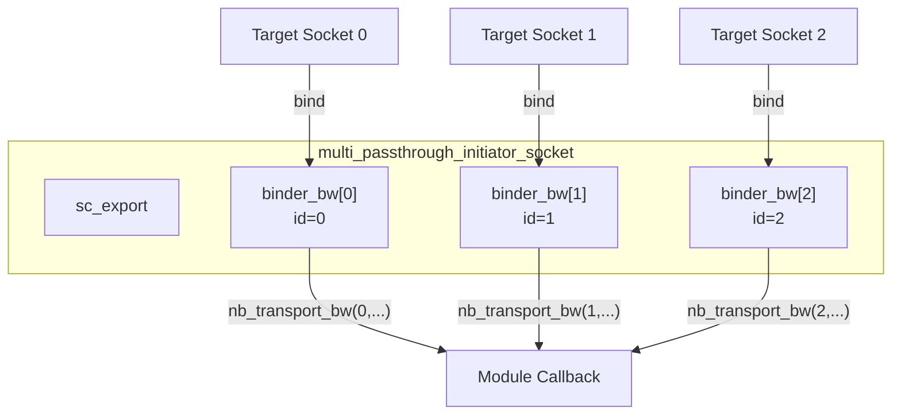

# multi_passthrough_initiator_socket - Multi-Connection Initiator Socket

## Overview

`multi_passthrough_initiator_socket` allows a single initiator to connect to multiple targets simultaneously. Each target has a unique index, and callback functions carry this index to identify which target triggered the callback. A typical use case is an interconnect component that needs to connect to multiple targets.

## Everyday Analogy

Imagine you are a call center supervisor managing multiple phone lines:
- Each line corresponds to a target (customer)
- When a line rings, the system shows "incoming call on line 3" (index = 3)
- You can make outgoing calls on any line (accessing a specific target via index)

## Basic Usage

```cpp
class MyInterconnect : public sc_module {
  tlm_utils::multi_passthrough_initiator_socket<MyInterconnect> init_socket;

  SC_CTOR(MyInterconnect) : init_socket("init_socket") {
    init_socket.register_nb_transport_bw(this, &MyInterconnect::nb_transport_bw);
    init_socket.register_invalidate_direct_mem_ptr(this, &MyInterconnect::inv_dmi);
  }

  // Backward callback with index
  tlm::tlm_sync_enum nb_transport_bw(int id,
    tlm::tlm_generic_payload& txn, tlm::tlm_phase& phase, sc_time& t)
  {
    // id tells which target called back
    return tlm::TLM_ACCEPTED;
  }

  void inv_dmi(int id, uint64 start, uint64 end) {
    // forward to all initiators
  }

  // Forward call to specific target
  void forward(int target_id, tlm::tlm_generic_payload& txn, sc_time& delay) {
    init_socket[target_id]->b_transport(txn, delay);
  }
};
```

## Internal Mechanism

### Callback Binder

Whenever a new target socket is bound to this socket, a new `callback_binder_bw` instance is automatically created:



### `get_base_interface()` Override

```cpp
virtual tlm::tlm_bw_transport_if<TYPES>& get_base_interface() {
  m_binders.push_back(new callback_binder_bw<TYPES>(this, m_binders.size()));
  return *m_binders[m_binders.size()-1];
}
```

Each time a target binds, a new binder is created and returned — each target binds to a different binder, so the source can be distinguished through the binder's id.

### Hierarchical Binding Support

Supports hierarchical binding, using `m_hierarch_bind` to track hierarchical relationships.

## Template Parameters

| Parameter | Default | Description |
|-----------|---------|-------------|
| `MODULE` | (required) | Owner module type |
| `BUSWIDTH` | 32 | Bus width |
| `TYPES` | `tlm_base_protocol_types` | Protocol types |
| `N` | 0 | Maximum number of connections (0 = unlimited) |
| `POL` | `SC_ONE_OR_MORE_BOUND` | Binding policy |

## Source Location

`ref/systemc/src/tlm_utils/multi_passthrough_initiator_socket.h`

## Related Files

- [multi_passthrough_target_socket.md](multi_passthrough_target_socket.md) - Corresponding multi-connection target socket
- [multi_socket_bases.md](multi_socket_bases.md) - Base classes and callback binders
- [simple_initiator_socket.md](simple_initiator_socket.md) - Single-connection simplified version
