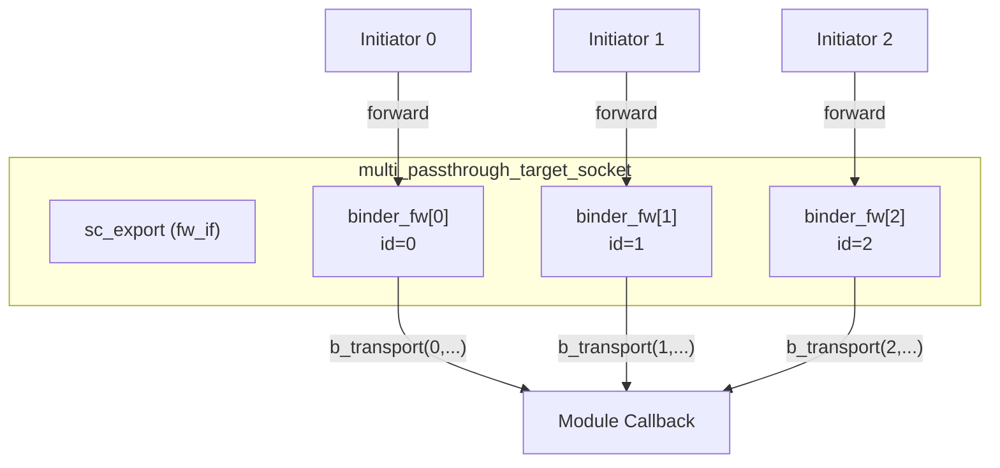

# multi_passthrough_target_socket - Multi-Connection Target Socket

## Overview

`multi_passthrough_target_socket` allows multiple initiators to connect to a single target simultaneously. Each initiator has a unique index, and the forward callback functions carry this index to identify which initiator initiated the call. Typical use cases include shared memory or targets on a multi-master bus.

## Everyday Analogy

Imagine a restaurant kitchen (target) receiving orders from multiple waiters (initiators) at the same time:
- Waiter #0 delivers an order -> `b_transport(id=0, ...)`
- Waiter #1 delivers an order -> `b_transport(id=1, ...)`
- The kitchen can track order origins through the waiter's number

## Basic Usage

```cpp
class SharedMemory : public sc_module {
  tlm_utils::multi_passthrough_target_socket<SharedMemory> target_socket;

  SC_CTOR(SharedMemory) : target_socket("target") {
    target_socket.register_b_transport(this, &SharedMemory::b_transport);
    target_socket.register_transport_dbg(this, &SharedMemory::transport_dbg);
  }

  void b_transport(int id, tlm::tlm_generic_payload& txn, sc_time& delay) {
    // id identifies which initiator sent this
    uint64 addr = txn.get_address();
    // process read/write...
    txn.set_response_status(tlm::TLM_OK_RESPONSE);
  }

  unsigned int transport_dbg(int id, tlm::tlm_generic_payload& txn) {
    // debug access
    return txn.get_data_length();
  }
};
```

## Callback Registration

```cpp
void register_nb_transport_fw(MODULE* mod, nb_cb cb);
void register_b_transport(MODULE* mod, b_cb cb);
void register_transport_dbg(MODULE* mod, dbg_cb cb);
void register_get_direct_mem_ptr(MODULE* mod, dmi_cb cb);
```

All callbacks take `int id` as their first parameter:

```cpp
typedef sync_enum_type (MODULE::*nb_cb)(int, transaction_type&, phase_type&, sc_time&);
typedef void (MODULE::*b_cb)(int, transaction_type&, sc_time&);
typedef unsigned int (MODULE::*dbg_cb)(int, transaction_type&);
typedef bool (MODULE::*dmi_cb)(int, transaction_type&, tlm_dmi&);
```

## Internal Mechanism

### Callback Binder



### Multi-to-Multi Binding

`multi_passthrough_target_socket` also implements `multi_to_multi_bind_base`, supporting direct binding with `multi_passthrough_initiator_socket`. In this case, connections between two multi-sockets establish the correct binder correspondences.

## Template Parameters

| Parameter | Default | Description |
|-----------|---------|-------------|
| `MODULE` | (required) | Owner module type |
| `BUSWIDTH` | 32 | Bus width |
| `TYPES` | `tlm_base_protocol_types` | Protocol types |
| `N` | 0 | Maximum number of connections (0 = unlimited) |
| `POL` | `SC_ONE_OR_MORE_BOUND` | Binding policy |

## Source Location

`ref/systemc/src/tlm_utils/multi_passthrough_target_socket.h`

## Related Files

- [multi_passthrough_initiator_socket.md](multi_passthrough_initiator_socket.md) - Multi-connection initiator socket
- [multi_socket_bases.md](multi_socket_bases.md) - Base classes
- [passthrough_target_socket.md](passthrough_target_socket.md) - Single-connection version
