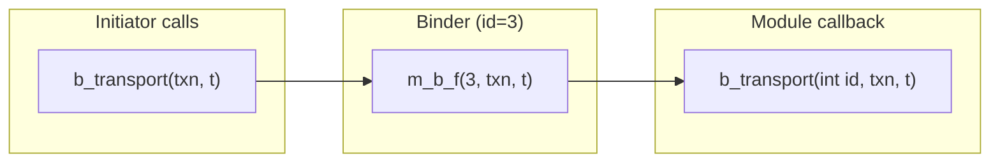
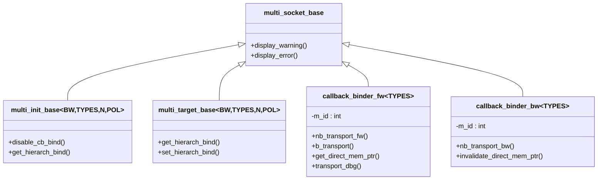

# multi_socket_bases.h - Multi-Socket Infrastructure

## Overview

`multi_socket_bases.h` provides all the infrastructure needed for multi-sockets (multi-connection sockets), including:
- **Callback binder**: Creates an independent interface implementation for each connection, automatically appending the connection index
- **Functor**: Type-safe function pointer wrappers
- **Base classes**: Abstract base classes for multi-sockets

## Everyday Analogy

Imagine a telephone switchboard:
- **Callback binder** = The extension adapter for each phone line, automatically displaying the line number on incoming calls
- **Functor** = The operator's manual, recording "calls on this line should be forwarded to whom"
- **Base classes** = The hardware specifications of the switchboard, defining "what features the switchboard must support"

## Callback Binder

### `callback_binder_fw<TYPES>`

The binder for the forward interface, implementing `tlm_fw_transport_if`:

```cpp
template <typename TYPES>
class callback_binder_fw : public tlm::tlm_fw_transport_if<TYPES> {
  int m_id;  // connection index
  nb_func_type* m_nb_f;
  b_func_type* m_b_f;
  debug_func_type* m_dbg_f;
  dmi_func_type* m_dmi_f;
  sc_port_base* m_caller_port;  // who is bound to me
};
```

When an initiator calls `b_transport(txn, t)`, the binder converts it to `(*m_b_f)(m_id, txn, t)` — automatically inserting the connection index.

### `callback_binder_bw<TYPES>`

The binder for the backward interface, implementing `tlm_bw_transport_if`:

```cpp
template <typename TYPES>
class callback_binder_bw : public tlm::tlm_bw_transport_if<TYPES> {
  int m_id;
  nb_func_type* m_nb_f;
  dmi_func_type* m_dmi_f;
};
```



## Functor Mechanism

The macro `TLM_DEFINE_FUNCTOR` generates a corresponding functor class for each callback type:

| Functor | Used for | Signature |
|---------|----------|-----------|
| `nb_transport_functor` | nb_transport_fw/bw | `sync_enum (MODULE::*)(int, txn&, phase&, time&)` |
| `b_transport_functor` | b_transport | `void (MODULE::*)(int, txn&, time&)` |
| `debug_transport_functor` | transport_dbg | `unsigned int (MODULE::*)(int, txn&)` |
| `get_dmi_ptr_functor` | get_direct_mem_ptr | `bool (MODULE::*)(int, txn&, dmi&)` |
| `invalidate_dmi_functor` | invalidate_direct_mem_ptr | `void (MODULE::*)(int, uint64, uint64)` |

Each functor uses `void*` for type erasure and a static forwarding function to restore type safety.

## Base Classes

### `multi_init_base<BUSWIDTH, TYPES, N, POL>`

Base class for multi initiator sockets:

```cpp
class multi_init_base
  : public tlm::tlm_initiator_socket<BUSWIDTH, TYPES, N, POL>
  , public multi_init_base_if<TYPES>
  , protected multi_socket_base
{
  virtual void disable_cb_bind() = 0;
  virtual multi_init_base* get_hierarch_bind() = 0;
  virtual std::vector<callback_binder_bw<TYPES>*>& get_binders() = 0;
  virtual std::vector<tlm::tlm_fw_transport_if<TYPES>*>& get_sockets() = 0;
};
```

### `multi_target_base<BUSWIDTH, TYPES, N, POL>`

Base class for multi target sockets:

```cpp
class multi_target_base
  : public tlm::tlm_target_socket<BUSWIDTH, TYPES, N, POL>
  , public multi_target_base_if<TYPES>
  , protected multi_socket_base
{
  virtual multi_target_base* get_hierarch_bind() = 0;
  virtual void set_hierarch_bind(multi_target_base*) = 0;
  virtual std::vector<callback_binder_fw<TYPES>*>& get_binders() = 0;
  virtual std::map<unsigned int, tlm::tlm_bw_transport_if<TYPES>*>& get_multi_binds() = 0;
};
```

### `multi_to_multi_bind_base<TYPES>`

A helper interface supporting direct binding between multi-initiator and multi-target sockets.

## Class Relationships



## Source Location

`ref/systemc/src/tlm_utils/multi_socket_bases.h`

## Related Files

- [multi_passthrough_initiator_socket.md](multi_passthrough_initiator_socket.md)
- [multi_passthrough_target_socket.md](multi_passthrough_target_socket.md)
- [convenience_socket_bases.md](convenience_socket_bases.md) - Error reporting base class
