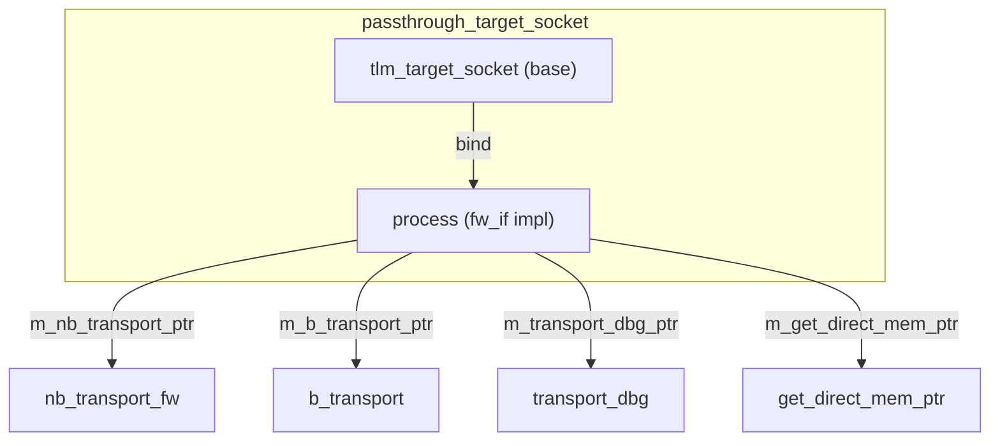

# passthrough_target_socket - Passthrough Target Socket

## Overview

`passthrough_target_socket` is a lightweight target socket wrapper that directly forwards forward interface calls to user-registered callback functions, **without performing any blocking/non-blocking conversion**. It is primarily used for interconnect components such as buses, routers, and arbiters.

## Everyday Analogy

If `simple_target_socket` is a secretary who helps you redirect and translate calls, then `passthrough_target_socket` is a **direct line** — incoming calls go straight to your extension without any processing.

This is useful in interconnect components — a router that receives a packet does not need to "translate" it; it only needs to modify the address and forward it directly.

## Basic Usage

```cpp
class MyRouter : public sc_module {
  tlm_utils::passthrough_target_socket<MyRouter> target_socket;
  tlm::tlm_initiator_socket<32> init_socket;

  SC_CTOR(MyRouter) : target_socket("target") {
    target_socket.register_b_transport(this, &MyRouter::b_transport);
    target_socket.register_nb_transport_fw(this, &MyRouter::nb_transport_fw);
    target_socket.register_transport_dbg(this, &MyRouter::transport_dbg);
    target_socket.register_get_direct_mem_ptr(this, &MyRouter::get_direct_mem_ptr);
  }

  void b_transport(tlm::tlm_generic_payload& txn, sc_time& delay) {
    uint64 addr = txn.get_address();
    txn.set_address(addr & 0xFFF);  // mask address
    init_socket->b_transport(txn, delay);  // forward
    txn.set_address(addr);  // restore
  }

  // ... similar for other callbacks
};
```

## Callback Registration

```cpp
void register_nb_transport_fw(MODULE* mod, sync_enum_type (MODULE::*cb)(...));
void register_b_transport(MODULE* mod, void (MODULE::*cb)(...));
void register_transport_dbg(MODULE* mod, unsigned int (MODULE::*cb)(...));
void register_get_direct_mem_ptr(MODULE* mod, bool (MODULE::*cb)(...));
```

### Default Behavior for Unregistered Callbacks

| Method | Behavior when unregistered |
|--------|---------------------------|
| `nb_transport_fw` | `display_error` (reports error) |
| `b_transport` | `display_error` (reports error) |
| `transport_dbg` | Returns 0 (debug not supported) |
| `get_direct_mem_ptr` | Returns `false`, allows full address range |

## Internal Architecture



Compared to `simple_target_socket`:
- **No** PEQ (payload event queue)
- **No** automatic blocking/non-blocking conversion
- **No** extra thread spawning
- Purely synchronous function pointer forwarding

## Variants

| Variant | Description |
|---------|-------------|
| `passthrough_target_socket` | Standard version |
| `passthrough_target_socket_optional` | Can be left unbound |
| `passthrough_target_socket_tagged` | Callbacks carry an `int id` parameter |
| `passthrough_target_socket_tagged_optional` | tagged + optional |

## Tagged Version

The tagged version's callback functions have an additional `int id` parameter:

```cpp
socket.register_b_transport(this, &MyModule::b_transport, 0);

void b_transport(int id, tlm::tlm_generic_payload& txn, sc_time& delay) {
  // id identifies which socket triggered this callback
}
```

## Source Location

`ref/systemc/src/tlm_utils/passthrough_target_socket.h`

## Related Files

- [simple_target_socket.md](simple_target_socket.md) - Alternative with automatic conversion
- [multi_passthrough_target_socket.md](multi_passthrough_target_socket.md) - Multi-connection version
- [convenience_socket_bases.md](convenience_socket_bases.md) - Base classes
