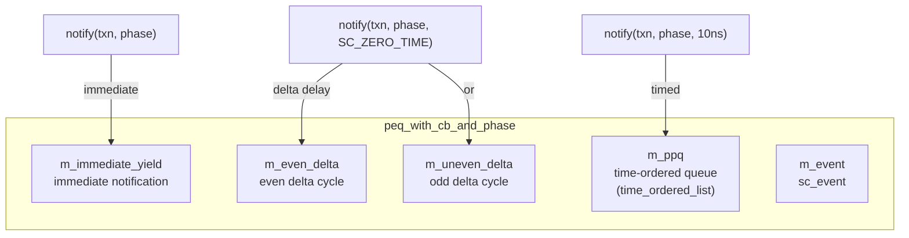
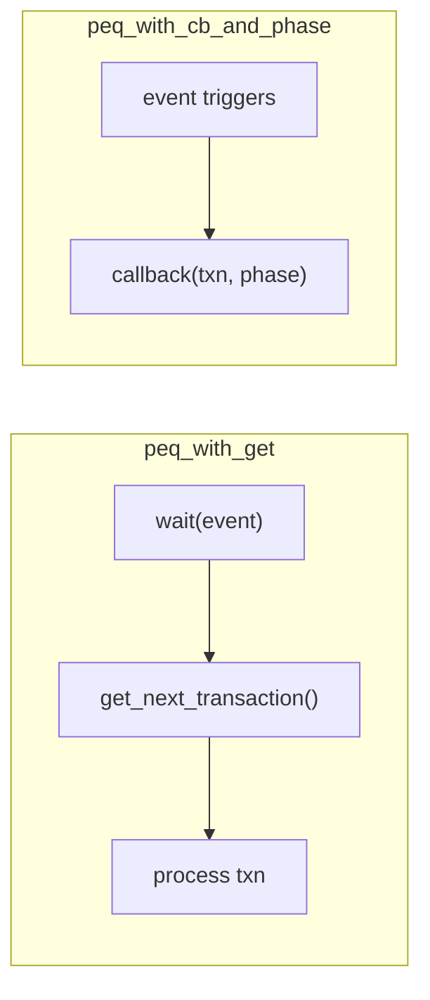

# peq_with_cb_and_phase - Callback-based Payload Event Queue

## Overview

`peq_with_cb_and_phase` is a more sophisticated event queue that does not require the user to poll manually. Instead, it automatically invokes a registered callback function when a transaction is due, carrying the transaction's phase information. This is a key tool for implementing Approximately-Timed (AT) models.

## Everyday Analogy

If `peq_with_get` is a to-do list you have to keep checking, then `peq_with_cb_and_phase` is like a smart assistant — you tell it "remind me to handle this in 10 minutes, the current progress is BEGIN_REQ," and when the 10 minutes are up, the assistant proactively notifies you and tells you the recorded progress.

## Basic Usage

```cpp
class MyModule : public sc_module {
  tlm_utils::peq_with_cb_and_phase<MyModule> m_peq;

  SC_CTOR(MyModule) : m_peq(this, &MyModule::peq_cb) {}

  // This gets called automatically when a transaction is due
  void peq_cb(tlm::tlm_generic_payload& txn, const tlm::tlm_phase& phase) {
    switch (phase) {
      case tlm::BEGIN_REQ:  handle_begin_req(txn);  break;
      case tlm::END_REQ:    handle_end_req(txn);    break;
      case tlm::BEGIN_RESP: handle_begin_resp(txn); break;
      case tlm::END_RESP:   handle_end_resp(txn);   break;
    }
  }

  // Schedule a transaction
  void some_method() {
    tlm::tlm_phase phase = tlm::BEGIN_RESP;
    m_peq.notify(txn, phase, sc_time(10, SC_NS));  // timed
    m_peq.notify(txn, phase);                       // immediate
  }
};
```

## Class Details

### Constructor

```cpp
peq_with_cb_and_phase(OWNER* owner, cb callback);
peq_with_cb_and_phase(const char* name, OWNER* owner, cb callback);
```

### Methods

| Method | Description |
|--------|-------------|
| `notify(txn, phase, time)` | Trigger callback after `time` |
| `notify(txn, phase)` | Trigger callback immediately |
| `cancel_all()` | Cancel all scheduled events |

## Internal Implementation

### Three-tier Scheduling

The PEQ uses three separate queues to handle different notification timings:



### Delta Cycle Handling

SC_ZERO_TIME notifications are processed in the next delta cycle. To handle this correctly, the PEQ distinguishes between odd and even delta cycles:

- A zero-time notification set during an even delta cycle -> placed in `m_uneven_delta` (next one is odd)
- A zero-time notification set during an odd delta cycle -> placed in `m_even_delta` (next one is even)

### `fec()` Method (Fire Event Callback)

Executed using `sc_spawn` as an SC_METHOD, sensitive to `m_event`:

```
1. Process all immediate notifications (m_immediate_yield)
2. Based on current delta cycle parity, process the corresponding delta notifications
3. Process all due timed notifications (m_ppq)
4. If m_ppq still has pending items, reschedule m_event
```

### `time_ordered_list<PAYLOAD>`

A custom ordered linked list that supports:
- `insert(payload, time)` - Insert in time order
- `top()` / `top_time()` - Access the earliest due item
- `delete_top()` - Remove the earliest item
- Uses a free-node list (empties) to reduce memory allocations

## Comparison with `peq_with_get`



## Source Location

`ref/systemc/src/tlm_utils/peq_with_cb_and_phase.h`

## Related Files

- [peq_with_get.md](peq_with_get.md) - Simpler polling-based event queue
- [../tlm_core/tlm_2/tlm_phase.md](../tlm_core/tlm_2/tlm_phase.md) - Transaction phase definitions
