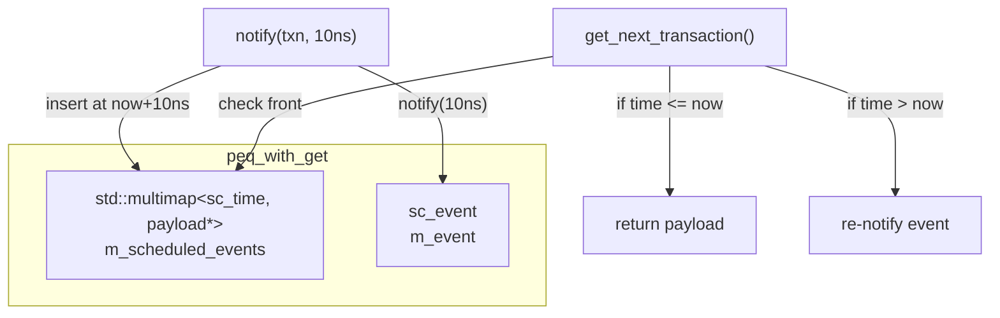

# peq_with_get - Polling-based Payload Event Queue

## Overview

`peq_with_get` (Payload Event Queue with Get) is a time-ordered event queue used for scheduling transactions in non-blocking transports. Users place transactions into the queue via `notify()`, then retrieve due transactions using `get_next_transaction()` in an SC_THREAD or SC_METHOD.

## Everyday Analogy

Imagine a to-do list with timestamps:
- `notify(task, 10ns)` = "Remind me to do this in 10ns"
- `get_event()` = The alarm goes off
- `get_next_transaction()` = "What tasks are due right now?"

You set multiple reminders, and when the alarm goes off you check the list and take out all due tasks one by one for processing.

## Class Details

### `peq_with_get<PAYLOAD>`

```cpp
template <class PAYLOAD>
class peq_with_get : public sc_core::sc_object {
public:
  peq_with_get(const char* name);

  void notify(transaction_type& trans, const sc_time& t);  // timed
  void notify(transaction_type& trans);                     // immediate

  transaction_type* get_next_transaction();  // returns null when empty
  sc_event& get_event();
  void cancel_all();
};
```

### Usage Flow

```cpp
// In SC_THREAD:
void my_thread() {
  while (true) {
    wait(m_peq.get_event());  // wait for something in queue

    tlm::tlm_generic_payload* txn;
    while ((txn = m_peq.get_next_transaction()) != nullptr) {
      // process txn
    }
  }
}

// Elsewhere:
m_peq.notify(txn, sc_time(10, SC_NS));  // schedule for 10ns from now
m_peq.notify(txn);                       // schedule for now (immediate)
```

### Internal Implementation



`m_scheduled_events` is a `std::multimap` sorted by absolute time as key:
- `notify()` inserts a `(now + delay, payload*)` entry
- `get_next_transaction()` checks whether the front entry is due; if so, it removes and returns it
- If the front entry is not yet due, `m_event` is rescheduled to that time point
- If the queue is empty, returns `nullptr`

### Important Notes

`get_next_transaction()` must be called repeatedly until it returns `nullptr`, because multiple transactions may be due at the same time point.

## Differences from `peq_with_cb_and_phase`

| Feature | `peq_with_get` | `peq_with_cb_and_phase` |
|---------|----------------|------------------------|
| Notification method | Polling (get) | Callback |
| Usage pattern | SC_THREAD + wait + get | Automatically invokes callback |
| Phase support | No | Yes |
| Complexity | Simple | More complex |
| Use case | Internal to simple_target_socket | Precise phase management |

## Source Location

`ref/systemc/src/tlm_utils/peq_with_get.h`

## Related Files

- [peq_with_cb_and_phase.md](peq_with_cb_and_phase.md) - Callback-based event queue
- [simple_target_socket.md](simple_target_socket.md) - Socket that uses PEQ internally
