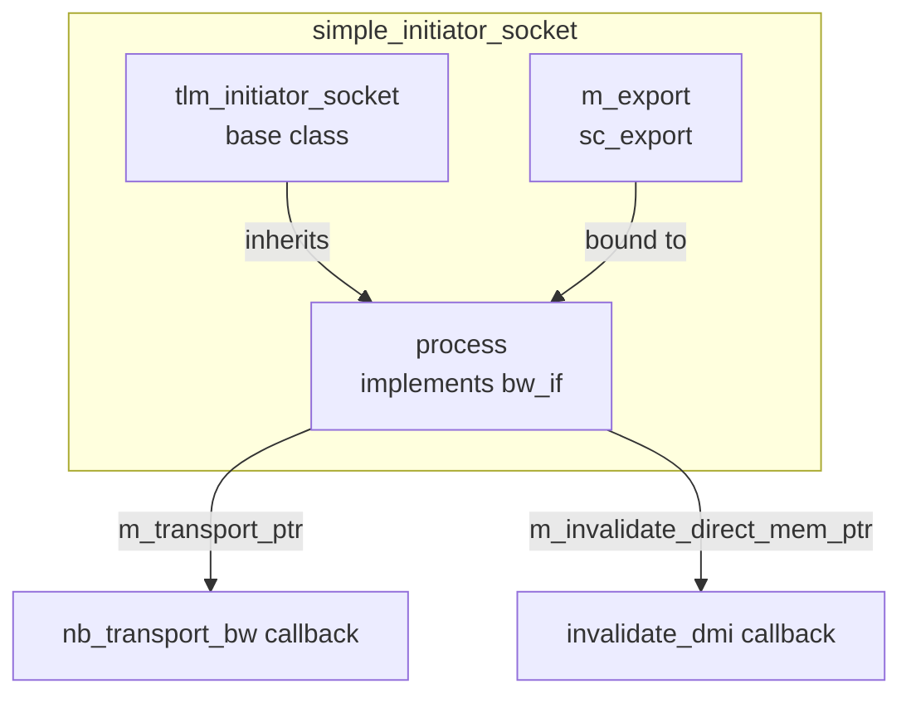

# simple_initiator_socket - Simplified Initiator Socket

## Overview

`simple_initiator_socket` is the most commonly used initiator socket wrapper. It inherits from `tlm_initiator_socket` and automatically manages backward interface callback registration. Users only need to register callbacks for `nb_transport_bw` and/or `invalidate_direct_mem_ptr`.

## Everyday Analogy

The standard `tlm_initiator_socket` requires you to fully implement `tlm_bw_transport_if` (nb_transport_bw + invalidate_direct_mem_ptr). It is like buying a computer where the standard version requires you to assemble the motherboard, CPU, and memory yourself.

`simple_initiator_socket` is like a pre-built branded computer — the motherboard and basic components are already assembled, and you just need to tell it "use this CPU" and "install this memory." The internal `process` class is that pre-assembled motherboard.

## Basic Usage

```cpp
class MyInitiator : public sc_module {
  tlm_utils::simple_initiator_socket<MyInitiator> socket;

  SC_CTOR(MyInitiator) : socket("socket") {
    // Register backward callbacks
    socket.register_nb_transport_bw(this, &MyInitiator::nb_transport_bw);
    socket.register_invalidate_direct_mem_ptr(this, &MyInitiator::invalidate_dmi);
  }

  // Forward call
  void thread() {
    tlm::tlm_generic_payload txn;
    sc_time delay = SC_ZERO_TIME;
    socket->b_transport(txn, delay);
  }

  // Backward callback
  tlm::tlm_sync_enum nb_transport_bw(
    tlm::tlm_generic_payload& txn,
    tlm::tlm_phase& phase,
    sc_time& t)
  {
    // handle backward transport
    return tlm::TLM_ACCEPTED;
  }

  void invalidate_dmi(uint64 start, uint64 end) {
    // handle DMI invalidation
  }
};
```

## Internal Architecture



### `process` Inner Class

```cpp
class process : public tlm::tlm_bw_transport_if<TYPES>,
                protected convenience_socket_cb_holder {
  MODULE* m_mod;
  TransportPtr m_transport_ptr;
  InvalidateDirectMemPtr m_invalidate_direct_mem_ptr;
};
```

`process` implements the full `tlm_bw_transport_if`:
- When the target calls `nb_transport_bw`, `process` forwards the call to the user-registered callback
- If no callback is registered when called, it reports an error (`display_error`)
- `invalidate_direct_mem_ptr` is silently ignored if no callback is registered

## Variants

### `simple_initiator_socket_optional`

```cpp
template<typename MODULE, unsigned int BUSWIDTH = 32, typename TYPES = ...>
class simple_initiator_socket_optional
```

Uses the `SC_ZERO_OR_MORE_BOUND` binding policy — the socket can be left unbound to any target.

### `simple_initiator_socket_tagged`

```cpp
socket.register_nb_transport_bw(this, &MyModule::nb_transport_bw, id);
```

The callback function has an additional `int id` parameter, used to distinguish which socket triggered the callback. Suitable when a module owns multiple sockets.

### `simple_initiator_socket_tagged_optional`

Combines the tagged and optional features.

## Template Parameters

| Parameter | Default | Description |
|-----------|---------|-------------|
| `MODULE` | (required) | Module type that owns this socket |
| `BUSWIDTH` | 32 | Bus width |
| `TYPES` | `tlm_base_protocol_types` | Protocol types |

## Source Location

`ref/systemc/src/tlm_utils/simple_initiator_socket.h`

## Related Files

- [simple_target_socket.md](simple_target_socket.md) - Corresponding target socket
- [convenience_socket_bases.md](convenience_socket_bases.md) - Base classes
- [../tlm_core/tlm_2/tlm_initiator_socket.md](../tlm_core/tlm_2/tlm_initiator_socket.md) - Underlying socket
