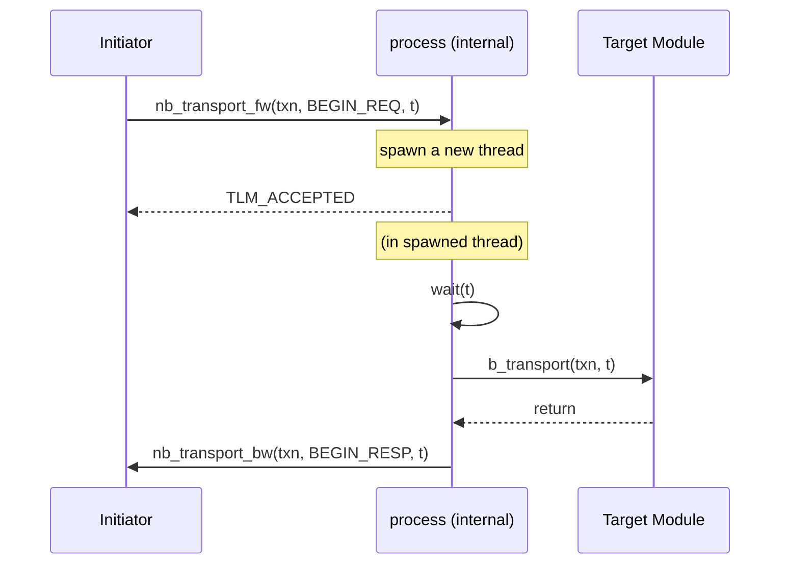
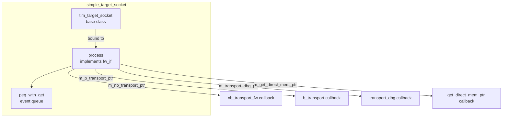

# simple_target_socket - Simplified Target Socket

## Overview

`simple_target_socket` is the most commonly used target socket wrapper. It not only automatically manages forward interface (`tlm_fw_transport_if`) callback registration, but also provides **automatic blocking-to-non-blocking conversion** — if the user only registers `b_transport`, the socket will automatically convert incoming `nb_transport_fw` calls into blocking calls.

## Everyday Analogy

A plain target socket requires you to implement all four interface methods (b_transport, nb_transport_fw, get_direct_mem_ptr, transport_dbg). It is like running a restaurant where you must handle both "dine-in" (blocking) and "takeout" (non-blocking) at the same time.

`simple_target_socket` acts like a smart front desk:
- You only need to teach it how to cook (register `b_transport`)
- If someone requests takeout (`nb_transport_fw`), the front desk automatically converts the takeout order into a dine-in order for the kitchen
- DMI and debug, if not specifically configured, politely respond "not supported"

## Basic Usage

```cpp
class MyTarget : public sc_module {
  tlm_utils::simple_target_socket<MyTarget> socket;

  SC_CTOR(MyTarget) : socket("socket") {
    socket.register_b_transport(this, &MyTarget::b_transport);
    // nb_transport_fw will be auto-converted to b_transport
  }

  void b_transport(tlm::tlm_generic_payload& txn, sc_time& delay) {
    // process transaction
    unsigned char* data = txn.get_data_ptr();
    uint64 addr = txn.get_address();
    // ...
    txn.set_response_status(tlm::TLM_OK_RESPONSE);
  }
};
```

## Callback Registration

```cpp
void register_nb_transport_fw(MODULE* mod,
    sync_enum_type (MODULE::*cb)(transaction_type&, phase_type&, sc_time&));

void register_b_transport(MODULE* mod,
    void (MODULE::*cb)(transaction_type&, sc_time&));

void register_transport_dbg(MODULE* mod,
    unsigned int (MODULE::*cb)(transaction_type&));

void register_get_direct_mem_ptr(MODULE* mod,
    bool (MODULE::*cb)(transaction_type&, tlm_dmi&));
```

## Automatic Blocking/Non-blocking Conversion

When only `b_transport` is registered and an `nb_transport_fw` call arrives:



Internal flow:
1. When `nb_transport_fw` is received, the transaction is placed into a PEQ (Payload Event Queue)
2. A new thread is spawned using `sc_spawn`
3. The user's `b_transport` is called inside the new thread
4. After completion, the initiator is called back through the backward path

### PEQ (Payload Event Queue)

simple_target_socket internally uses `peq_with_get` to schedule transactions. The PEQ ensures transactions are processed at the correct simulation time.

## Internal Architecture



## Variants

| Variant | Description |
|---------|-------------|
| `simple_target_socket` | Standard version; must be bound to at least one initiator |
| `simple_target_socket_optional` | Can be left unbound |
| `simple_target_socket_tagged` | Callbacks carry an `int id` parameter |
| `simple_target_socket_tagged_optional` | tagged + optional |

## Differences from passthrough_target_socket

| Feature | simple_target_socket | passthrough_target_socket |
|---------|---------------------|--------------------------|
| Automatic blocking/nb conversion | Supported | Not supported |
| Behavior when callback is unregistered | Auto-converts or reports error | Reports error |
| Use case | Endpoint modules (target) | Intermediate components (interconnect) |
| Uses PEQ | Yes | No |
| Extra thread overhead | Possible | None |

## Source Location

`ref/systemc/src/tlm_utils/simple_target_socket.h`

## Related Files

- [simple_initiator_socket.md](simple_initiator_socket.md) - Corresponding initiator socket
- [passthrough_target_socket.md](passthrough_target_socket.md) - Passthrough alternative
- [peq_with_get.md](peq_with_get.md) - Event queue used internally
- [convenience_socket_bases.md](convenience_socket_bases.md) - Base classes
