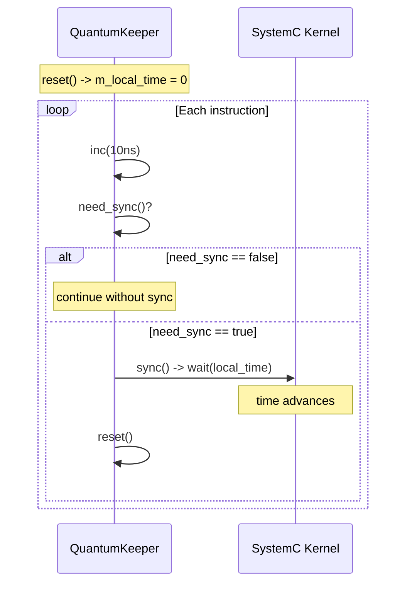

# tlm_quantumkeeper - Quantum Time Manager

## Overview

`tlm_quantumkeeper` helps initiators manage local time — how far ahead the initiator is relative to SystemC time. It tracks the accumulation of local time, determines whether synchronization is needed, and performs synchronization (wait) when necessary. This is a key tool for implementing time decoupling in Loosely-Timed (LT) models.

## Everyday Analogy

Imagine you are playing a turn-based strategy game, but you are an impatient player:
- **Local time** = How many steps you have run ahead
- **Global quantum** = Maximum number of steps you can run ahead
- **`inc()`** = You ran one more step ahead
- **`need_sync()`** = "Have I run too far ahead? Should I wait for the other players?"
- **`sync()`** = Stop and wait for all players to catch up
- **`reset()`** = Return to the starting line and begin counting again

## Class Details

### Static Methods (Global Quantum Management)

```cpp
static void set_global_quantum(const sc_time& t);
static const sc_time& get_global_quantum();
```

Wraps access to `tlm_global_quantum::instance()`.

### Instance Methods

```cpp
class tlm_quantumkeeper {
public:
  virtual void inc(const sc_time& t);         // local_time += t
  virtual void set(const sc_time& t);         // local_time = t
  virtual bool need_sync() const;             // should we sync?
  virtual void sync();                        // wait(local_time) + reset
  void set_and_sync(const sc_time& t);        // set + conditional sync

  virtual void reset();                       // local_time = 0, recalculate next sync point
  virtual sc_time get_current_time() const;   // sc_time_stamp() + local_time
  virtual sc_time get_local_time() const;     // just local_time
protected:
  virtual sc_time compute_local_quantum();    // overridable
};
```

### Synchronization Decision Logic

```cpp
bool need_sync() const {
  return sc_time_stamp() + m_local_time >= m_next_sync_point;
}
```

`m_next_sync_point` is the time of the next quantum boundary, computed during `reset()`.

## Typical Usage Flow



### Usage Example

```cpp
class CPU : public sc_module {
  tlm_utils::tlm_quantumkeeper m_qk;

  void run() {
    m_qk.reset();  // initialize

    while (true) {
      // Execute one instruction
      execute_instruction();
      m_qk.inc(sc_time(10, SC_NS));  // instruction takes 10ns

      // Memory access
      tlm::tlm_generic_payload txn;
      sc_time delay = m_qk.get_local_time();
      socket->b_transport(txn, delay);
      m_qk.set(delay);  // target may have changed delay

      // Sync if needed
      if (m_qk.need_sync()) {
        m_qk.sync();
      }
    }
  }
};
```

## Timeline Illustration

```
Global Quantum = 100ns

SystemC time:  0     100    200    300    400
               |------|------|------|------|
                 ^sync  ^sync  ^sync  ^sync

Initiator:
  inc(10) -> local=10
  inc(10) -> local=20
  ...
  inc(10) -> local=100 -> need_sync()! -> sync() -> wait(100ns)
  reset() -> local=0
  inc(10) -> local=10
  ...
```

## Custom Quantum

By overriding `compute_local_quantum()`, a specific initiator can use a local quantum smaller than the global quantum:

```cpp
class PreciseCPU : public sc_module {
  class my_qk : public tlm_utils::tlm_quantumkeeper {
  protected:
    sc_time compute_local_quantum() override {
      // Use half of global quantum for finer granularity
      sc_time gq = tlm::tlm_global_quantum::instance().compute_local_quantum();
      return gq / 2;
    }
  };
  my_qk m_qk;
};
```

## Source Location

`ref/systemc/src/tlm_utils/tlm_quantumkeeper.h`

## Related Files

- [../tlm_core/tlm_2/tlm_global_quantum.md](../tlm_core/tlm_2/tlm_global_quantum.md) - Global quantum management
- [simple_initiator_socket.md](simple_initiator_socket.md) - Commonly used together with quantum keeper
