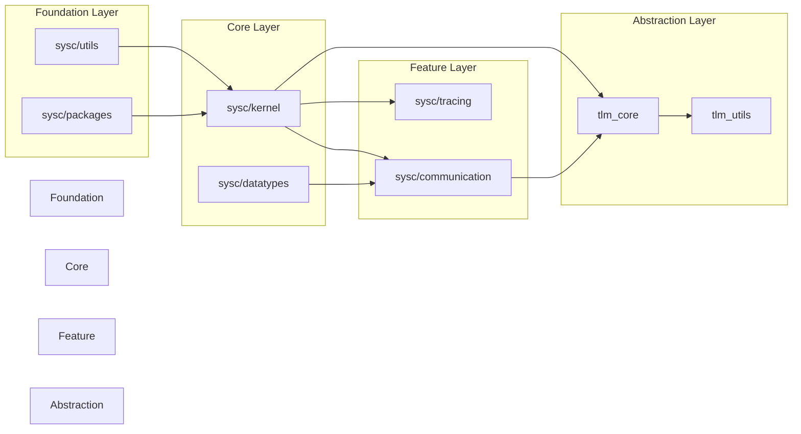

# SystemC Architecture Overview

> This page provides a global relationship diagram across all SystemC framework subsystems.

## Subsystem Relationship Diagram

```mermaid
flowchart TB
    subgraph User Layer
        USER[User Models<br/>sc_module Subclasses]
        MAIN[sc_main<br/>Program Entry Point]
    end

    subgraph Core Engine["sysc/kernel/"]
        SIM[sc_simcontext<br/>Simulation Context]
        EVT[sc_event<br/>Event System]
        PROC[sc_process_b<br/>Process Management]
        TIME[sc_time<br/>Time Management]
        MOD[sc_module<br/>Module System]
        OBJ[sc_object<br/>Object Base]
        RUN[sc_runnable<br/>Scheduling Queue]
        COR[sc_cor<br/>Coroutine Support]
    end

    subgraph Communication Layer["sysc/communication/"]
        SIG[sc_signal<br/>Signal Channel]
        PORT[sc_port<br/>Port System]
        IF[sc_interface<br/>Interface]
        PRIM[sc_prim_channel<br/>Primitive Channel]
        FIFO[sc_fifo<br/>FIFO Channel]
        MUT[sc_mutex / sc_semaphore<br/>Synchronization Primitives]
    end

    subgraph Data Types["sysc/datatypes/"]
        BIT[bit/<br/>sc_logic, sc_bv, sc_lv]
        INT[int/<br/>sc_int, sc_uint, sc_bigint]
        FX[fx/<br/>sc_fixed, sc_fix]
    end

    subgraph Tracing["sysc/tracing/"]
        TRC[sc_trace_file<br/>Tracing Base]
        VCD[sc_vcd_trace<br/>VCD Format]
        WIF[sc_wif_trace<br/>WIF Format]
    end

    subgraph TLM["tlm_core/ + tlm_utils/"]
        GP[tlm_generic_payload<br/>Generic Payload]
        SOC[tlm_initiator_socket<br/>tlm_target_socket]
        PEQ[peq_with_cb_and_phase<br/>Event Queue]
        QK[tlm_quantumkeeper<br/>Time Quantum]
    end

    subgraph Utilities["sysc/utils/"]
        RPT[sc_report<br/>Error Reporting]
        VEC[sc_vector<br/>Named Vector]
        MEM[sc_mempool<br/>Memory Pool]
    end

    subgraph Platform["sysc/packages/"]
        QT[QuickThreads<br/>Coroutine Implementation]
    end

    %% User → Core
    MAIN --> SIM
    USER --> MOD

    %% Core internal
    SIM --> EVT
    SIM --> PROC
    SIM --> TIME
    SIM --> RUN
    MOD --> OBJ
    MOD --> PROC
    PROC --> COR
    PROC --> EVT
    RUN --> PROC

    %% Communication → Core
    PORT --> IF
    SIG --> PRIM
    PRIM --> SIM
    FIFO --> PRIM
    MUT --> PRIM

    %% User → Communication
    USER --> PORT
    USER --> SIG

    %% Datatypes used everywhere
    SIG -.-> BIT
    SIG -.-> INT
    USER -.-> FX

    %% Tracing
    TRC --> SIM
    VCD --> TRC
    WIF --> TRC
    SIG -.-> TRC

    %% TLM
    SOC --> PORT
    GP -.-> INT
    PEQ --> EVT
    QK --> TIME

    %% Utils
    RPT --> SIM
    COR --> QT

    %% Styling
    style Core Engine fill:#e1f5fe
    style Communication Layer fill:#f3e5f5
    style Data Types fill:#e8f5e9
    style Tracing fill:#fff3e0
    style TLM fill:#fce4ec
    style Utilities fill:#f5f5f5
    style Platform fill:#f5f5f5
```

## Dependency Direction Overview

## File Statistics

| Subsystem | File Count | Description |
|-----------|-----------|-------------|
| sysc/kernel | 42 | Simulation core engine |
| sysc/communication | 28 | Communication components |
| sysc/datatypes | 52 | Data types (bit + fx + int + misc) |
| sysc/tracing | 5 | Waveform tracing |
| sysc/utils | 16 | Utility library |
| sysc/packages | 2 | QuickThreads coroutines |
| tlm_core | 18 | TLM 1.0 + 2.0 core |
| tlm_utils | 11 | TLM utility kit |
| topdown | 10 | Top-down conceptual docs |
| **Total** | **~195** | **Including index pages** |
