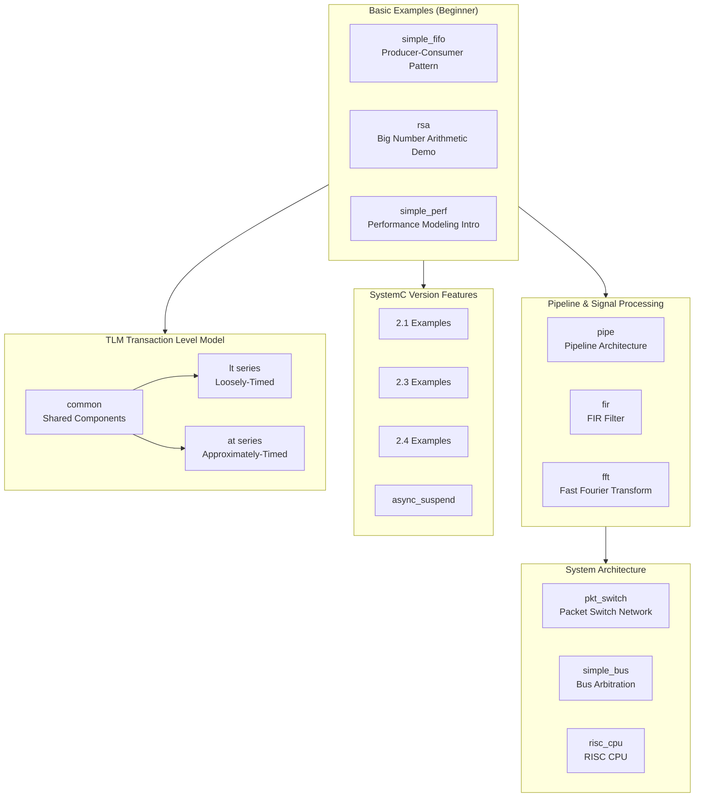

# SystemC Official Example Documentation

> This documentation covers a complete analysis of the SystemC official example code, designed for **software engineers without a hardware background**.
> Each example uses software-world analogies to explain hardware concepts.

## Navigation Map

## Example Overview

### SystemC Core Examples (`sysc/`)

| Example | Difficulty | One-Line Description | Software Analogy |
| --- | --- | --- | --- |
| [simple_fifo](code/sysc/simple_fifo/_index.md) | Beginner | Producer-consumer communication via FIFO | Python queue.Queue |
| [rsa](code/sysc/rsa/_index.md) | Beginner | RSA encryption algorithm, demonstrating big number types | Python native big int arithmetic |
| [simple_perf](code/sysc/simple_perf/_index.md) | Beginner | Performance analysis with timing model | Performance stress test + bottleneck analysis |
| [pipe](code/sysc/pipe/_index.md) | Intermediate | Multi-stage pipeline processing | Unix pipe / Chain of Responsibility pattern |
| [fir](code/sysc/fir/_index.md) | Intermediate | FIR Finite Impulse Response filter | Sliding window weighted average |
| [fft](code/sysc/fft/_index.md) | Intermediate | Fast Fourier Transform (floating-point + fixed-point) | Spectrum analyzer |
| [pkt_switch](code/sysc/pkt_switch/_index.md) | Advanced | Packet switch network | Network router simulation |
| [simple_bus](code/sysc/simple_bus/_index.md) | Advanced | Shared bus and arbitration | Multi-threaded shared resource + locks |
| [risc_cpu](code/sysc/risc_cpu/_index.md) | Advanced | Complete RISC CPU model | Instruction interpreter + cache system |
| [2.1](code/sysc/2.1/_index.md) | Intermediate | SystemC 2.1 new features | API version upgrade examples |
| [2.3](code/sysc/2.3/_index.md) | Intermediate | SystemC 2.3 new features | Asynchronous event handling |
| [2.4](code/sysc/2.4/_index.md) | Intermediate | SystemC 2.4 new features | In-class initialization |
| [async_suspend](code/sysc/async_suspend/_index.md) | Advanced | Asynchronous suspend and external events | External interrupt / async callback |

### TLM Transaction Level Model Examples (`tlm/`)

| Example | Difficulty | One-Line Description | Software Analogy |
| --- | --- | --- | --- |
| [common](code/tlm/common/_index.md) | Intermediate | Shared initiator/target/memory | Shared client/server component library |
| [lt](code/tlm/lt/_index.md) | Intermediate | Loosely-Timed basic example | Synchronous HTTP request |
| [lt_dmi](code/tlm/lt_dmi/_index.md) | Intermediate | LT + Direct Memory Interface | Memory mapping / mmap |
| [lt_temporal_decouple](code/tlm/lt_temporal_decouple/_index.md) | Advanced | LT + temporal decoupling | Batch processing acceleration |
| [lt_mixed_endian](code/tlm/lt_mixed_endian/_index.md) | Intermediate | LT + mixed endianness | Big/Little Endian conversion |
| [lt_extension_mandatory](code/tlm/lt_extension_mandatory/_index.md) | Intermediate | LT + mandatory extension | Custom HTTP Header |
| [at_1_phase](code/tlm/at_1_phase/_index.md) | Advanced | AT single-phase protocol | Single ACK RPC |
| [at_2_phase](code/tlm/at_2_phase/_index.md) | Advanced | AT two-phase protocol | Request-response RPC |
| [at_4_phase](code/tlm/at_4_phase/_index.md) | Advanced | AT four-phase protocol | Full handshake TCP |
| [at_extension_optional](code/tlm/at_extension_optional/_index.md) | Advanced | AT + optional extension | Optional HTTP Header |
| [at_mixed_targets](code/tlm/at_mixed_targets/_index.md) | Advanced | AT mixed targets | Heterogeneous microservices |
| [at_ooo](code/tlm/at_ooo/_index.md) | Advanced | AT out-of-order completion | Asynchronous asyncio.gather() |

## Naming Convention Mapping

| Source | Documentation |
| --- | --- |
| `ref/systemc/examples/<case>/*.cpp` | `doc_v2/examples/code/<case>/*.md` |
| Hardware specification for each example | `doc_v2/examples/code/<case>/spec.md` |
| Conceptual documents | `doc_v2/examples/topdown/*.md` |

## Statistics

- Total source files: **226**
- SystemC core examples: **123** files / **13** examples
- TLM examples: **103** files / **12** examples
