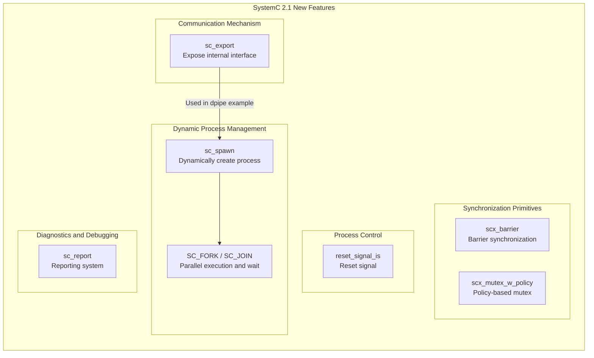

# SystemC 2.1 -- New Feature Examples

> **Difficulty**: Intermediate | **Prerequisites**: Basic SystemC module, port, channel concepts | **Source code**: `ref/systemc/examples/sysc/2.1/`

## Overview

SystemC 2.1 introduced several important language extensions that bring the simulation framework closer to the parallel programming models familiar to modern software engineers. This directory contains 7 examples, each demonstrating a new feature in version 2.1.

If you are a software engineer, think of SystemC 2.1 as a major **framework upgrade** -- just as Python added asyncio and type hints when upgrading from 2 to 3, SystemC 2.1 added dynamic processes, fork-join, export mechanisms, and more.

## Software Analogy Overview

| SystemC 2.1 Feature | Software Analogy | Problem Solved |
| --- | --- | --- |
| `sc_export` | Dependency Injection / Exposing internal service APIs | Makes a submodule's channel interface visible externally without extra port forwarding |
| `sc_spawn` (dynamic process) | Dynamically creating threads (`threading.Thread()` / Python coroutine (asyncio)) | Dynamically creating new execution units during simulation runtime |
| `SC_FORK` / `SC_JOIN` | `Python asyncio.gather()` / `Python asyncio.Future` | Dispatch multiple tasks in parallel, wait for all to complete before continuing |
| `reset_signal_is` | Graceful restart / Circuit breaker pattern | When a reset signal triggers, the thread automatically returns to its initial state |
| `sc_report` | Logging framework (Python logging) | Unified message reporting mechanism with filtering by severity and ID |
| `scx_barrier` | `Python threading.Barrier` | Multiple threads wait at the same synchronization point, all released together once everyone arrives |
| `scx_mutex_w_policy` | Mutex with fairness policy (`Python threading.Lock`) | Mutex supporting FIFO or RANDOM arbitration policies |

## Architecture Concept Diagram

## File List

| Example Directory | Description | Software Analogy | Documentation Link |
| --- | --- | --- | --- |
| `dpipe/` | Dynamic delay pipeline using `sc_export` to expose FIFO interface | Dynamic thread pool | [dpipe.md](dpipe.md) |
| `forkjoin/` | Fork-join parallel execution and dynamic process creation | `Python asyncio.gather()` | [forkjoin.md](forkjoin.md) |
| `reset_signal_is/` | Reset signal controls the reset behavior of clocked threads | Graceful restart | [reset-signal-is.md](reset-signal-is.md) |
| `sc_export/` | `sc_export` mechanism: exposing a submodule's channel interface to the outside | Dependency Injection | [sc-export.md](sc-export.md) |
| `sc_report/` | Reporting and messaging system with severity levels and custom handlers | Logging framework | [sc-report.md](sc-report.md) |
| `scx_barrier/` | Barrier synchronization primitive, multiple threads wait until all arrive | `Python threading.Barrier` | [scx-barrier.md](scx-barrier.md) |
| `scx_mutex_w_policy/` | Mutex supporting FIFO / RANDOM arbitration policies | `Python threading.Lock` with fairness | [scx-mutex-w-policy.md](scx-mutex-w-policy.md) |

## Core Concepts Quick Reference

| SystemC Concept | Software Equivalent | Description |
| --- | --- | --- |
| `sc_export<IF>` | API endpoint exposing an internal service | Lets an external port bind directly to a submodule's internal channel, without creating a forwarding port in the parent module |
| `sc_spawn()` | Python coroutine (asyncio) / `threading.Thread(target=runnable)` | Dynamically creates SC_THREAD or SC_METHOD during simulation runtime |
| `SC_FORK` / `SC_JOIN` | `Python asyncio.gather(p1, p2, p3)` | Wraps multiple `sc_spawn` calls with macros, waits for all processes to finish |
| `reset_signal_is()` | Registering a shutdown hook / circuit breaker trigger | When the specified signal reaches a certain value, the thread automatically re-executes from the beginning |
| `sc_report_handler` | `logging.Logger` (Python logging) | Configures handling actions for different message IDs and severity levels |
| `scx_barrier` | `Python threading.Barrier` | When the counter reaches zero, all waiting threads are released simultaneously |
| `sc_mutex` + policy | `Python threading.Lock` | When multiple processes contend, the policy determines who acquires the lock first |

## Suggested Learning Path

1. **Getting started**: Read [sc-export.md](sc-export.md) first -- `sc_export` is the most fundamental new concept in version 2.1
2. **Advanced communication**: Read [dpipe.md](dpipe.md) -- combines `sc_export` with `SC_METHOD` to implement a pipeline
3. **Dynamic processes**: Read [forkjoin.md](forkjoin.md) -- learn `sc_spawn` and `SC_FORK/SC_JOIN`
4. **Synchronization primitives**: Read [scx-barrier.md](scx-barrier.md) and [scx-mutex-w-policy.md](scx-mutex-w-policy.md)
5. **Process control**: Read [reset-signal-is.md](reset-signal-is.md) -- understand the software equivalent of hardware reset
6. **Diagnostic tools**: Read [sc-report.md](sc-report.md) -- learn about SystemC's logging framework
