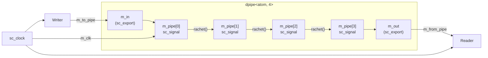
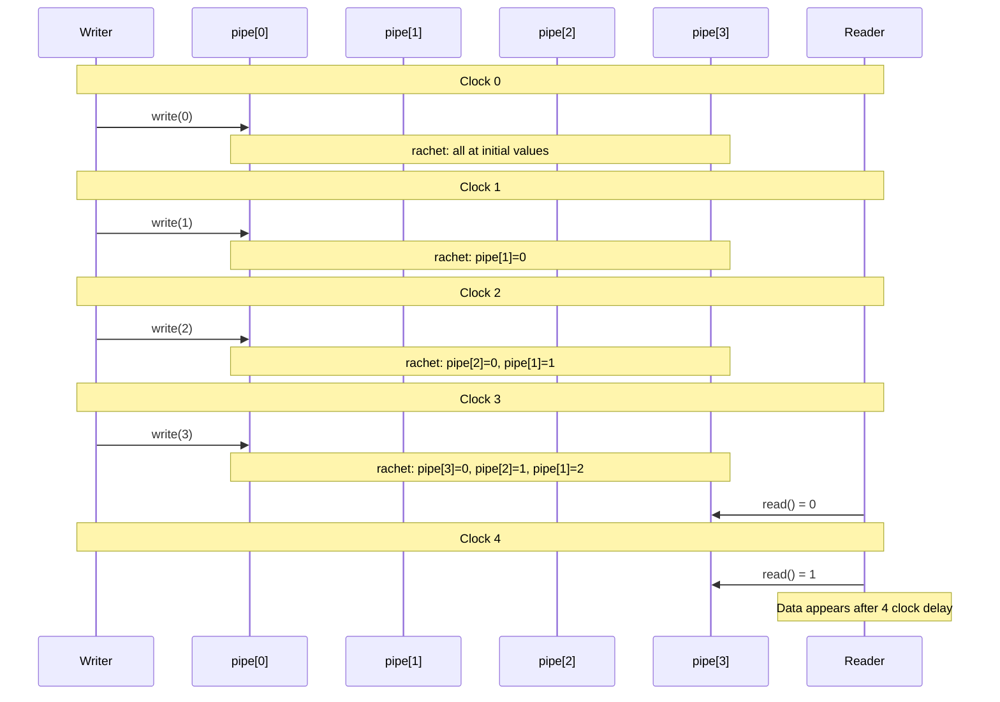

# dpipe -- Dynamic Delay Pipeline

> **Difficulty**: Intermediate | **Software Analogy**: Fixed-depth data delay queue / Multi-stage buffer pipeline | **Source code**: `ref/systemc/examples/sysc/2.1/dpipe/main.cpp`

## Overview

The `dpipe` example implements a **delay pipeline**: data is written at one end and appears at the other end after N clock cycles. This is an extremely common pattern in hardware design -- used to match timing delays between different modules.

### Software Analogy: Fixed-Delay Data Queue

Imagine you are designing a **message processing system** that needs to delay each message by a fixed amount of time before sending it (e.g., simulating network latency):

```python
# Python analogy: fixed delay pipeline
class DelayPipeline:
    def __init__(self, stages=4):
        self.pipe = [None] * stages  # N-stage registers

    def tick(self):
        """Called once per clock"""
        for i in range(len(self.pipe)-1, 0, -1):
            self.pipe[i] = self.pipe[i-1]  # Shift one position forward

    def write(self, value):
        self.pipe[0] = value

    def read(self):
        return self.pipe[-1]  # Appears after N ticks
```

The SystemC version does exactly the same thing, but uses `sc_export` to expose the write and read interfaces.

## Architecture Diagrams

### Module Connection Diagram



### Class Relationship Diagram

```mermaid
classDiagram
    class dpipe~T_N~ {
        +sc_in_clk m_clk
        +sc_export~sc_signal_inout_if~ m_in
        +sc_export~sc_signal_in_if~ m_out
        -sc_signal~T~ m_pipe[N]
        -rachet() void
    }

    class Writer {
        +sc_in_clk m_clk
        +sc_inout~atom~ m_to_pipe
        -atom m_counter
        -insert() void
    }

    class Reader {
        +sc_in_clk m_clk
        +sc_in~atom~ m_from_pipe
        -extract() void
    }

    Writer -->|"via sc_export"| dpipe : write
    dpipe -->|"via sc_export"| Reader : read
```

## Code Analysis

### `dpipe` -- Delay Pipeline Module

```cpp
template<class T, int N>
SC_MODULE(dpipe) {
    typedef sc_export<sc_signal_inout_if<T> > in;   // Write-end export type
    typedef sc_export<sc_signal_in_if<T> >    out;  // Read-end export type

    SC_CTOR(dpipe)
    {
        m_in(m_pipe[0]);       // Export bound to the first-stage signal
        m_out(m_pipe[N-1]);    // Export bound to the last-stage signal
        SC_METHOD(rachet);
        sensitive << m_clk.pos();  // Triggered on each clock rising edge
    }

    void rachet()
    {
        for ( int i = N-1; i > 0; i-- )
        {
            m_pipe[i].write(m_pipe[i-1].read());  // Shift data one position forward
        }
    }

    sc_in_clk    m_clk;
    in           m_in;       // External writes through this export
    out          m_out;      // External reads through this export
    sc_signal<T> m_pipe[N];  // N-stage pipeline registers
};
```

**Key Design Points**:

1. **Purpose of `sc_export`**: `m_in` is an `sc_export<sc_signal_inout_if<T>>` that exposes the **write interface** of the internal `m_pipe[0]` (an `sc_signal`) to the outside. The external `Writer` can write directly to `m_pipe[0]` through this export, as if it were directly connected to that signal.

   Software analogy: This is like a microservice architecture where a service exposes its internal database API through a gateway -- the outside does not need to know the internal implementation details.

2. **`SC_METHOD(rachet)`**: `rachet()` is triggered once per clock. It does not call `wait()`, just performs one data shift. This is like a timer-triggered callback.

3. **Template parameters**: `T` is the data type, `N` is the pipeline depth. In this example, `dpipe<atom, 4>` is used, where `atom` is `sc_biguint<121>` (a 121-bit unsigned integer).

### `Writer` -- Write End

```cpp
SC_MODULE(Writer)
{
    SC_CTOR(Writer)
    {
        SC_METHOD(insert);
        sensitive << m_clk.pos();
        m_counter = 0;
    }

    void insert()
    {
        m_to_pipe.write(m_counter);
        m_counter++;
    }

    sc_in_clk       m_clk;
    atom            m_counter;
    sc_inout<atom > m_to_pipe;  // Connected to dpipe's m_in export
};
```

Each clock writes an incrementing number. `m_to_pipe` is an `sc_inout` port that writes directly into `dpipe`'s internal `m_pipe[0]` through the `sc_export`.

### `Reader` -- Read End

```cpp
void extract()
{
    cout << sc_time_stamp().to_double() << ": " << m_from_pipe.read() << endl;
}
```

Each clock reads the pipeline output once. Since the pipeline depth is 4, a written number appears at the read end after 4 clocks.

### Connection

```cpp
dpipe<atom,4> delay("pipe");
Reader        reader("reader");
Writer        writer("writer");

reader.m_from_pipe(delay.m_out);  // Port bound to sc_export
writer.m_to_pipe(delay.m_in);    // Port bound to sc_export
```

The subtlety here is that `delay.m_out` is an `sc_export`, but `reader.m_from_pipe` is an ordinary `sc_in` port. An `sc_export` can be directly bound to an `sc_port` because an export essentially "exposes" the underlying channel's interface.

## Execution Timing



## Design Rationale

### Why use `sc_export` instead of directly exposing the signal?

If `m_pipe[0]` were made public directly, the outside could access all of `sc_signal`'s methods (including methods that should not be used externally). `sc_export<sc_signal_inout_if<T>>` only exposes the methods defined by the `sc_signal_inout_if` interface, achieving **interface segregation**.

This is equivalent to **encapsulation** in software: instead of exposing the entire object, you only expose a restricted interface.

### Why does `rachet()` write from back to front?

```cpp
for ( int i = N-1; i > 0; i-- )
    m_pipe[i].write(m_pipe[i-1].read());
```

If written from front to back (`i = 0` to `N-1`), all signals would be overwritten with the value of `m_pipe[0]` in the same iteration. Writing from back to front ensures each value is correctly shifted by one position. This is the classic shift register implementation pattern.
