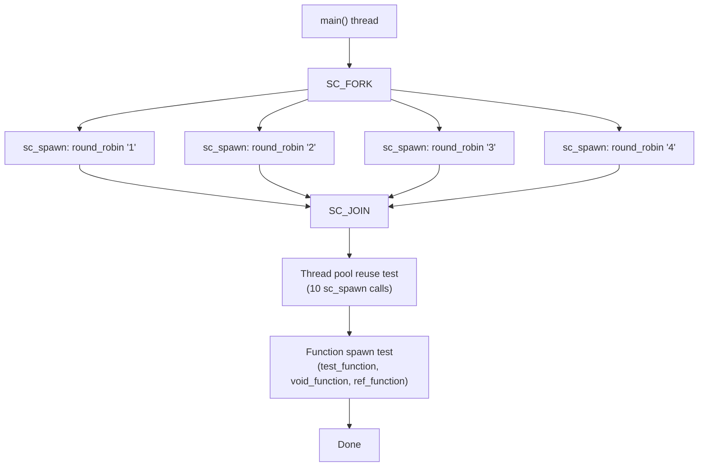
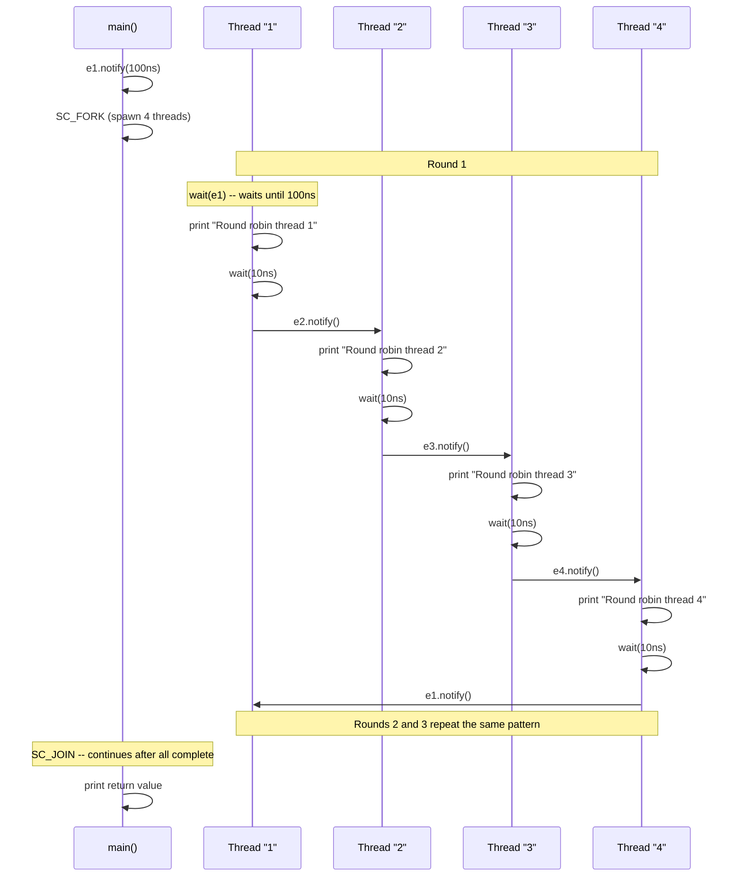

# forkjoin -- Fork-Join Parallel Execution

> **Difficulty**: Intermediate | **Software Analogy**: `Python asyncio.gather()` / `Python asyncio.Future` / Python coroutine group | **Source code**: `ref/systemc/examples/sysc/2.1/forkjoin/forkjoin.cpp`

## Overview

The `forkjoin` example demonstrates SystemC 2.1's **dynamic process creation** (`sc_spawn`) and **fork-join parallel execution pattern** (`SC_FORK` / `SC_JOIN`). This allows you to dynamically create multiple threads during simulation runtime and wait for all of them to complete.

### Software Analogy: Python asyncio.gather()

In Python, when you need to dispatch multiple asynchronous tasks in parallel and wait for all of them to complete:

```python
# Python asyncio analogy
import asyncio

async def main():
    results = await asyncio.gather(
        fetch('/api/task1'),
        fetch('/api/task2'),
        fetch('/api/task3'),
        fetch('/api/task4'),
    )
    print("All tasks completed")
```

Or using threading:

```python
# Python threading analogy
import threading

barrier = threading.Barrier(4)
threads = []
for i in range(4):
    t = threading.Thread(target=do_work, args=(i,))
    threads.append(t)
    t.start()
for t in threads:
    t.join()  # Wait for all threads to complete
```

SystemC's `SC_FORK` / `SC_JOIN` does exactly the same thing.

## Architecture Diagrams

### Execution Flow Diagram



### Round-Robin Event Chain



## Code Analysis

### Part 1: SC_FORK / SC_JOIN

```cpp
SC_FORK
    sc_spawn(&r,
        sc_bind(&top::round_robin, this, "1", sc_ref(e1), sc_ref(e2), 3), "1") ,
    sc_spawn(&r,
        sc_bind(&top::round_robin, this, "2", sc_ref(e2), sc_ref(e3), 3), "2") ,
    sc_spawn(&r,
        sc_bind(&top::round_robin, this, "3", sc_ref(e3), sc_ref(e4), 3), "3") ,
    sc_spawn(&r,
        sc_bind(&top::round_robin, this, "4", sc_ref(e4), sc_ref(e1), 3), "4") ,
SC_JOIN
```

**Layer-by-layer breakdown**:

| Element | Description | Software Analogy |
| --- | --- | --- |
| `SC_FORK` / `SC_JOIN` | Dispatch multiple processes, wait for all to finish | `Python asyncio.gather(...)` |
| `sc_spawn(&r, func, "name")` | Dynamically create a process, `&r` receives the return value | `threading.Thread(target=func)` with return value |
| `sc_bind(&top::round_robin, this, ...)` | Bind a member function and arguments into a callable | `std::bind` / lambda capture |
| `sc_ref(e1)` | Pass `sc_event` by reference | C++ `std::ref` |

**Significance of `sc_spawn`**: In SystemC 2.0 and earlier, all processes had to be statically registered during the construction phase (elaboration phase). Version 2.1's `sc_spawn` allows dynamic process creation during simulation runtime -- just like Python can `asyncio.create_task()` at any time.

### Part 2: Round-Robin Function

```cpp
int round_robin(const char *str, sc_event& receive, sc_event& send, int cnt)
{
    while (--cnt >= 0)
    {
        wait(receive);   // Wait for the previous thread to notify me
        cout << "Round robin thread " << str
             << " at time " << sc_time_stamp() << endl;
        wait(10, SC_NS); // Do some work (simulate delay)
        send.notify();   // Notify the next thread
    }
    return 0;
}
```

This is an **event chain** pattern: each thread waits for its own event, processes it, then triggers the next thread's event. This forms a circular round-robin execution pattern.

Software analogy: This is similar to multiple Python coroutines forming a pipeline through queues:

```python
# Python asyncio analogy
import asyncio

async def round_robin(name: str, receive: asyncio.Queue, send: asyncio.Queue, cnt: int):
    for i in range(cnt):
        await receive.get()           # Wait for the previous one
        print(f"Thread {name}")
        await asyncio.sleep(0.01)
        await send.put(None)          # Notify the next one
```

### Part 3: Thread Pool Reuse

```cpp
for (int i = 0 ; i < 10; i++)
    sc_spawn(&r, sc_bind(&top::wait_and_end, this, i));

wait(20, SC_NS);
```

Spawns 10 threads in succession, each waiting a different amount of time before finishing. This tests whether SystemC's internal thread pool can correctly reuse finished threads -- just like Python's `concurrent.futures.ThreadPoolExecutor` reuses worker threads.

### Part 4: Spawning Regular Functions

```cpp
// Spawn a free function (non-member function) and retrieve its return value
wait( sc_spawn(&r, sc_bind(&test_function, 3.14159)).terminated_event() );
cout << "Returned int is " << r << endl;

// Spawn a void function
sc_process_handle handle1 = sc_spawn(sc_bind(&void_function, 1.2345));
wait(handle1.terminated_event());

// Spawn a function with const reference parameter
double d = 9.8765;
wait( sc_spawn(&r, sc_bind(&ref_function, sc_cref(d))).terminated_event() );
```

**Key concepts**:
- `sc_spawn` returns `sc_process_handle`, which can be used to wait for the process to finish
- `.terminated_event()` returns an `sc_event` that triggers when the process terminates
- `wait(handle.terminated_event())` is equivalent to Python's `thread.join()`
- `sc_cref(d)` passes the argument as a const reference

## Core API Summary

| API | Description | Software Analogy |
| --- | --- | --- |
| `sc_spawn(&ret, func, "name")` | Dynamically create a process | `asyncio.create_task()` / `threading.Thread()` |
| `sc_bind(func, args...)` | Bind a function with arguments | `std::bind` / lambda |
| `sc_ref(x)` / `sc_cref(x)` | Pass by reference / const reference | `std::ref` / `std::cref` |
| `SC_FORK ... SC_JOIN` | Dispatch in parallel, wait for all to complete | `Python asyncio.gather()` |
| `handle.terminated_event()` | Event triggered when the process ends | `thread.join()` |
| `sc_spawn_options` | Spawn options (e.g., stack size) | `threading.Thread` configuration |

## Design Rationale

### Why are dynamic processes needed?

In hardware simulation, many scenarios require dynamically creating execution units:
- **Transaction-level modeling (TLM)**: Each transaction may need an independent thread to track it
- **Testbench**: Tests need to dynamically generate different stimuli
- **Protocol modeling**: Protocol message handling may need to track multiple state machines in parallel

This is like a web server creating a Python coroutine (asyncio) / thread for each request -- you cannot know at compile time how many requests there will be.

### SC_FORK/SC_JOIN vs Manual spawn + wait

```cpp
// Manual approach (verbose)
auto h1 = sc_spawn(...);
auto h2 = sc_spawn(...);
wait(h1.terminated_event() & h2.terminated_event());

// SC_FORK/SC_JOIN (concise)
SC_FORK
    sc_spawn(...) ,
    sc_spawn(...) ,
SC_JOIN
```

`SC_FORK` / `SC_JOIN` is syntactic sugar (macros) that makes parallel dispatch code cleaner. Note the comma separation (not semicolons) -- this is a syntax requirement of the macros.
