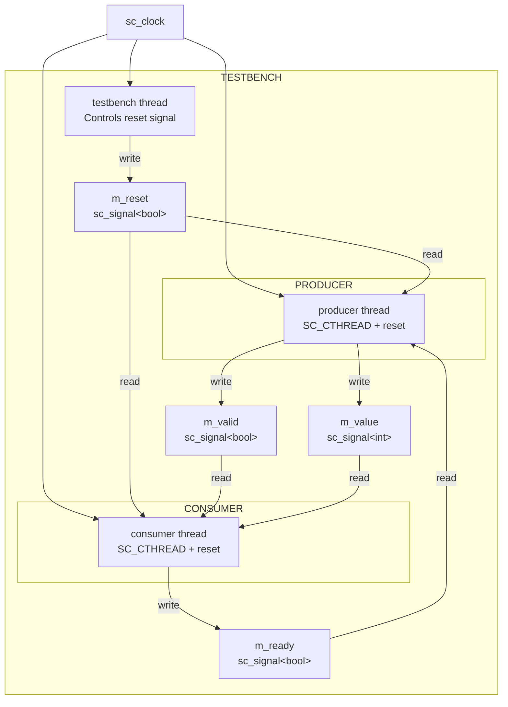
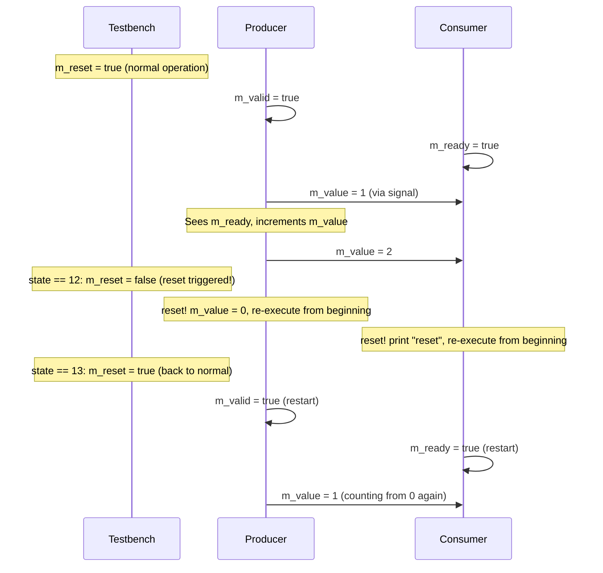
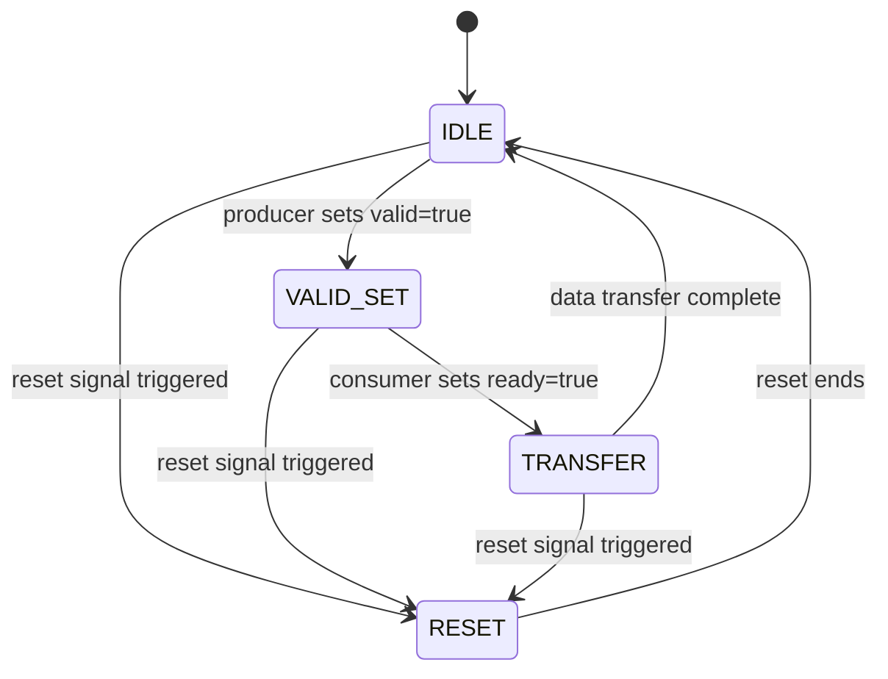

# reset_signal_is -- Reset Signal Mechanism

> **Difficulty**: Intermediate | **Software Analogy**: Graceful restart / Circuit breaker pattern | **Source code**: `ref/systemc/examples/sysc/2.1/reset_signal_is/reset_signal_is.cpp`

## Overview

The `reset_signal_is` example demonstrates how to configure a **reset signal** for an `SC_CTHREAD` (clocked thread). When the reset signal triggers, the thread automatically returns to the beginning of its function and re-executes, as if being "restarted."

### Software Analogy: Graceful Restart / Circuit Breaker

Imagine you have a long-running worker thread that needs to be restarted when the system detects an anomaly:

```python
# Python analogy
class Worker:
    def run(self):
        while True:
            if self.reset_signal:
                self.cleanup()
                continue  # Go back to the top of while, reinitialize

            # Normal work logic
            self.do_work()
```

Or similar to the **circuit breaker pattern** in microservice architecture: when a service fails too many times, the breaker trips (reset), and the service returns to its initial state waiting for recovery.

In the hardware world, reset is a very fundamental concept -- every chip has a reset pin, and pressing it returns all registers to their initial values. `reset_signal_is` lets you express this behavior in SystemC code.

## Architecture Diagrams

### Module Connection Diagram



### Data Flow and Handshake Protocol



## Code Analysis

### CONSUMER -- Consumer (with reset)

```cpp
SC_MODULE(CONSUMER)
{
    SC_CTOR(CONSUMER)
    {
        SC_CTHREAD(consumer, m_clk.pos());
        reset_signal_is(m_reset, false);  // Trigger reset when m_reset is false
    }
    void consumer()
    {
        cout << sc_time_stamp() << ": reset" << endl;  // Starts here after reset
        while (1)
        {
            m_ready = true;
            do { wait(); } while ( !m_valid );  // Wait until valid is true
            cout << sc_time_stamp() << ": " << m_value.read() << endl;
        }
    }
};
```

**Key concepts**:

1. **`SC_CTHREAD(consumer, m_clk.pos())`**: `SC_CTHREAD` is a clocked thread -- it is only woken up on the clock rising edge. This differs from `SC_THREAD`, which can wait on arbitrary events.

2. **`reset_signal_is(m_reset, false)`**: When `m_reset` has the value `false`, this thread will be reset. The effect of reset is: **the thread re-executes from the first line of the function**.

   Software analogy: This is like wrapping the entire function in a `try-catch`, where reset throws a special exception that is caught by the outer layer, which then re-calls the function:

   ```python
   # Python analogy
   while True:
       try:
           consumer()  # Normal execution
       except ResetException:
           # Reset triggered, restart
           continue
   ```

3. **`do { wait(); } while (!m_valid)`**: This is the classic **handshake** pattern in hardware design -- wait until the other side is ready before proceeding. Each `wait()` waits for one clock cycle.

### PRODUCER -- Producer (with reset)

```cpp
void producer()
{
    m_value = 0;       // m_value resets to zero on reset
    while (1)
    {
        m_valid = true;
        do { wait(); } while (!m_ready);  // Wait until consumer is ready
        m_value = m_value + 1;            // Increment counter
    }
}
```

Producer and Consumer form a **handshake protocol**:
- Producer sets `m_valid = true`, indicating data is ready
- Consumer sets `m_ready = true`, indicating it can receive data
- Both sides proceed to the next step only after seeing the other's signal

This is the standard valid/ready handshake pattern in hardware, similar to TCP's three-way handshake or the CSP (Communicating Sequential Processes) model in software.

### TESTBENCH -- Test Bench

```cpp
void testbench()
{
    for ( int state = 0; state < 100; state++ )
    {
        m_reset = ( state%20 == 12 ) ? false : true;
        wait();
    }
    sc_stop();
}
```

The testbench is the controller -- it sets `m_reset` to `false` (triggering reset) at clock cycles 12, 32, 52, 72, and 92, and to `true` (normal operation) at all other times.

```mermaid
gantt
    title Reset Signal Timing
    dateFormat X
    axisFormat %s

    section m_reset
    true (normal)     :0, 12
    false (RESET)     :12, 13
    true (normal)     :13, 32
    false (RESET)     :32, 33
    true (normal)     :33, 52
```



## Core Concepts

### `SC_CTHREAD` vs `SC_THREAD`

| Property | `SC_CTHREAD` | `SC_THREAD` |
| --- | --- | --- |
| Trigger method | Only on specified clock edge | Any event |
| Reset support | Via `reset_signal_is()` | Not directly supported |
| `wait()` semantics | Wait for next clock edge | Wait for specified event or time |
| Software analogy | Timer-triggered worker | General thread |
| Use cases | Synchronous logic (register behavior) | Asynchronous logic, testbench |

### Reset Semantics

When reset triggers:
1. The thread's execution is interrupted
2. The thread re-executes from the **first line** of the function (not from the `wait()` position)
3. All local variables return to uninitialized state
4. But signal and port values are **not** automatically reset -- you need to manually set initial values at the beginning of the function

This is why `producer()` writes `m_value = 0` at the start -- this line serves as both the normal initialization and the re-initialization after reset.

## Design Rationale

### Why Does Hardware Need Reset?

In the software world, memory is initialized when a program starts (or at least there is a clear initialization flow). But in hardware:
- Register values after power-on are **undefined** (could be 0 or 1)
- A reset signal is needed to set all registers to known initial values
- Reset is also used for error recovery -- when hardware enters an abnormal state, reset can bring it back to normal

`reset_signal_is` lets you precisely model this behavior in SystemC, ensuring simulation results match real hardware.

### Valid/Ready Handshake Pattern



This handshake pattern ensures reliable data transfer: transfer only occurs when both sides are ready. Triggering reset at any point will not cause data errors.
