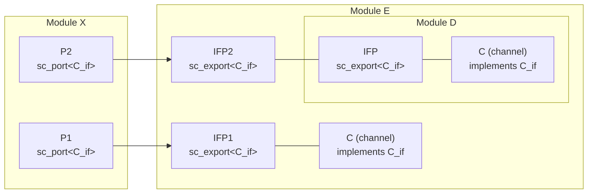
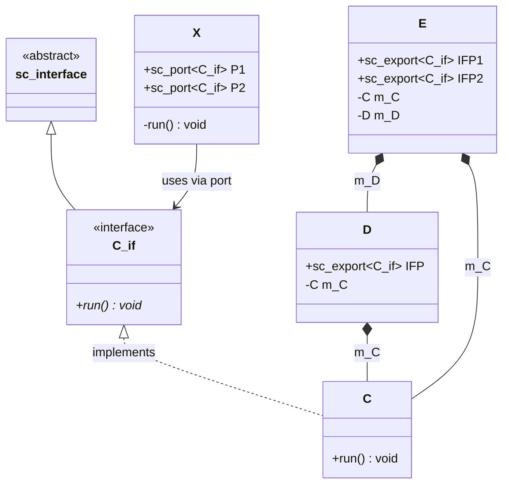
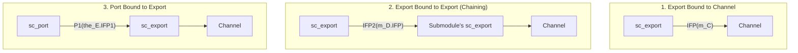

# sc_export -- Interface Export Mechanism

> **Difficulty**: Intermediate | **Software Analogy**: Dependency Injection / Exposing internal service APIs | **Source code**: `ref/systemc/examples/sysc/2.1/sc_export/main.cpp`

## Overview

The `sc_export` example demonstrates the `sc_export` mechanism introduced in SystemC 2.1. `sc_export` allows a module to expose its **internal channel's interface** to the outside, without needing to create forwarding ports at every level.

### Software Analogy: Exposing an Internal Service's API

Imagine you have a microservice `E` that internally contains two database services `C1` and `C2` (where `C2` is wrapped inside a sub-service `D`). An external client `X` needs to access both databases:

```
Without sc_export (traditional approach):
  X --> E.proxy1 --> C1
  X --> E.proxy2 --> D.proxy --> C2
  (Need to write forwarding proxies at every level)

With sc_export:
  X --> E.IFP1 --> C1       (direct exposure)
  X --> E.IFP2 --> D.IFP --> C2  (chained exposure)
```

This is like an API Gateway where you do not need to write proxy endpoints at every level, but instead directly "export" the underlying service's API.

## Architecture Diagrams

### ASCII Architecture Diagram from Source Code (translated)

```
          +-------------+             +------------------+
          |     X       |             |    E    +----+   |
          |             |P1       IFP1|         | C  |   |
          |            [ ]------------O---------@    |   |
          |             |             |         |    |   |
          |             |             |         +----+   |
          |             |             |                  |
          |             |             |     +----------+ |
          |             |             |     | D        | |
          |             |             |     |   +----+ | |
          |             |P2       IFP2|  IFP|   | C  | | |
          |            [ ]------------O-----O---@    | | |
          |             |             |     |   |    | | |
          |             |             |     |   +----+ | |
          |             |             |     |          | |
          |             |             |     +----------+ |
          +-------------+             +------------------+

 [ ] = port    O = sc_export    @ = channel (interface implementation)
```

### Mermaid Architecture Diagram



### Class Relationship Diagram



## Code Analysis

### Interface and Channel Definition

```cpp
// Interface: defines the run() method
class C_if : virtual public sc_interface
{
public:
    virtual void run() = 0;
};

// Channel: implements the C_if interface
class C : public C_if, public sc_channel
{
public:
    SC_CTOR(C) { }
    virtual void run()
    {
        cout << sc_time_stamp() << " In Channel run() " << endl;
    }
};
```

`C_if` is a pure virtual interface, and `C` is the channel that implements this interface. In software, this is the standard interface + implementation pattern.

### Module D: Single-Level Export

```cpp
SC_MODULE( D )
{
    sc_export<C_if> IFP;   // Expose C_if interface to the outside

    SC_CTOR( D )
        : IFP("IFP"), m_C("C")
    {
        IFP( m_C );   // Binding: sc_export points to the internal channel
    }
 private:
    C m_C;             // Internal channel instance
};
```

**`IFP( m_C )`** -- This line is the core. It tells the `sc_export`: "expose `m_C`'s `C_if` interface to the outside." After this, any port bound to `IFP` that calls `->run()` will actually call `m_C.run()`.

Software analogy:

```python
# Python analogy (using ABC)
from abc import ABC, abstractmethod

class C_if(ABC):
    @abstractmethod
    def run(self) -> None: ...

class C(C_if):
    def run(self) -> None:
        print("In Channel run()")

class D:
    def __init__(self):
        self._channel = C()

    # Instead of exposing the entire C object, only expose the C_if interface
    def get_interface(self) -> C_if:
        return self._channel
```

### Module E: Multi-Level Export and Export Chaining

```cpp
SC_MODULE( E )
{
    sc_export<C_if> IFP1;
    sc_export<C_if> IFP2;

    SC_CTOR( E )
        : m_C("C"), m_D("D"), IFP1("IFP1")
    {
        IFP1( m_C );         // Export bound to its own channel
        IFP2( m_D.IFP );     // Export bound to a submodule's export (chaining!)
    }

 private:
    C m_C;                    // Its own channel
    D m_D;                    // Submodule (contains another channel)
};
```

**`IFP2( m_D.IFP )`** -- This demonstrates the **chaining** capability of `sc_export`. `E`'s `IFP2` is not bound to a channel, but to `D`'s `IFP` (another `sc_export`). Ultimately, calling `run()` through `IFP2` traces all the way to `m_C.run()` inside `D`.

Software analogy: This is like layer-by-layer forwarding in an API Gateway:

```
Client -> Gateway.IFP2 -> SubService.IFP -> Internal.Channel.run()
```

### Module X: Using Ports to Connect to Exports

```cpp
SC_MODULE( X )
{
    sc_port<C_if> P1;
    sc_port<C_if> P2;

    void run() {
        wait(10, SC_NS);
        P1->run();       // Via P1 -> E.IFP1 -> E.m_C.run()
        wait(10, SC_NS);
        P2->run();       // Via P2 -> E.IFP2 -> D.IFP -> D.m_C.run()
    }
};
```

`X` has no knowledge of what `P1` and `P2` are connected to behind the scenes -- it could be a direct channel, or a channel accessed through multiple layers of export forwarding. This is the power of **polymorphism** and **encapsulation**.

### Connection and Execution

```cpp
int sc_main(int , char** ) {
    E the_E("E");
    X the_X("X");

    the_X.P1( the_E.IFP1 );    // Port bound to export
    the_X.P2( the_E.IFP2 );    // Port bound to export

    sc_start(17, SC_NS);
    the_E.IFP1->run();          // Can also call directly through the export
    sc_start(50, SC_NS);
}
```

**Note**: `the_E.IFP1->run()` demonstrates `sc_export`'s `operator->`, which lets you call interface methods directly through the export without going through a port.

## Comparison of Three Binding Methods



| Binding Method | Code | Purpose |
| --- | --- | --- |
| Export -> Channel | `IFP(m_C)` | Most basic: expose an internal channel |
| Export -> Export | `IFP2(m_D.IFP)` | Chaining: expose a submodule's export |
| Port -> Export | `P1(the_E.IFP1)` | Consumer side: port connects to an export |

## Design Rationale

### `sc_export` vs Traditional Port Forwarding

Without `sc_export`, you would need to create ports at every module level to "forward" the internal channel's interface:

```
Traditional approach:
  X.P1 -> E.port_in -> E internally uses SC_METHOD to forward -> E.m_C

sc_export approach:
  X.P1 -> E.IFP1 -> E.m_C (direct pass-through, no forwarding needed)
```

`sc_export` eliminates the intermediate forwarding code, making the module hierarchy cleaner.

### Directionality of `sc_port` vs `sc_export`

| Element | Direction | Description |
| --- | --- | --- |
| `sc_port<IF>` | Requests outward | "I need something that implements IF" -- provided by the outside |
| `sc_export<IF>` | Provides outward | "I provide an implementation of IF" -- already available internally |

Software analogy:
- `sc_port` is like a dependency parameter in a constructor: `class X { X(Database db) {...} }` -- "give me a Database"
- `sc_export` is like an external API endpoint: `class E { Database getDB() {...} }` -- "I provide a Database"
