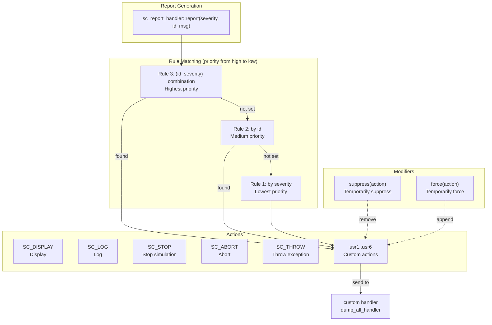
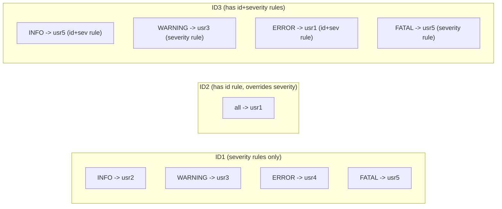

# sc_report -- Reporting and Messaging System

> **Difficulty**: Intermediate | **Software Analogy**: Logging framework (Python logging, C++ spdlog) | **Source code**: `ref/systemc/examples/sysc/2.1/sc_report/main.cpp`

## Overview

The `sc_report` example demonstrates SystemC's **reporting system**, which is a full-featured logging framework. You can configure different handling actions based on **message ID** and **severity level**, such as displaying, logging, stopping the simulation, or calling a custom handler.

### Software Analogy: Python logging

If you have used Python's logging module, SystemC's `sc_report` does exactly the same thing:

```python
# Python logging analogy
import logging

# Configure different loggers with different levels and handlers
logging.getLogger("DB").setLevel(logging.WARNING)     # Set by ID
logging.getLogger("HTTP").setLevel(logging.DEBUG)

# Configure different handling for different severity levels
handler = logging.StreamHandler()
handler.addFilter(SeverityFilter(logging.ERROR))      # Set by severity
```

```python
# C++ spdlog concept analogy (expressed via Python logging)
logging.getLogger("ID1").setLevel(logging.WARNING)
logging.getLogger("ID2").setLevel(logging.DEBUG)

# Custom handler
logging.getLogger("ID3").addHandler(CustomHandler())
```

## Architecture Diagrams

### Reporting System Concept Diagram



### Rule Priority Matrix

Rules configured in the example:



## Code Analysis

### User-Defined Actions

```cpp
const unsigned num_usr_actions = 6;
sc_actions usr_actions[num_usr_actions];

void allocate_user_actions()
{
    for (unsigned int n = 0; n < 1000; n++) {
        sc_actions usr = sc_report_handler::get_new_action_id();
        if (usr == SC_UNSPECIFIED) {
            cout << "We got " << n << " user-defined actions\n";
            break;
        }
        if (n < num_usr_actions)
            usr_actions[n] = usr;
    }
}
```

`sc_actions` is a bitmask where each action occupies one bit. SystemC predefines several actions:

| Predefined Action | Description | Software Analogy |
| --- | --- | --- |
| `SC_DO_NOTHING` | Do nothing | `logging.NOTSET` |
| `SC_DISPLAY` | Display to console | `StreamHandler` |
| `SC_LOG` | Write to log | `FileHandler` |
| `SC_CACHE_REPORT` | Cache the report object | Keep in memory |
| `SC_THROW` | Throw a C++ exception | `throw` |
| `SC_STOP` | Stop simulation | `sys.exit()` |
| `SC_ABORT` | Abort immediately (`abort()`) | `os._exit(1)` |

`get_new_action_id()` lets you allocate additional custom actions (used to identify them in custom handlers).

### Custom Handler

```cpp
void dump_all_handler(const sc_report& report, const sc_actions& actions)
{
    cout << "report: " << report.get_msg_type()
         << " " << severity2str[report.get_severity()];
    cout << " --> ";
    // Print all triggered actions
    for (int n = 0; n < 32; n++) {
        sc_actions action = actions & 1 << n;
        if (action) {
            // Print action name
        }
    }
    cout << " msg=" << report.get_msg()
         << " file=" << report.get_file_name()
         << " line " << report.get_line_number()
         << " time=" << report.get_time()
         << " process=" << report.get_process_name();
}
```

The handler signature is `void handler(const sc_report&, const sc_actions&)`. The `sc_report` object contains complete report information:

| Method | Returns | Software Analogy |
| --- | --- | --- |
| `get_msg_type()` | Message ID (e.g., "ID1") | Logger name |
| `get_severity()` | Severity level | Log level |
| `get_msg()` | Additional message | Log message |
| `get_file_name()` | Source file name | `__FILE__` |
| `get_line_number()` | Source line number | `__LINE__` |
| `get_time()` | Simulation time | Timestamp |
| `get_process_name()` | Current process name | Thread name |

### Three-Level Rule Configuration

```cpp
void set_rules()
{
    // Rule 1: by severity (lowest priority)
    sc_report_handler::set_actions(SC_INFO,    usr2);
    sc_report_handler::set_actions(SC_WARNING, usr3);
    sc_report_handler::set_actions(SC_ERROR,   usr4);
    sc_report_handler::set_actions(SC_FATAL,   usr5);

    // Rule 2: by id (medium priority)
    sc_report_handler::set_actions(id2, usr1);

    // Rule 3: by (id, severity) combination (highest priority)
    sc_report_handler::set_actions(id3, SC_INFO,  usr5);
    sc_report_handler::set_actions(id3, SC_ERROR, usr1);
}
```

**Priority** (from high to low):
1. **(id, severity) combination rules** -- Most specific, highest priority
2. **id rules** -- For all severities of a given id
3. **severity rules** -- Global severity level settings

This is similar to Python logging's Logger inheritance hierarchy: more specific logger settings override parent-level settings.

### Suppress and Force

```cpp
// Temporarily suppress usr4 action
sc_report_handler::suppress(usr4);
query_rules(id1);  // At this point, ERROR (originally usr4) will not produce usr4 action
sc_report_handler::suppress();  // Clear suppression

// Temporarily force usr1 action
sc_report_handler::force(usr1);
query_rules(id1);  // All reports will additionally include usr1 action
sc_report_handler::force();  // Clear force
```

| Modifier | Description | Software Analogy |
| --- | --- | --- |
| `suppress(action)` | Temporarily remove a specified action | Temporarily disable a log handler |
| `force(action)` | Temporarily add a specified action | Temporarily enable verbose logging |
| `suppress()` / `force()` | Clear the modifier, restore original settings | Restore default settings |

**Combining suppress and force**:

```cpp
sc_report_handler::force(usr1 | usr3);     // Force add usr1 and usr3
sc_report_handler::suppress(usr3 | usr4);  // Suppress usr3 and usr4
// Result: usr3 is force-added then suppress-removed -> not executed
//         usr1 is force-added -> executed
//         usr4 is suppressed -> not executed
```

## Complete Rule Resolution Table

| ID | Severity | Matched Rule | Resulting Action |
| --- | --- | --- | --- |
| ID1 | INFO | severity rule | usr2 |
| ID1 | WARNING | severity rule | usr3 |
| ID1 | ERROR | severity rule | usr4 |
| ID1 | FATAL | severity rule | usr5 |
| ID2 | INFO | id rule (overrides severity) | usr1 |
| ID2 | WARNING | id rule | usr1 |
| ID2 | ERROR | id rule | usr1 |
| ID2 | FATAL | id rule | usr1 |
| ID3 | INFO | (id,severity) rule | usr5 |
| ID3 | WARNING | severity rule (no specific combination rule) | usr3 |
| ID3 | ERROR | (id,severity) rule | usr1 |
| ID3 | FATAL | severity rule | usr5 |

## Design Rationale

### Why Does SystemC Need Its Own Logging Framework?

1. **Simulation time**: Regular logging only has wall-clock time, but SystemC reports include **simulation time** (`get_time()`), which is critical for debugging timing issues
2. **Process identification**: Reports automatically include the current process name, making it easy to trace which module produced the message
3. **Simulation control**: `SC_STOP` and `SC_ABORT` can directly affect the simulator's execution, which regular logging frameworks cannot do
4. **Bitmask actions**: Each report can trigger a combination of multiple actions, which is more flexible than regular logging's "one level maps to one behavior"
