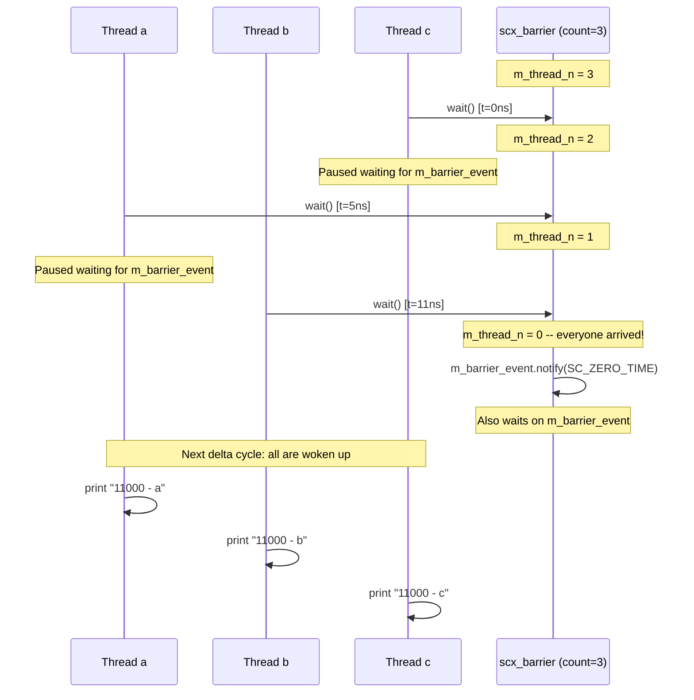
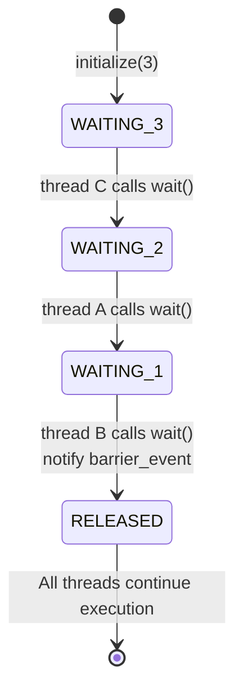

# scx_barrier -- Barrier Synchronization

> **Difficulty**: Beginner | **Software Analogy**: `Python threading.Barrier` / `pthread_barrier` | **Source code**: `ref/systemc/examples/sysc/2.1/scx_barrier/scx_barrier.h`, `ref/systemc/examples/sysc/2.1/scx_barrier/main.cpp`

## Overview

The `scx_barrier` example implements a **barrier synchronization** primitive. Multiple threads each execute until they reach the barrier's `wait()` point and then pause. When **all** threads have arrived at the barrier, they are all released simultaneously to continue execution.

### Software Analogy: Meeting Point

Imagine you and three friends have agreed to meet at a restaurant. Everyone departs from a different location and arrives at different times. **The rule is: everyone must arrive before anyone can enter**.

- Friend C arrives first (0 ns), waits
- Friend A arrives second (5 ns), waits
- Friend B arrives last (11 ns), everyone is here, all enter together

In code:

```python
# Python threading.Barrier analogy
import threading

barrier = threading.Barrier(3)

# Thread A
def thread_a():
    time.sleep(0.005)
    barrier.wait()  # Arrive, wait
    print("A proceeds")

# Thread B
def thread_b():
    time.sleep(0.011)
    barrier.wait()  # Arrive, wait
    print("B proceeds")

# Thread C (arrives fastest)
def thread_c():
    barrier.wait()  # Arrive, wait
    print("C proceeds")

# All print at the same time after the slowest thread arrives
```

## Architecture Diagrams

### Execution Timing



### State Transition Diagram



## Code Analysis

### scx_barrier Class (scx_barrier.h)

```cpp
class scx_barrier {
  public:
    void initialize(int thread_n)
    {
        m_thread_n = thread_n;  // Set the number of threads to wait for
    }

    void wait()
    {
        m_thread_n--;
        if (m_thread_n)
        {
            // Not everyone has arrived yet -> wait
            ::sc_core::wait(m_barrier_event);
        }
        else
        {
            // Last one to arrive -> notify everyone
            m_barrier_event.notify(SC_ZERO_TIME);
            ::sc_core::wait(m_barrier_event);  // Also waits (woken up in the next delta cycle)
        }
    }

  protected:
    sc_event m_barrier_event;   // Synchronization event
    int      m_thread_n;        // Remaining threads to wait for
};
```

**Step-by-step breakdown**:

1. **`initialize(3)`**: Tells the barrier that 3 threads must arrive before all can proceed
2. **Each thread calls `wait()`**: Counter decrements by 1
3. **Counter > 0**: Not everyone has arrived, calls `::sc_core::wait(m_barrier_event)` to pause
4. **Counter = 0**: The last thread has arrived, calls `m_barrier_event.notify(SC_ZERO_TIME)` to wake up all waiting threads
5. **`SC_ZERO_TIME`**: The event fires in the next delta cycle (not immediately), ensuring all waiting threads are woken up in the same delta cycle

**Why does the last thread also `wait(m_barrier_event)`?**

Because `notify(SC_ZERO_TIME)` fires in the next delta cycle. After the last thread calls `wait()`, in the next delta cycle all threads (including the last one) are woken up, ensuring all threads continue execution at **the same point in time**.

### Usage Example (main.cpp)

```cpp
SC_MODULE(X)
{
    SC_CTOR(X)
    {
        SC_THREAD(a);
        SC_THREAD(b);
        SC_THREAD(c);
        m_barrier.initialize(3);  // Synchronize 3 threads
    }
    void a()
    {
        wait(5.0, SC_NS);        // Simulate different arrival times
        m_barrier.wait();         // Wait at the barrier
        printf("%f - a\n", sc_time_stamp().to_double());
    }
    void b()
    {
        wait(11.0, SC_NS);       // Slowest
        m_barrier.wait();
        printf("%f - b\n", sc_time_stamp().to_double());
    }
    void c()
    {
        m_barrier.wait();         // Fastest (arrives immediately)
        printf("%f - c\n", sc_time_stamp().to_double());
    }
    scx_barrier m_barrier;
};
```

**Expected output**:
```
11000 - c
11000 - a
11000 - b
```

All threads print their message at 11 ns (the time the slowest thread b arrives), verifying the barrier's synchronization effect.

## Comparison with Software Synchronization Primitives

| Property | `scx_barrier` | Python `threading.Barrier` | `pthread_barrier` |
| --- | --- | --- | --- |
| Initialization | `initialize(n)` | `threading.Barrier(n)` | `pthread_barrier_init(&b, n)` |
| Wait | `wait()` | `barrier.wait()` | `pthread_barrier_wait()` |
| Reusable | No (one-time use) | Yes (auto-resets) | Yes |
| Arrival notification | Implicit in `wait()` | Implicit in `wait()` | Implicit in `wait()` |
| Timeout support | Via SystemC `wait(event, time)` | `barrier.wait(timeout)` | No |

## Design Rationale

### Why Use `SC_ZERO_TIME` Instead of Immediate `notify()`?

If `m_barrier_event.notify()` (immediate notification) were used, the last thread would not be paused, while other threads would be woken up in the same delta cycle. This could lead to subtle timing differences.

Using `SC_ZERO_TIME` (next delta cycle) ensures:
1. All threads (including the last one) are woken up at the same point in time
2. Semantics are clearer -- barrier release is an atomic operation

### Limitations of This Implementation

- **One-time use**: The counter does not auto-reset after reaching zero, unlike Python's `threading.Barrier`
- **Not a channel**: `scx_barrier` is not an `sc_channel` and cannot be connected via ports
- **Not part of the official standard**: The `scx_` prefix indicates this is an extension, not part of the SystemC standard
