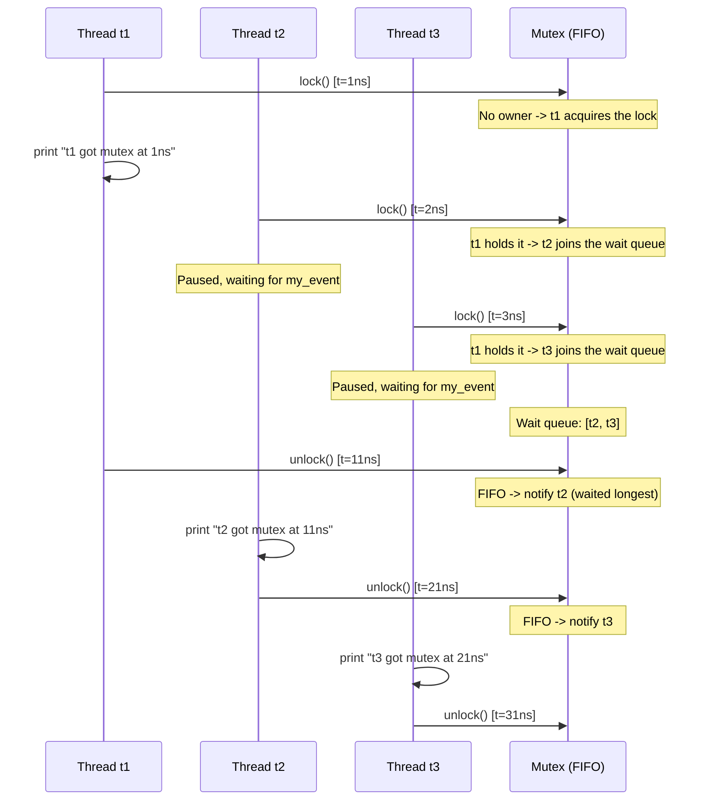
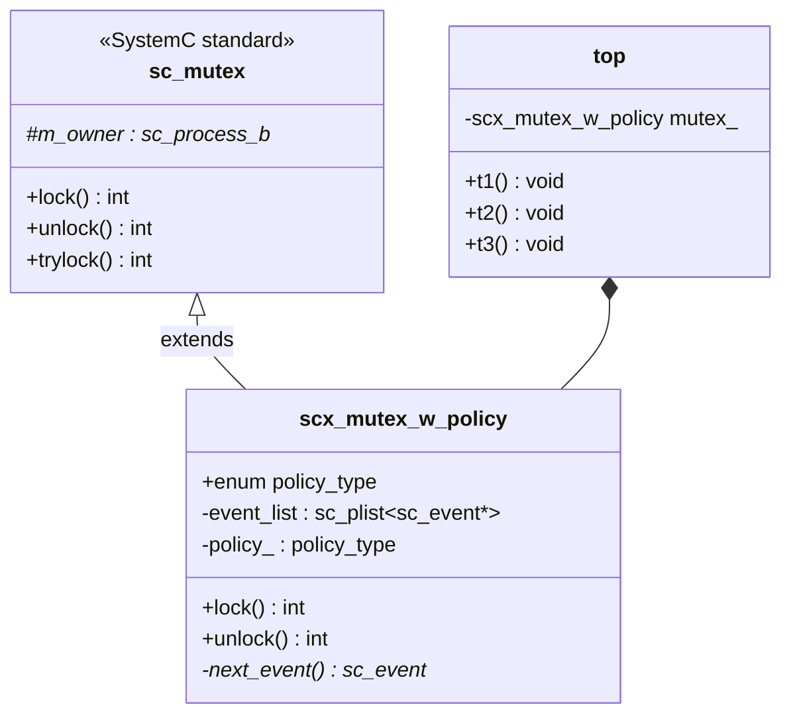
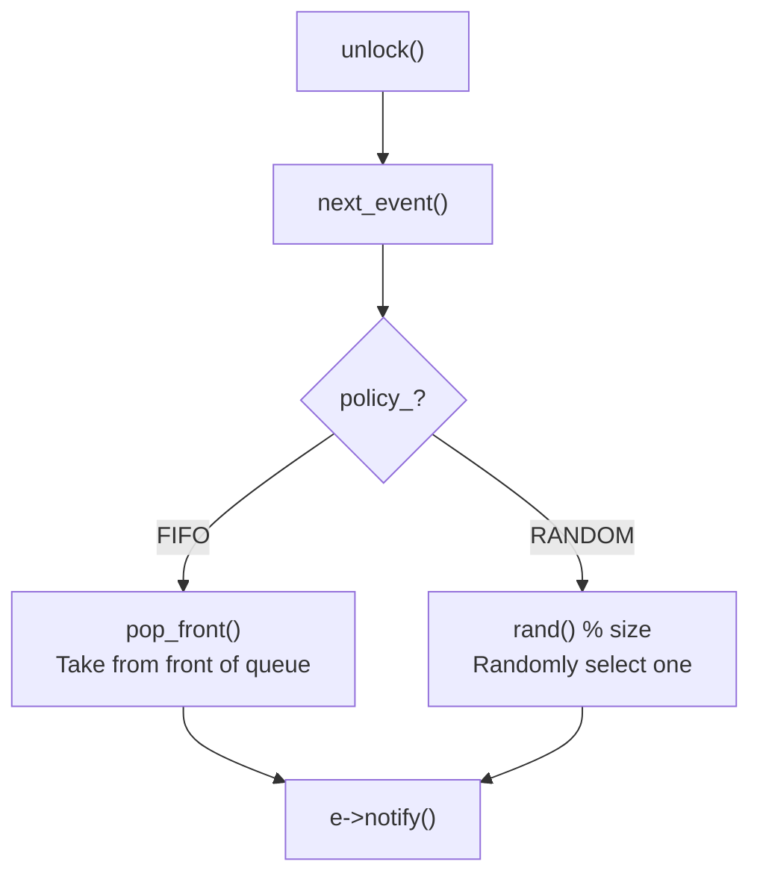

# scx_mutex_w_policy -- Mutex with Arbitration Policy

> **Difficulty**: Intermediate | **Software Analogy**: `Python threading.Lock` with fairness policy | **Source code**: `ref/systemc/examples/sysc/2.1/scx_mutex_w_policy/scx_mutex_w_policy.cpp`

## Overview

The `scx_mutex_w_policy` example implements a **mutex with arbitration policy**. When multiple threads simultaneously contend for a mutex, the standard `sc_mutex` cannot guarantee who acquires the lock first. This extended version provides two policies:
- **FIFO**: First come, first served (fair lock)
- **RANDOM**: Randomly select one of the waiting threads

### Software Analogy: Fair Lock vs Unfair Lock

```python
# Python analogy
import threading

# Python's threading.Lock provides no fairness guarantee
lock = threading.Lock()

# For a fair lock (FIFO), you need a custom implementation (e.g., using queue.Queue with Lock)
# scx_mutex_w_policy lets you explicitly choose FIFO or RANDOM policy
```

## Architecture Diagrams

### FIFO Policy Execution Timing



### Class Relationship Diagram



## Code Analysis

### scx_mutex_w_policy Class

```cpp
class scx_mutex_w_policy : public sc_mutex
{
public:
    enum policy_type { FIFO, RANDOM };

    explicit scx_mutex_w_policy(policy_type policy) : policy_(policy) {}
```

Inherits from the standard `sc_mutex`, adding a `policy_type` enum. The policy is specified at construction time.

### lock() -- Acquire Lock

```cpp
virtual int lock()
{
    if (in_use()) {             // Is the mutex held by another thread?
        sc_event my_event;      // Create a private event
        event_list.push_back(&my_event);  // Join the wait queue
        wait(my_event);         // Wait to be notified
    }

    m_owner = sc_get_current_process_b();  // Record the new owner
    return 0;
}
```

**Difference from standard `sc_mutex`**:

The standard `sc_mutex`'s `lock()` is roughly:
```cpp
// Standard sc_mutex (simplified)
while (in_use())
    wait(m_free);  // All waiters wait on the same event
// After being woken up, may still need to compete
```

The key improvement in `scx_mutex_w_policy`: **each waiter has its own `sc_event`**. When unlocking, only **one** specific waiter is notified, rather than waking everyone up to compete again. This is like:

| Approach | Behavior | Efficiency |
| --- | --- | --- |
| Standard `sc_mutex` | Wake all waiters, then they compete | Low (thundering herd) |
| `scx_mutex_w_policy` | Wake only the selected waiter | High (precise notification) |

### unlock() -- Release Lock

```cpp
virtual int unlock()
{
    if (m_owner != sc_get_current_process_b()) return -1;  // Only the owner can unlock

    m_owner = 0;                // Clear the owner
    sc_event* e = next_event(); // Select the next waiter based on policy
    if (e) e->notify();         // Notify the selected waiter

    return 0;
}
```

### next_event() -- Policy Selection

```cpp
sc_event* next_event()
{
    if (event_list.empty())
        return 0;

    if (policy_ == FIFO)
    {
        return event_list.pop_front();  // FIFO: take the front of the queue
    }
    else
    { // RANDOM
        sc_plist_iter<sc_event*> ev_itr(&event_list);
        int index = rand() % event_list.size();  // Randomly select one
        for (int i = 0; i < index; i++)
            ev_itr++;

        sc_event* e = ev_itr.get();
        ev_itr.remove();
        return e;
    }
}
```

This is the most central function in the entire example. It embodies the **Strategy Pattern**:



### Usage Example

```cpp
top(sc_module_name name) : sc_module(name), mutex_(scx_mutex_w_policy::FIFO)
{
    SC_THREAD(t1);
    SC_THREAD(t2);
    SC_THREAD(t3);
}

void t1() {
    wait(1, SC_NS);
    mutex_.lock();
    cout << "t1 got mutex at " << sc_time_stamp() << endl;
    wait(10, SC_NS);
    mutex_.unlock();
}
// t2, t3 are similar, but attempt lock at 2ns and 3ns respectively
```

**Execution result with FIFO policy**:
```
t1 got mutex at 1 ns    // t1 arrives first, acquires immediately
t2 got mutex at 11 ns   // After t1 unlocks, t2 was first in the queue
t3 got mutex at 21 ns   // After t2 unlocks, t3 is the only one waiting
```

**With RANDOM policy**: The order of t2 and t3 may be swapped.

## FIFO vs RANDOM Policy Comparison

| Property | FIFO | RANDOM |
| --- | --- | --- |
| Fairness | Fully fair (first come, first served) | No fairness guarantee |
| Starvation | Cannot occur | Theoretically possible (but low probability) |
| Use cases | Protocols requiring guaranteed ordering | Simulating real hardware's nondeterministic arbitration |
| Performance considerations | Predictable, easier to debug | Closer to real hardware behavior |
| Software analogy | `Python threading.Lock` (FIFO wrapper) | `Python threading.Lock` (default) |

## Design Rationale

### Why Does Hardware Arbitration Need Policies?

In real hardware design, when multiple modules compete for the same resource (e.g., bus, memory controller), an **arbiter** decides who gets access first. Common arbitration policies include:

- **Round-robin**: Take turns (similar to FIFO)
- **Priority-based**: By priority order
- **Random**: Random selection (used in some bus protocols)

`scx_mutex_w_policy` allows the simulator to accurately model how different arbitration policies affect system performance.

### Why Is "Wake Only One" Better Than "Wake All"?

The standard `sc_mutex` wakes all waiters when unlocking, and then they compete. In SystemC's cooperative scheduling model, this means:
1. All waiters are placed in the ready queue
2. Each executes up to the `in_use()` check in `lock()`
3. Only one succeeds, the rest go back to `wait()`

This is the **thundering herd problem** -- N threads are woken up, but only 1 can proceed. `scx_mutex_w_policy` avoids this problem through precise notification via private events.

### Use of `sc_plist`

`sc_plist` is a linked list container provided internally by SystemC, supporting iterator operations. In modern C++ you might use `std::list` or `std::deque`, but this example uses SystemC's built-in container.
