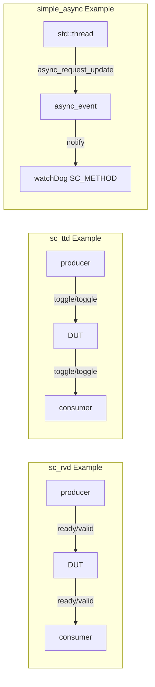

# SystemC 2.3 Example Collection

> **Version**: SystemC 2.3 | **Topics**: Communication Protocols and Asynchronous Events | **Difficulty**: Intermediate

## Overview

SystemC 2.3 introduced several important improvements to communication and asynchronous mechanisms. The three examples in this directory demonstrate:

1. **sc_rvd** -- Ready-Valid Data Protocol: A handshake protocol that controls data transfer using "ready" and "valid" signals
2. **sc_ttd** -- Toggle-Toggle Data Protocol: A handshake protocol that coordinates reads and writes using toggle bits
3. **simple_async** -- Simple Asynchronous Event: Demonstrates how to safely notify events in the SystemC simulation engine from an external thread

### Quick Reference for Software Engineers

| Example | Software Analogy | Core Concept |
| --- | --- | --- |
| sc_rvd | gRPC bidirectional streaming / TCP flow control | Producer and consumer coordinate data flow via ready/valid signals |
| sc_ttd | Alternating ACK protocol / ping-pong buffer | Uses toggle bits instead of ready/valid to simplify handshake logic |
| simple_async | Python `asyncio loop.call_soon_threadsafe()` / Python `queue.Queue` sending signals from a coroutine | Trigger SystemC events from OS native threads |

## File List

### sc_rvd (Ready-Valid Data)

| File | Path | Description |
| --- | --- | --- |
| `sc_rvd.h` | `include/sc_rvd.h` | Template definitions for Ready-Valid channel, input port, and output port |
| `main.cpp` | `sc_rvd/main.cpp` | DUT and TB modules demonstrating the complete ready-valid handshake flow |

### sc_ttd (Toggle-Toggle Data)

| File | Path | Description |
| --- | --- | --- |
| `sc_ttd.h` | `include/sc_ttd.h` | Template definitions for Toggle-Toggle channel, input port, and output port |
| `main.cpp` | `sc_ttd/main.cpp` | DUT and TB modules demonstrating the complete toggle-toggle handshake flow |

### simple_async

| File | Path | Description |
| --- | --- | --- |
| `async_event.h` | `simple_async/async_event.h` | Thread-safe asynchronous event class |
| `main.cpp` | `simple_async/main.cpp` | watchDog and activity modules demonstrating external thread triggering SystemC events |

## Architecture Overview

## Suggested Learning Path

1. Start with [sc-rvd.md](sc-rvd.md) -- Ready-Valid is the most common handshake protocol in hardware communication
2. Then read [sc-ttd.md](sc-ttd.md) -- Compare with sc_rvd to understand the trade-offs between different handshake strategies
3. Finally read [simple-async.md](simple-async.md) -- Learn how SystemC interacts with the external world
