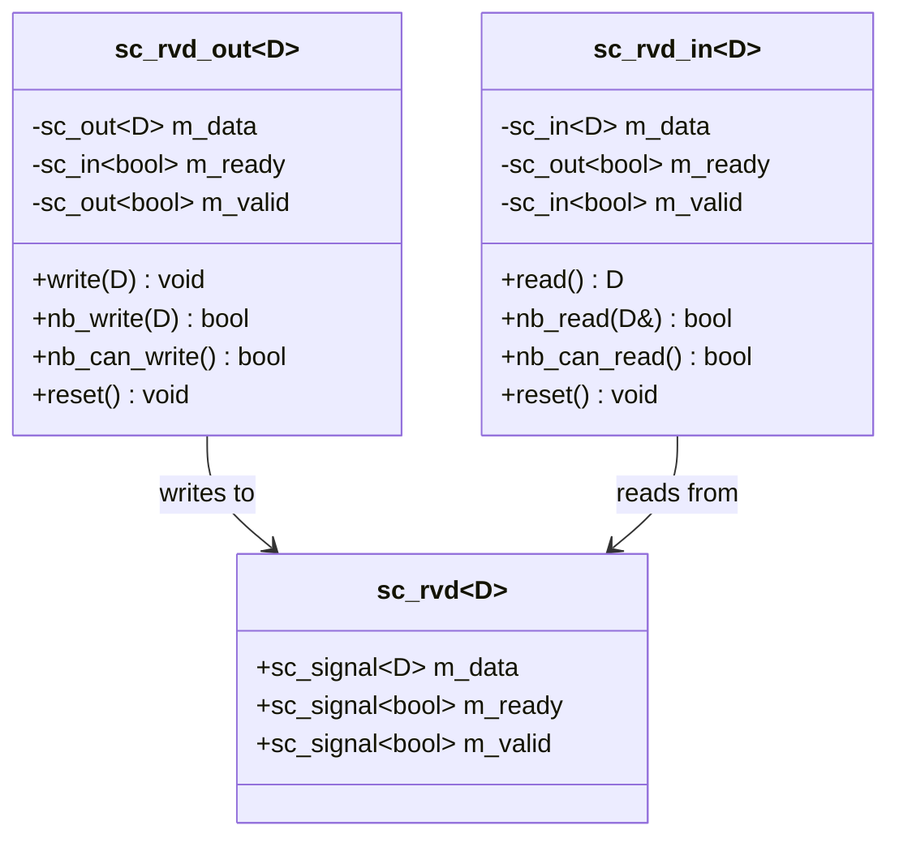
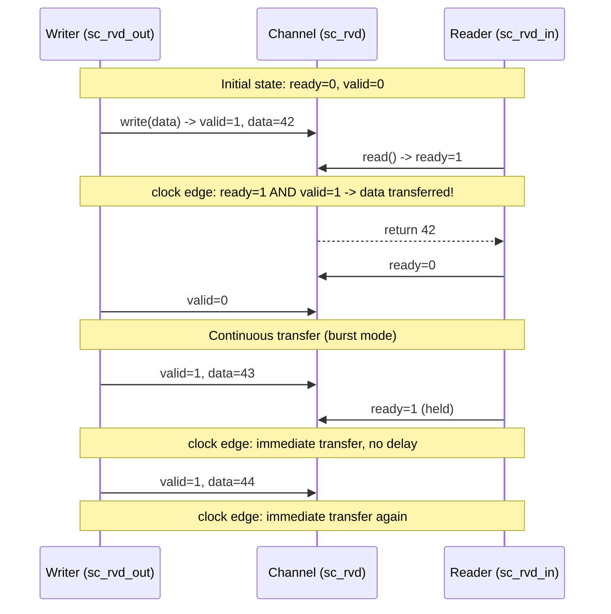

# sc_rvd -- Ready-Valid Data Protocol

> **Source**: `ref/systemc/examples/sysc/2.3/include/sc_rvd.h`, `ref/systemc/examples/sysc/2.3/sc_rvd/main.cpp`
> **Difficulty**: Intermediate | **Software Analogy**: gRPC bidirectional streaming / TCP flow control

## Overview

`sc_rvd` implements a **Ready-Valid handshake protocol** for safely transferring data between two modules. This is one of the most common communication patterns in hardware design.

### Explanation for Software Engineers

Imagine you are writing a gRPC bidirectional streaming service:

```
Client (producer)  <---->  Server (DUT)  <---->  Response handler (consumer)
```

- **valid** is like "I have data to send" (server calls `stream.Send()`)
- **ready** is like "I'm ready to receive" (client calls `stream.Recv()`)
- Data is only actually transferred when **both sides agree** (ready AND valid are both true)

This is exactly the same concept as TCP flow control:
- TCP's window size tells the other side "how much space I have left to receive"
- Ready-Valid simplifies this to a single bit: "can/cannot"

## Protocol Rules

The Ready-Valid protocol has the following key rules:

| Rule | Description | Software Analogy |
| --- | --- | --- |
| valid=1 means data available | The writer has placed data on the channel | `stream.Send()` has been called |
| ready=1 means can receive | The reader is ready to accept data | `stream.Recv()` is waiting |
| Transfer occurs when ready AND valid | Both sides handshake successfully | A successful request-response |
| First transfer has one clock cycle latency | Establishing the handshake takes time | The first RTT in a TCP three-way handshake |
| Consecutive transfers can happen every clock cycle | Keep ready and valid high | TCP continuous streaming, no re-handshake needed |

## Architecture Diagram



## Timing Diagram



## Core Class Analysis

### `sc_rvd<D>` -- Channel

This is the simplest part: just three signal lines bundled together.

```cpp
template<typename D>
class sc_rvd {
    sc_signal<D>    m_data;   // Data line
    sc_signal<bool> m_ready;  // Reader -> Writer: "I'm ready"
    sc_signal<bool> m_valid;  // Writer -> Reader: "Data is valid"
};
```

**Software Analogy**: This is like a struct that bundles the request channel and response channel together:

```go
type RVD struct {
    data  chan T     // Data channel
    ready chan bool  // Backpressure channel
    valid chan bool  // Data valid notification
}
```

### `sc_rvd_out<D>` -- Write Port

The `write()` method is blocking: it places data on the line and waits until the other side is ready before returning.

```cpp
inline void write(const D& data) {
    m_data = data;        // Place data on the line
    m_valid = true;       // Tell the other side "data is valid"
    do { ::wait(); }      // Wait one clock cycle
    while (m_ready.read() == false);  // Until the other side says "I'm ready"
    m_valid = false;      // Transfer complete, deassert valid
}
```

`nb_write()` is the non-blocking version (nb = non-blocking); it returns false if the other side is not ready yet:

```cpp
inline bool nb_write(const D& data) {
    if (m_ready.read() == true) {
        m_data = data;
        m_valid = true;
        return true;     // Success
    }
    return false;        // Other side not ready
}
```

**Software Analogy**:
- `write()` is like Go's `ch <- data` (blocking write)
- `nb_write()` is like Go's `select { case ch <- data: ... default: ... }` (non-blocking attempt)

### `sc_rvd_in<D>` -- Read Port

The `read()` method is also blocking: it first tells the other side "I'm ready", then waits for data to arrive.

```cpp
inline D read() {
    m_ready = true;       // Tell the other side "I'm ready to receive"
    do { ::wait(); }      // Wait one clock cycle
    while (m_valid.read() == false);  // Until the other side sends valid data
    m_ready = false;      // Received, deassert ready
    return m_data.read(); // Read the data
}
```

## main.cpp Analysis

`main.cpp` constructs a test environment with three roles:

| Role | Class | Function |
| --- | --- | --- |
| producer | `TB::producer()` | Continuously generates incrementing numbers (0, 1, 2, ...), inserting waits every 6 iterations |
| DUT | `DUT::thread()` | Reads N data items then writes N data items (N increments from 0 to 9) |
| consumer | `TB::consumer()` | Reads 40 data items then calls `sc_stop()` to end simulation |


### Key Observations

1. **SC_CTHREAD**: Uses clocked threads (threads synchronized with the clock); each `wait()` waits for one clock positive edge
2. **reset_signal_is**: Specifies the reset signal; enters reset state when `m_reset` is false
3. **burst and bubble**: The producer inserts a wait period (`wait(i)`) every 6 iterations, simulating real-world scenarios where the data source is intermittent

## Comparison with Software Patterns

| Concept | Ready-Valid (sc_rvd) | Software Equivalent |
| --- | --- | --- |
| Blocking write | `write()` -- waits for ready | `channel <- data` (Go) |
| Non-blocking write | `nb_write()` -- returns immediately | `select + default` (Go) |
| Blocking read | `read()` -- waits for valid | `data := <-channel` (Go) |
| Non-blocking read | `nb_read()` -- returns immediately | `select + default` (Go) |
| Backpressure control | ready signal | TCP window / gRPC flow control |
| Continuous transfer | ready+valid held high | HTTP/2 multiplexed stream |
| Reset | `reset()` -- clears state | `channel.close()` + recreate |
