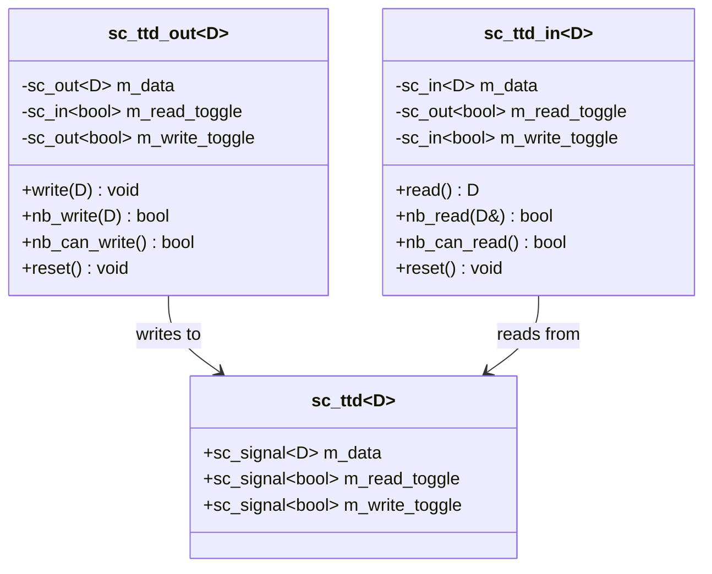

# sc_ttd -- Toggle-Toggle Data Protocol

> **Source**: `ref/systemc/examples/sysc/2.3/include/sc_ttd.h`, `ref/systemc/examples/sysc/2.3/sc_ttd/main.cpp`
> **Difficulty**: Intermediate | **Software Analogy**: Alternating Bit Protocol

## Overview

`sc_ttd` implements a **Toggle-Toggle handshake protocol** for data transfer between two modules. It solves the same problem as [sc_rvd](sc-rvd.md) (safe data transfer), but uses a fundamentally different handshake strategy.

### Explanation for Software Engineers

Imagine you are implementing a **timed event stream** system. Unlike Ready-Valid, the core idea of Toggle-Toggle is:

> "I flip my card once to signal I'm done; when you see my card flipped, you know it's your turn."

**Network protocol analogy**: This is the classic **Alternating Bit Protocol (ABP)**:
- The sender toggles its sequence bit (0->1 or 1->0) with each data item sent
- The receiver sees the sequence bit change and knows there is new data
- After processing, the receiver also toggles its own bit as an acknowledgment

```
Writer: toggle=0 -> write data -> toggle=1 -> write data -> toggle=0 ...
Reader: toggle=0 ------> read data -> toggle=1 ------> read data -> toggle=0 ...
```

## sc_rvd vs sc_ttd Comparison

| Feature | sc_rvd (Ready-Valid) | sc_ttd (Toggle-Toggle) |
| --- | --- | --- |
| Handshake signals | ready + valid (two independent states) | read_toggle + write_toggle (two toggle bits) |
| Data available check | `valid == true` | `write_toggle != read_toggle` |
| Channel idle check | `ready == true` | `write_toggle == read_toggle` |
| Burst mode | Supported (keep ready+valid high) | **Not supported** (each item must toggle, causing a one-cycle bubble) |
| Software analogy | TCP streaming (continuous transfer) | Timed heartbeat/ACK (alternating confirmation each time) |
| Use case | High-throughput data streams | Low-frequency, simple control signals |

### Visualizing the Key Difference

```mermaid
gantt
    title sc_rvd vs sc_ttd Transfer Timing Comparison
    dateFormat X
    axisFormat %s

    section sc_rvd (Burst)
    Setup          :0, 1
    Data 1         :1, 2
    Data 2         :2, 3
    Data 3         :3, 4

    section sc_ttd (Bubble per item)
    Data 1         :0, 1
    Bubble         :1, 2
    Data 2         :2, 3
    Bubble         :3, 4
```



## Protocol Rules

| Rule | Description |
| --- | --- |
| `write_toggle != read_toggle` | Channel has data available to read |
| `write_toggle == read_toggle` | Channel is idle, can write |
| Toggle `write_toggle` on write | Tells the reader "there is new data" |
| Toggle `read_toggle` on read | Tells the writer "I've finished reading" |
| No need to wait for the other side's confirmation | Just toggle unilaterally; the other side sees it on the next clock cycle |

## Architecture Diagram



## Core Class Analysis

### `sc_ttd<D>` -- Channel

Just as simple as `sc_rvd` -- three signal lines:

```cpp
template<typename D>
class sc_ttd {
    sc_signal<D>    m_data;          // Data line
    sc_signal<bool> m_read_toggle;   // Reader's toggle bit
    sc_signal<bool> m_write_toggle;  // Writer's toggle bit
};
```

### `sc_ttd_out<D>::write()` -- Blocking Write

```cpp
inline void write(const D& data) {
    // Wait until toggle values are equal (channel is idle)
    do { ::wait(); }
    while (m_write_toggle.read() != m_read_toggle.read());
    m_data = data;                        // Place data
    m_write_toggle = !m_write_toggle;     // Toggle my bit
}
```

**Note**: After writing, there is no need to wait for the other side's confirmation. After toggling `write_toggle`, the reader will see `write_toggle != read_toggle` on the next clock cycle and know there is new data.

### `sc_ttd_in<D>::read()` -- Blocking Read

```cpp
inline D read() {
    // Wait until toggle values differ (data available)
    do { ::wait(); }
    while (m_write_toggle.read() == m_read_toggle.read());
    m_read_toggle = !m_read_toggle;   // Toggle my bit (indicates read complete)
    return m_data.read();             // Return data
}
```

### Why Is There No Burst Mode?

In sc_rvd, as long as both ready and valid are held high, data can be transferred every clock cycle. But in sc_ttd:

1. The writer toggles `write_toggle` to indicate "new data available"
2. The reader toggles `read_toggle` to indicate "read complete"
3. At this point `write_toggle == read_toggle`, so the writer can write again
4. But this state change takes **one clock cycle** to propagate

Therefore, there is always a one-cycle gap (bubble) between every two data items.

**Software Analogy**: This is like using `threading.Barrier` to allow only one thread to execute at a time:
```python
# sc_ttd behaves similarly to waiting for an ACK each time
import queue
q = queue.Queue(maxsize=1)
q.put(data)       # Send data
ack_event.wait()   # Wait for the other side's confirmation
# Next item...
```

Whereas sc_rvd is like a buffered `queue.Queue` -- as long as the buffer is not full, you can keep sending.

## main.cpp Analysis

The structure of `main.cpp` is nearly identical to the sc_rvd example (DUT, TB, producer, consumer), with the only difference being that `sc_rvd` is replaced with `sc_ttd`. This is intentional, allowing you to directly compare the behavior of the two protocols under the same workload.

| Role | Function |
| --- | --- |
| `TB::producer` | Generates incrementing numbers, inserting waits every 6 iterations |
| `DUT::thread` | Reads N items then writes N items |
| `TB::consumer` | Reads 40 items then terminates |

## Use Case Comparison

| Scenario | Recommended Protocol | Reason |
| --- | --- | --- |
| High-speed data streaming | sc_rvd | Supports burst, high throughput |
| Low-speed control commands | sc_ttd | Simpler logic, no burst needed |
| FIFO interface | sc_rvd | FIFOs naturally need burst mode |
| Register read/write | sc_ttd | Single operations, no continuous transfer needed |
