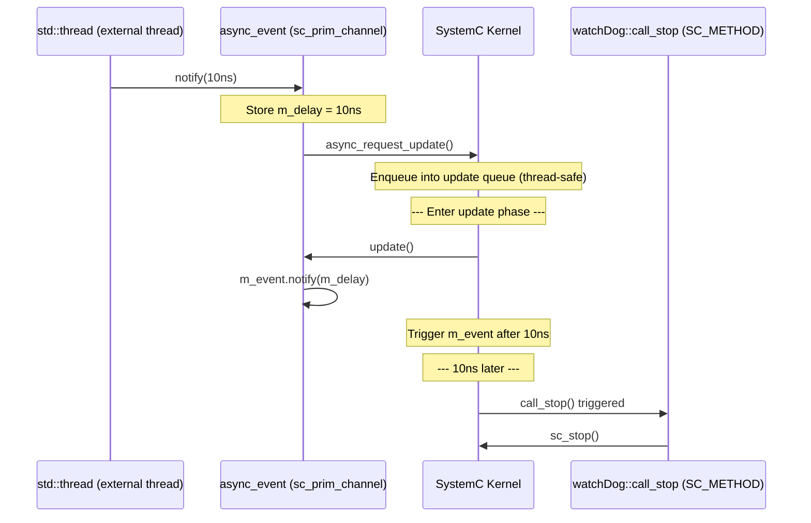
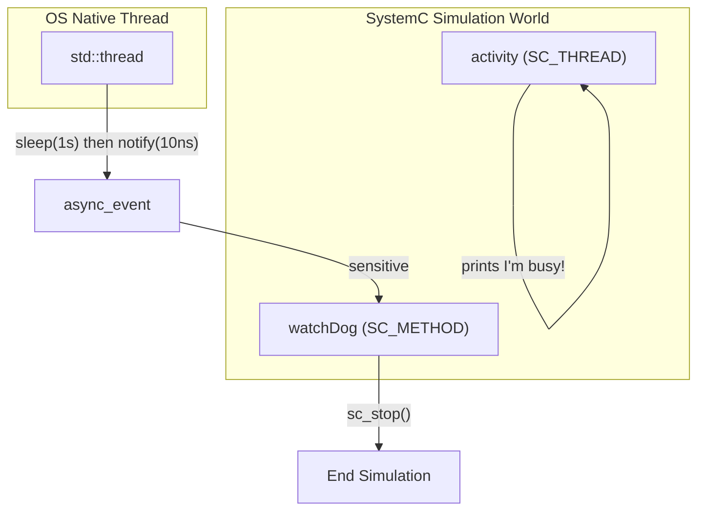

# simple_async -- Simple Asynchronous Event

> **Source**: `ref/systemc/examples/sysc/2.3/simple_async/async_event.h`, `ref/systemc/examples/sysc/2.3/simple_async/main.cpp`
> **Difficulty**: Intermediate | **Software Analogy**: async/await cross-thread notification / Python `asyncio loop.call_soon_threadsafe()` from a worker thread

## Overview

`simple_async` demonstrates how to safely notify events in the SystemC simulation engine from an **OS native thread (std::thread)**. This solves a core problem: SystemC simulation is **single-threaded**, but real systems often need to interact with the external world.

### Explanation for Software Engineers

The SystemC simulation engine is like the **Python asyncio event loop**:
- It is single-threaded
- All module `SC_THREAD`/`SC_METHOD` processes execute cooperatively in the same thread
- You cannot directly modify its state from outside (just like you cannot directly manipulate the event loop's state from a worker thread)

The problem `async_event` solves is: **How do you safely post an event to the event loop from a worker thread?**

| Framework | Equivalent Mechanism |
| --- | --- |
| Python asyncio | `loop.call_soon_threadsafe()` |
| Qt | `QMetaObject::invokeMethod()` with `Qt::QueuedConnection` |
| C++ (Boost.Asio) | `io_context::post()` to post a handler from an external thread |

## async_event Class Analysis

```cpp
class async_event : public sc_core::sc_prim_channel {
    sc_core::sc_time  m_delay;    // Delay for notification
    sc_core::sc_event m_event;    // Internal SystemC event

public:
    async_event(const char* name = ...);

    // Thread-safe method -- can be called from any thread
    void notify(sc_core::sc_time delay = SC_ZERO_TIME);

    // Allows wait(async_event_instance) syntax
    operator const sc_event&() const;

protected:
    // Called during SystemC update phase (safe)
    void update(void);
};
```

### How It Works



### Three Key Mechanisms

#### 1. `async_request_update()` -- Cross-Thread Posting

This is a method provided by `sc_prim_channel` and is the **only API in SystemC that can be safely called from an external thread**. Its purpose is to enqueue a callback in the SystemC kernel's update queue.

**Software Analogy**: `loop.call_soon_threadsafe(callback)` (Python asyncio)

#### 2. `update()` -- Executed at a Safe Time

`update()` is called during the SystemC **update phase**. At this point we are back in SystemC's single-threaded environment and can safely call `m_event.notify()`.

**Software Analogy**: Just like React's `setState()` does not immediately update the DOM, but takes effect in the next render cycle.

#### 3. `async_attach_suspending()` -- Preventing Premature Simulation End

The constructor calls `async_attach_suspending()`. This tells the SystemC kernel: "Even if there are no currently scheduled events, do not end the simulation, because external events may still arrive."

**Software Analogy**: In Python asyncio, as long as there are active tasks or futures, the event loop will not exit. `async_attach_suspending()` is like creating an unresolved `asyncio.Future` to keep the event loop alive.

## main.cpp Analysis

### Module Architecture



### watchDog Module

`watchDog` plays the role of a "watchdog timer":

1. **At construction**: Creates an `async_event` and registers an `SC_METHOD(call_stop)` sensitive to it
2. **At simulation start**: Launches a `std::thread` that sleeps for 1 second
3. **After 1 second**: The external thread calls `when.notify(sc_time(10, SC_NS))`
4. **After 10ns of simulation time**: `call_stop()` is triggered, calling `sc_stop()` to end the simulation

```cpp
// External thread (non-SystemC)
void process() {
    std::this_thread::sleep_for(std::chrono::seconds(1));  // Wait 1 second in real time
    when.notify(sc_time(10, SC_NS));  // Notify SystemC, with 10ns delay
}

// Inside SystemC (safe)
void call_stop() {
    cout << "Asked to stop at time " << sc_time_stamp() << endl;
    barked = true;
    sc_stop();
}
```

### activity Module

`activity` is simply an `SC_THREAD` that prints one line and then terminates. It exists to demonstrate that even when all internal SystemC threads have finished (no events to schedule), the simulation does not end, because `async_event` has called `async_attach_suspending()`.

### Execution Timeline

```
t=0 (real time):
  - SystemC starts
  - activity: "I'm busy!" (then terminates)
  - std::thread starts, begins sleeping

t=0 (simulation time):
  - SystemC has no more events, but does not end due to async_attach_suspending
  - Simulator waits for external events

t=1s (real time):
  - std::thread wakes up
  - Calls when.notify(10ns)
  - async_request_update() enqueues callback into kernel

t=10ns (simulation time):
  - call_stop() is triggered
  - "Asked to stop at time 10 ns"
  - sc_stop() ends the simulation
```

## Key Takeaways

| Key Point | Description |
| --- | --- |
| SystemC is single-threaded | All `SC_THREAD`/`SC_METHOD` processes are scheduled in the same thread |
| Cannot trigger events directly from outside | `sc_event::notify()` is not thread-safe |
| `async_request_update()` is the bridge | The only kernel API that can be safely called from an external thread |
| `async_attach_suspending()` prevents early termination | Tells the kernel "there may still be external events coming" |
| Real time and simulation time are separate | The external thread sleeps for 1 second, but SystemC only advances 10ns |
