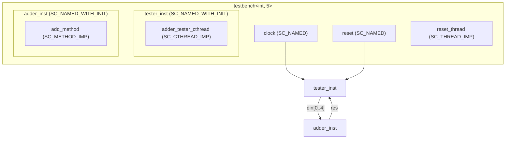

# SystemC 2.4 Example Collection

> **Version**: SystemC 2.4 | **Topics**: In-Class Initialization Macros | **Difficulty**: Intermediate

## Overview

SystemC 2.4 introduced a set of convenience macros that allow port declarations, process registration, and submodule initialization to be done **inside the class definition**, eliminating the need to cram everything into the constructor.

### Explanation for Software Engineers

If you have used **dependency injection (like Python's inject library)**, you will notice that the pre-SystemC 2.4 style is like "all dependency injection written in the constructor":

```python
# Old style (all initialization in the constructor)
class Service:
    def __init__(self, repo: Repository, logger: Logger):
        self.repo = repo
        self.logger = logger
        # Still need to set up many things...
```

The new macros in SystemC 2.4 let you use a "field injection" style:

```python
# New style (initialize at declaration)
import inject

class Service:
    repo: Repository = inject.attr(Repository)
    logger: Logger = inject.attr(Logger)
    # Much cleaner!
```

## New Macros Overview

| Macro | Purpose | Software Analogy |
| --- | --- | --- |
| `SC_NAMED(name, ...)` | Auto-name sc_object using the variable name, with optional extra parameters | Python `dataclasses.field()` auto-naming |
| `SC_NAMED_WITH_INIT(name)` | Declare with an attached initialization code block | Python `__post_init__()` initialization |
| `SC_METHOD_IMP(func, init)` | Declare SC_METHOD in-class with initialization (sensitivity, etc.) | Python decorator registration |
| `SC_THREAD_IMP(func, init)` | Declare SC_THREAD in-class with initialization | Python `@asyncio.coroutine` style |
| `SC_CTHREAD_IMP(func, edge, init)` | Declare SC_CTHREAD in-class with clock edge and initialization | Python `@sched.scheduled(interval=...)` |

## File List

| File | Path | Description | Documentation |
| --- | --- | --- | --- |
| `adder.h` | `in_class_initialization/adder.h` | N-input adder module (header-only, uses `SC_NAMED` and `SC_METHOD_IMP`) | [in-class-initialization.md](in-class-initialization.md) |
| `adder_int_5_pimpl.h` | `in_class_initialization/adder_int_5_pimpl.h` | PImpl idiom interface declaration | [in-class-initialization.md](in-class-initialization.md) |
| `adder_int_5_pimpl.cpp` | `in_class_initialization/adder_int_5_pimpl.cpp` | PImpl idiom implementation | [in-class-initialization.md](in-class-initialization.md) |
| `in_class_initialization.cpp` | `in_class_initialization/in_class_initialization.cpp` | Testbench demonstrating usage of all new macros | [in-class-initialization.md](in-class-initialization.md) |

## Architecture Diagram



## Suggested Learning Path

1. Read [in-class-initialization.md](in-class-initialization.md) to understand the specific usage of each macro
2. Compare `adder.h` (header-only) with `adder_int_5_pimpl.h/.cpp` (PImpl idiom) to understand the differences
3. Understand how `SC_NAMED` simplifies naming and how `SC_METHOD_IMP` integrates process declaration with sensitivity setup
