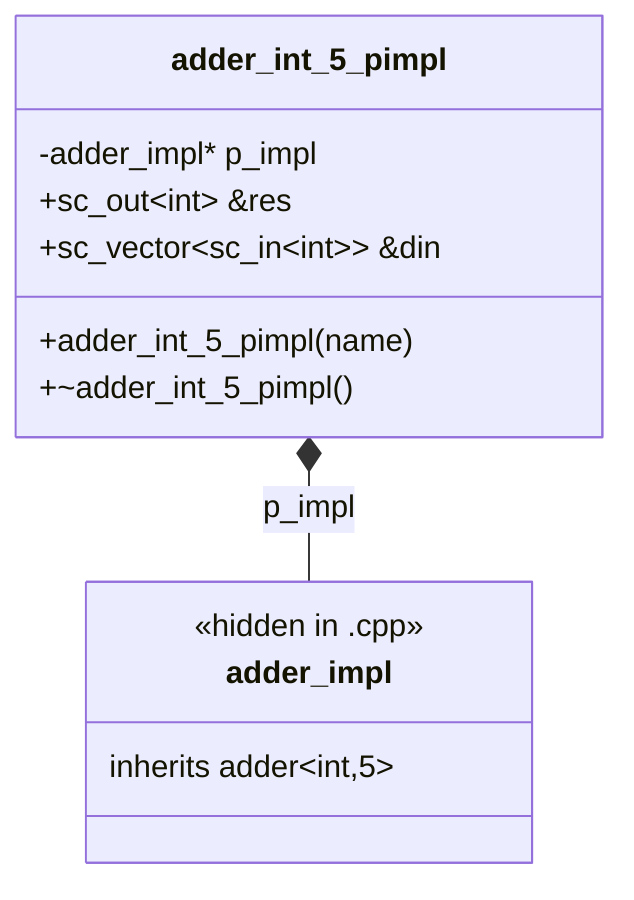

# In-Class Initialization -- In-Class Initialization Macros

> **Source**: `ref/systemc/examples/sysc/2.4/in_class_initialization/`
> **Difficulty**: Intermediate | **Software Analogy**: dependency injection (like Python's inject library) / Python field initialization / Python `@cached_property`

## Overview

This example demonstrates the in-class initialization macros introduced in SystemC 2.4. Before 2.4, all port naming, process registration, and submodule connections had to be written in the constructor. The new macros allow these to be **declared in place**, greatly improving readability.

## Macro-by-Macro Analysis

### 1. `SC_NAMED` -- Automatic Naming

**Problem**: In SystemC, every `sc_object` (port, signal, submodule, etc.) needs a string name. The traditional approach is very redundant:

```cpp
// Old style
SC_CTOR(my_module) : my_port("my_port"), my_signal("my_signal") { }
```

**Solution**: `SC_NAMED` automatically uses the C++ variable name as the SystemC object name:

```cpp
// New style
sc_out<int>           SC_NAMED(res);           // Name is automatically "res"
sc_vector<sc_in<int>> SC_NAMED(din, N_INPUTS); // Name is automatically "din", with parameter N_INPUTS
```

**Software Analogy**:
- **Python dataclass**: `field(default=...)` automatically infers from the variable name
- **C++ structured bindings**: Automatically infers from member names

### 2. `SC_NAMED_WITH_INIT` -- Declaration with Initialization

Used for submodule declarations, allowing an initialization code block to be attached after the declaration (typically for port binding):

```cpp
// Declare tester_inst and immediately bind all its ports
adder_tester<T, N_INPUTS> SC_NAMED_WITH_INIT(tester_inst) {
    tester_inst.clock(clock);
    tester_inst.reset(reset);
    tester_inst.res(res);
    tester_inst.din(din);
}
```

**Software Analogy**: This is like Python dependency injection, completing configuration at the point of declaration:

```python
# Python inject library
import inject

@inject.autoparams()
def configure_datasource() -> DataSource:
    ds = DataSource()
    ds.url = "jdbc:..."
    ds.username = "..."
    return ds
```

### 3. `SC_METHOD_IMP` -- In-Class Method Declaration

Combines `SC_METHOD` registration and sensitivity setup at the declaration site:

```cpp
// In adder.h
SC_METHOD_IMP(add_method, { for(auto &d : din) sensitive << d; });
```

Equivalent to the traditional approach:

```cpp
// Traditional style (in the constructor)
SC_CTOR(adder) {
    SC_METHOD(add_method);
    for(auto &d : din) sensitive << d;
}
```

**Software Analogy**: From "imperative registration" to "declarative registration":

```python
# Imperative (old)
scheduler.register(add_method, trigger)

# Declarative (new)
@scheduler.scheduled(interval=1.0)
def add_method():
    ...
```

### 4. `SC_THREAD_IMP` and `SC_CTHREAD_IMP`

Same principle as `SC_METHOD_IMP`, used for `SC_THREAD` and `SC_CTHREAD` respectively:

```cpp
// SC_THREAD_IMP: second parameter is initialization code
SC_THREAD_IMP(reset_thread, sensitive << clock.posedge_event();) {
    reset = 1;
    wait();
    reset = 0;
}

// SC_CTHREAD_IMP: second parameter is clock edge, third is initialization code
SC_CTHREAD_IMP(adder_tester_cthread, clock.pos(),
    { async_reset_signal_is(reset, true); }) {
    wait();
    // ... test logic
}
```

## File-by-File Analysis

### adder.h -- N-Input Adder (Header-Only)

This is a template module that sums N inputs:

```cpp
template <typename T, int N_INPUTS>
struct adder : sc_module {
    sc_out<T>           SC_NAMED(res);              // Output result
    sc_vector<sc_in<T>> SC_NAMED(din, N_INPUTS);    // N inputs

    SC_CTOR(adder){}

    // Declare SC_METHOD in-class, sensitive to all input ports
    SC_METHOD_IMP(add_method, { for(auto &d : din) sensitive << d; });
};

// Method implementation can be outside the class
template <typename T, int N_INPUTS>
void adder<T,N_INPUTS>::add_method() {
    T result = 0;
    for(auto &d : din)
        result += d.read();
    res = result;
}
```

**Software Analogy**: This is like a reactive computed property:

```python
# Python property analogy
@property
def result(self):
    return sum(self.inputs)
```

Whenever any `din` changes, `add_method` recalculates and updates `res`.

### adder_int_5_pimpl.h / .cpp -- PImpl Idiom

PImpl (Pointer to Implementation) is a C++ design pattern that **hides implementation details and exposes only the interface**.



**Why Use PImpl?**

| Advantage | Description | Software Analogy |
| --- | --- | --- |
| Compilation isolation | Modifying `adder.h` does not require recompiling files that use `adder_int_5_pimpl.h` | C++ abstract class / Python ABC vs implementation |
| Hide dependencies | Users do not need to include `adder.h` | Python's `_` prefix private convention |
| Binary compatibility | Modifying the implementation does not affect ABI | Stable API for dynamic libraries |

**Header file** (`adder_int_5_pimpl.h`):
```cpp
class adder_int_5_pimpl {
    struct adder_impl;      // forward declaration (declared only, not defined)
    adder_impl* p_impl;     // pointer to implementation
public:
    sc_out<int>           &res;   // reference to internal port
    sc_vector<sc_in<int>> &din;
};
```

**Implementation file** (`adder_int_5_pimpl.cpp`):
```cpp
struct adder_int_5_pimpl::adder_impl : adder<int,5> {
    adder_impl(const sc_module_name& name) : adder(name) {}
};

adder_int_5_pimpl::adder_int_5_pimpl(const char* name)
    : p_impl(new adder_impl(name))
    , res(p_impl->res)     // External res references the internal implementation's res
    , din(p_impl->din)
{ }
```

### in_class_initialization.cpp -- Testbench

This file demonstrates how to combine all the new macros together:

#### `adder_tester` -- Test Module

```cpp
template <typename T, int N_INPUTS>
struct adder_tester : sc_module {
    sc_in<bool>          SC_NAMED(clock);
    sc_in<bool>          SC_NAMED(reset);
    sc_in<T>             SC_NAMED(res);
    sc_vector<sc_out<T>> SC_NAMED(din, N_INPUTS);

    SC_CTOR(adder_tester){}

    // SC_CTHREAD_IMP: bind clock edge + set async reset
    SC_CTHREAD_IMP(adder_tester_cthread, clock.pos(),
                    { async_reset_signal_is(reset, true); }) {
        wait();
        for (int ii = 0; ii < TEST_SIZE; ++ii) {
            // Compute reference answer
            T ref_res = 0;
            for (int jj = 0; jj < N_INPUTS; ++jj) {
                T input = ii + jj;
                ref_res += input;
                din[jj] = input;
            }
            wait();
            sc_assert(res == ref_res);  // Verify adder output
        }
        sc_stop();
    }
};
```

#### `testbench` -- Top-Level Module

```cpp
template <typename T, int N_INPUTS>
struct testbench : sc_module {
    sc_clock                SC_NAMED(clock, 10, SC_NS);  // 10ns period clock
    sc_signal<bool>         SC_NAMED(reset);
    sc_signal<T>            SC_NAMED(res);
    sc_vector<sc_signal<T>> SC_NAMED(din, N_INPUTS);

    SC_CTOR(testbench) {}

    // Submodule declaration + port binding done together
    adder_tester<T, N_INPUTS> SC_NAMED_WITH_INIT(tester_inst) {
        tester_inst.clock(clock);
        tester_inst.reset(reset);
        tester_inst.res(res);
        tester_inst.din(din);
    }

    adder<T, N_INPUTS> SC_NAMED_WITH_INIT(adder_inst) {
        adder_inst.res(res);
        adder_inst.din(din);
    }

    // SC_THREAD_IMP: reset logic
    SC_THREAD_IMP(reset_thread, sensitive << clock.posedge_event();) {
        reset = 1;
        wait();
        reset = 0;
    }
};
```

## Full Old vs New Comparison

```cpp
// ========== Old style (before SystemC 2.4) ==========
struct old_testbench : sc_module {
    sc_clock clock;
    sc_signal<bool> reset;
    adder<int, 5> adder_inst;
    adder_tester<int, 5> tester_inst;

    old_testbench(sc_module_name name)
        : sc_module(name)
        , clock("clock", 10, SC_NS)   // Manual naming
        , reset("reset")               // Manual naming
        , adder_inst("adder_inst")     // Manual naming
        , tester_inst("tester_inst")   // Manual naming
    {
        // All port binding in constructor
        tester_inst.clock(clock);
        tester_inst.reset(reset);
        adder_inst.din(din);
        // ... rest omitted

        SC_THREAD(reset_thread);
        sensitive << clock.posedge_event();
    }

    void reset_thread() { ... }
};

// ========== New style (SystemC 2.4) ==========
struct new_testbench : sc_module {
    sc_clock SC_NAMED(clock, 10, SC_NS);   // Auto-naming + parameters
    sc_signal<bool> SC_NAMED(reset);        // Auto-naming

    SC_CTOR(new_testbench) {}               // Constructor is nearly empty!

    adder<int, 5> SC_NAMED_WITH_INIT(adder_inst) {
        adder_inst.din(din);    // In-place binding
    }

    SC_THREAD_IMP(reset_thread, sensitive << clock.posedge_event();) {
        reset = 1; wait(); reset = 0;
    }
};
```

## Quick Reference

| SystemC 2.4 Macro | Replaces Old Style | Advantage |
| --- | --- | --- |
| `SC_NAMED(x)` | `x("x")` in constructor initializer list | Avoids repetitive typing, prevents name mismatches |
| `SC_NAMED(x, args...)` | `x("x", args...)` | Supports extra parameters (e.g., vector size) |
| `SC_NAMED_WITH_INIT(x) { ... }` | Port binding code in constructor | Declaration and configuration together, improved readability |
| `SC_METHOD_IMP(f, init)` | `SC_METHOD(f); init;` in constructor | Process registration done in place |
| `SC_THREAD_IMP(f, init)` | `SC_THREAD(f); init;` in constructor | Same as above |
| `SC_CTHREAD_IMP(f, edge, init)` | `SC_CTHREAD(f, edge); init;` in constructor | Same as above |
