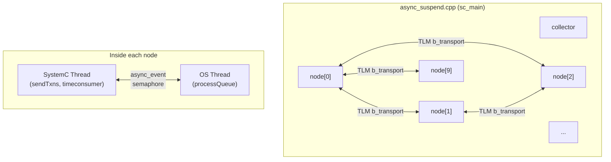
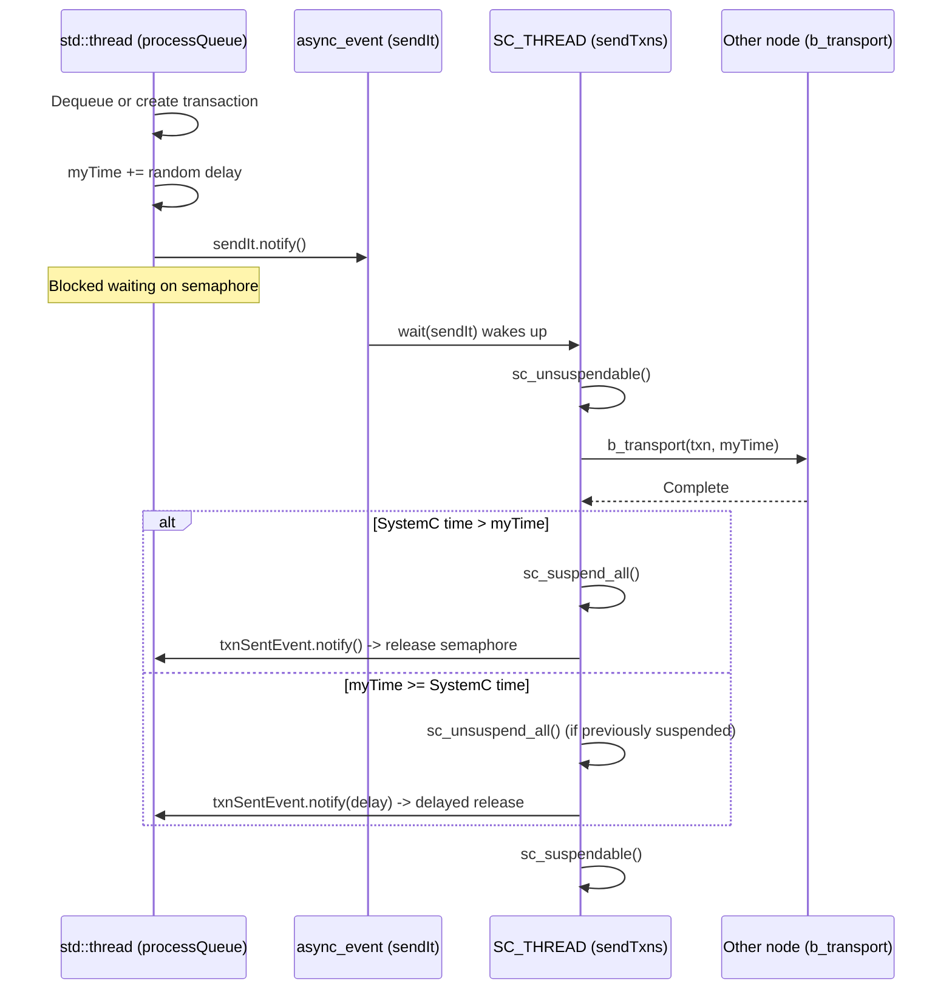

# async_suspend -- Asynchronous Suspend and External Thread Integration

> **Difficulty**: Advanced | **Software Analogy**: Python asyncio event loop integrating with native threads | **Source**: `ref/systemc/examples/sysc/async_suspend/`

## Overview

`async_suspend` is an advanced example demonstrating how **multiple OS native threads** cooperate with the SystemC simulation engine, using `sc_suspend_all()` / `sc_unsuspend_all()` to control pausing and resuming of the simulation.

### Explanation for Software Engineers

Imagine you are building a **Python asyncio application** where:
- The **event loop** (SystemC kernel) is single-threaded, responsible for scheduling all events
- You have **10 worker threads** (`std::thread` in `asynctestnode`), each performing time-consuming computations
- When a worker finishes, it needs to send results back to the event loop for processing
- You need to ensure the event loop does not run too fast and exceed the workers' "time"

SystemC APIs used in this example:

| API | Purpose | Python asyncio Analogy |
| --- | --- | --- |
| `async_event::notify()` | Safely trigger an event from an external thread | `loop.call_soon_threadsafe()` |
| `async_attach_suspending()` | Tell the kernel not to terminate early | `loop.create_future()` keeping the event loop alive |
| `sc_suspend_all()` | Pause the entire SystemC simulation | `loop.stop()` pausing the loop |
| `sc_unsuspend_all()` | Resume the simulation | `loop.run_forever()` resuming the loop |
| `sc_unsuspendable()` | Mark the current code section as non-suspendable | An atomic section without `await` in a coroutine |
| `sc_suspendable()` | Restore the suspendable state | Return to normal scheduling |

## File List

| File | Description | Documentation Link |
| --- | --- | --- |
| `async_event.h` | Thread-safe event class (inherits `sc_event`) | [async-event.md](async-event.md) |
| `node.h` | `asynctestnode` module -- the core dual-thread node | [node.md](node.md) |
| `collector.h` | Event collector for recording and reporting timestamps | [collector.md](collector.md) |
| `async_suspend.cpp` | Main program, creates a fully-connected network of 10 nodes | [async-suspend.md](async-suspend.md) |

## Architecture Overview

## Core Concept: Dual-Thread Model

Each `asynctestnode` contains two worlds:

## Suggested Learning Path

1. Start with [async-event.md](async-event.md) -- understand the basic cross-thread event mechanism
2. Then read [collector.md](collector.md) -- a simple utility class
3. Then read [node.md](node.md) -- the core dual-thread architecture (the most complex part)
4. Finally read [async-suspend.md](async-suspend.md) -- understand the overall assembly and TLM network
