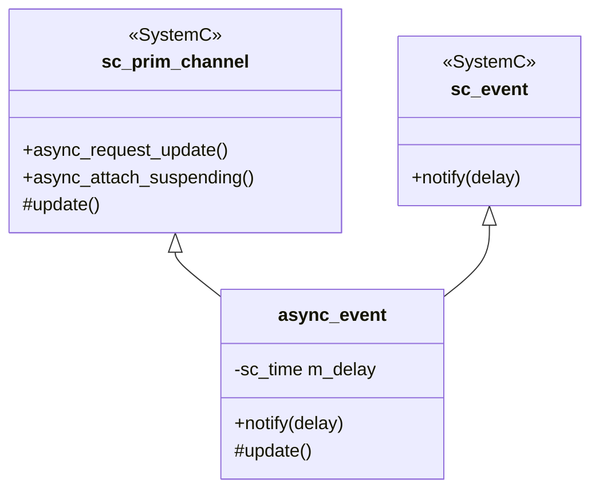
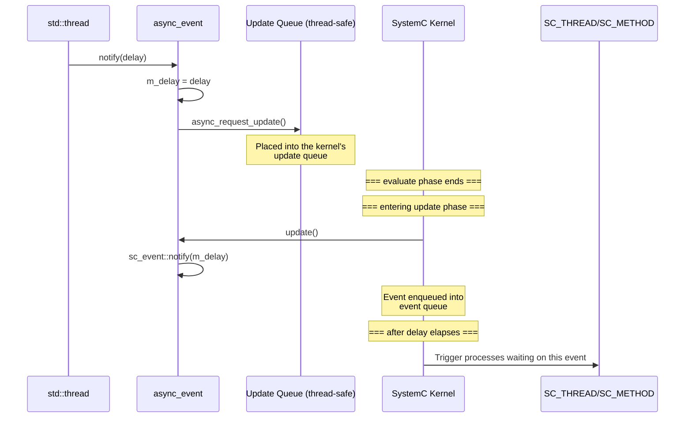

# async_event.h -- Cross-Thread Event Notification

> **Source**: `ref/systemc/examples/sysc/async_suspend/async_event.h`
> **Difficulty**: Intermediate | **Software Analogy**: Python `queue.Queue` notifying the main thread from a worker thread / `loop.call_soon_threadsafe()`

## Overview

`async_event` is a **thread-safe SystemC event**. It allows OS native threads (`std::thread`) to safely notify events in the SystemC simulation engine, solving the communication problem between SystemC's single-threaded model and the external multi-threaded world.

> **Note**: This version differs slightly from `2.3/simple_async/async_event.h`. This version directly inherits from `sc_event`, while the 2.3 version holds an internal `sc_event` member.

## Class Definition

```cpp
class async_event : public sc_core::sc_prim_channel, public sc_event
{
private:
    sc_core::sc_time m_delay;

public:
    async_event(sc_module_name n = "")
    {
        async_attach_suspending();  // Prevent simulation from ending prematurely
    }

    // Can be safely called from any thread
    void notify(sc_core::sc_time delay = SC_ZERO_TIME)
    {
        m_delay = delay;
        async_request_update();  // Enqueue into the SystemC kernel's update queue
    }

protected:
    // Called during the SystemC update phase
    void update(void)
    {
        sc_event::notify(m_delay);  // Now safely trigger the event
    }
};
```

## Design Pattern Analysis

### Dual Inheritance



`async_event` inherits two roles simultaneously:

1. **`sc_prim_channel`**: Provides `async_request_update()` -- the only SystemC API that can be safely called from an external thread
2. **`sc_event`**: Allows `async_event` to be used directly with `wait()` and `sensitive`, without any additional conversion

### Differences from the 2.3 Version

| Feature | 2.3 Version (`simple_async/async_event.h`) | async_suspend Version |
| --- | --- | --- |
| sc_event relationship | Holds an `m_event` member | Directly inherits `sc_event` |
| Usage | Requires conversion via `operator const sc_event&()` | Can be used directly as `sc_event` |
| Constructor | Accepts `const char* name` | Accepts `sc_module_name n` |
| Design consideration | More conservative, stricter encapsulation | More convenient, can directly `wait(async_event_instance)` |

## Detailed Operation Mechanism



### Three Phases

| Phase | Execution Environment | What It Does |
| --- | --- | --- |
| 1. `notify()` call | External `std::thread` | Stores the delay time, calls `async_request_update()` |
| 2. `update()` callback | SystemC kernel thread (update phase) | Safely calls `sc_event::notify()` |
| 3. Event firing | SystemC kernel thread (evaluate phase) | Wakes up `SC_THREAD` or `SC_METHOD` waiting on this event |

## Software Analogy

### Python queue.Queue Pattern

```python
# Conceptual equivalent of async_event:
import queue
import threading
import time

notify_q = queue.Queue(maxsize=1)

# External thread (equivalent to std::thread)
def external_thread():
    time.sleep(1)
    notify_q.put(10e-9)  # Equivalent to notify(10ns)

threading.Thread(target=external_thread).start()

# Main thread (equivalent to SystemC kernel)
while True:
    delay = notify_q.get()
    time.sleep(delay)
    handle_event()  # Equivalent to triggering SC_METHOD
```

### Python asyncio Pattern

```python
# Conceptual equivalent of async_event:
import asyncio
from concurrent.futures import ThreadPoolExecutor

loop = asyncio.get_event_loop()

def external_work():
    time.sleep(1)
    # Safely post an event from an external thread
    loop.call_soon_threadsafe(loop.call_later, 0.00001, handle_event)

executor = ThreadPoolExecutor()
executor.submit(external_work)
```

## Importance of `async_attach_suspending()`

Without calling `async_attach_suspending()`, when the SystemC event queue is empty (all internal events have been processed), the kernel would consider there is "nothing left to do" and terminate the simulation.

However, external threads may still be running and could send new events at any time. `async_attach_suspending()` tells the kernel: "I am an external event source, don't terminate yet."

**Software Analogy**:
- Python asyncio: `loop.run_forever()` keeps the event loop alive even without pending callbacks
- Python threading: `threading.Event().wait()` prevents the main thread from exiting
- C++: `std::condition_variable::wait()` makes the main thread wait

## Caveats

A comment in the source code mentions:

> Ensuring that the normal SystemC semantics of 'write-over-write' are maintained is left to the interested reader.

This means that if multiple external threads **simultaneously** call `notify()` with different `m_delay` values, there will be a race condition. In a production environment, you would need to:

1. Protect `m_delay` writes with a mutex
2. Or use a queue to store multiple notification requests
3. Or ensure that only one external thread calls `notify()`
