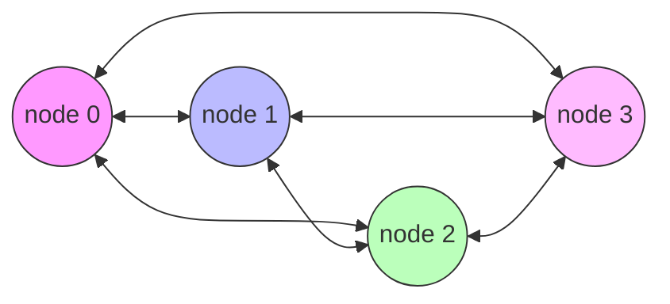
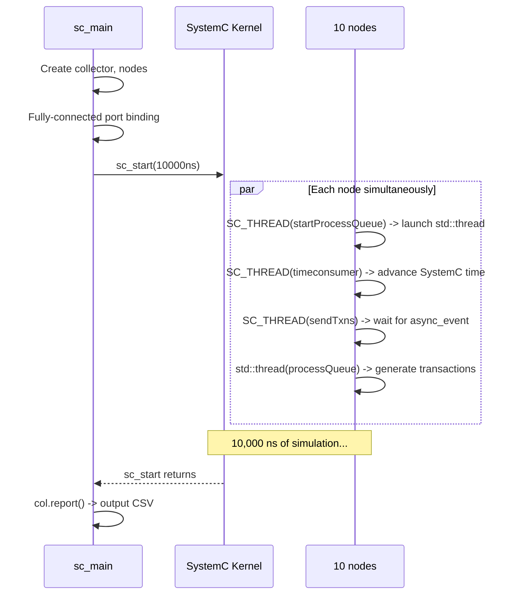

# async_suspend.cpp -- Main Program

> **Source**: `ref/systemc/examples/sysc/async_suspend/async_suspend.cpp`
> **Difficulty**: Advanced | **Software Analogy**: Multiple worker threads coordinating through an event loop in Python asyncio

## Overview

`async_suspend.cpp` is the entry point of the entire example. It creates a **fully-connected network of 10 `asynctestnode` instances**, where each node can send transactions to any other node via TLM `b_transport`.

## Code Analysis

```cpp
int sc_main(int argc, char **argv)
{
    collector col;
    srand(0);  // Fixed random seed for reproducible results

    // Set TLM quantum (maximum allowed offset for temporal decoupling)
    tlm_utils::tlm_quantumkeeper::set_global_quantum(
        sc_core::sc_time(1000, SC_NS));

    // Create 10 nodes, each holding a reference to the collector
    sc_vector<asynctestnode> nodes("nodes", NODES,
        [&](const char *n, size_t i) {
            return new asynctestnode(n, col);
        });

    // Fully connected: each node's init_socket connects to all other nodes' target_socket
    for (int n = 0; n < NODES; n++)
        for (int nn = 0; nn < NODES; nn++)
            if (n != nn)
                nodes[n].init_socket(nodes[nn].target_socket);

    sc_start(sc_time(10000, SC_NS));  // Simulate for 10,000 ns
    col.report();                      // Output timestamp report
    return 0;
}
```

### Section-by-Section Explanation

#### 1. `collector col`

A thread-safe timestamp recorder. All nodes (whether in SystemC threads or OS threads) write event times to the collector. At the end, `report()` outputs a CSV-formatted report.

#### 2. `set_global_quantum`

TLM Quantum Keeper is a **temporal decoupling** mechanism.

**Software Analogy**: Imagine multiple microservices each maintaining their own "local clock". The `global_quantum` specifies how much the local clock is allowed to deviate from the global clock. Setting it to 1000ns means each node can "run ahead" by up to 1000ns before needing to synchronize with the SystemC kernel.

This is like **clock skew tolerance** in distributed systems.

#### 3. `sc_vector` with Lambda Construction

```cpp
sc_vector<asynctestnode> nodes("nodes", NODES,
    [&](const char *n, size_t i) {
        return new asynctestnode(n, col);
    });
```

`sc_vector` is a SystemC container, similar to `std::vector` but with SystemC hierarchical name management. The lambda serves as a factory function, providing custom construction logic for each element.

**Software Analogy**: Python's dependency injection (inject library) with provider scope, creating a new instance on each call.

#### 4. Fully-Connected Topology

```cpp
for (int n = 0; n < NODES; n++)
    for (int nn = 0; nn < NODES; nn++)
        if (n != nn)
            nodes[n].init_socket(nodes[nn].target_socket);
```

Each node's `init_socket` (initiator) connects to all other nodes' `target_socket` (target). This forms a **fully-connected network of 10 nodes** (each node has 9 outgoing connections).



(The actual network has 10 nodes; simplified to 4 here for illustration)

**Software Analogy**: This is like a Service Mesh in Kubernetes, where every pod can directly call any other pod's API.

#### 5. Simulation and Report

```cpp
sc_start(sc_time(10000, SC_NS));  // Run for 10 microseconds
col.report();                      // Print CSV
```

After the simulation ends, the `collector` outputs all recorded events in CSV format, which can be imported into a spreadsheet for charting.

## Execution Flow



## Overall Design Software Analogy

This example simulates a **distributed system** where:

| Example Concept | Distributed System Equivalent |
| --- | --- |
| 10 `asynctestnode` instances | 10 microservices |
| Fully-connected TLM sockets | Service Mesh (every service can call any other) |
| `b_transport` | Synchronous RPC call |
| `std::thread` (processQueue) | Business logic thread in each service |
| `SC_THREAD` (sendTxns) | RPC sending thread in each service |
| `async_event` | Cross-thread RPC request queue |
| `sc_suspend_all` | Global flow control (rate limiting) |
| `collector` | Distributed tracing system (e.g., Jaeger / Zipkin) |
| `global_quantum` | Clock skew tolerance |
