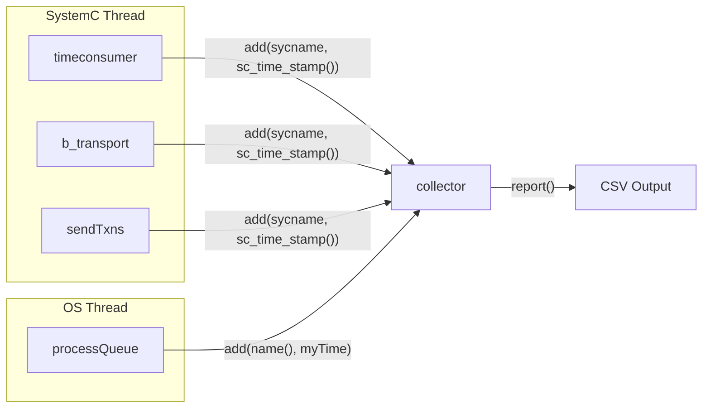

# collector.h -- Event Collector

> **Source**: `ref/systemc/examples/sysc/async_suspend/collector.h`
> **Difficulty**: Beginner | **Software Analogy**: Distributed tracing collector (Jaeger / Zipkin)

## Overview

`collector` is a thread-safe utility class for recording event timestamps from all nodes during simulation. After the simulation ends, it can output a CSV-formatted report for import into spreadsheets to create charts.

### Explanation for Software Engineers

`collector` is essentially a simplified **distributed tracing collector**. In a microservice architecture, Jaeger or Zipkin collects spans and timestamps from each service; in this SystemC example, `collector` collects the state of each node (or the SystemC kernel) at each point in time.

## Class Definition

```cpp
class collector {
private:
    std::unordered_map<const char*, sc_time> names;  // Latest time for each name
    std::mutex lock;                                   // Thread-safety lock
    std::vector<std::pair<const char*, const sc_time>> times;  // All event records

public:
    void add(const char* name, const sc_time mytime);
    void csvreport();
    void report();
};
```

## Method Analysis

### `add()` -- Record an Event

```cpp
void add(const char* name, const sc_time mytime) {
    std::lock_guard<std::mutex> guard(lock);
    if (names.find(name) == names.end()) {
        names.insert(std::make_pair(name, SC_ZERO_TIME));
    }
    times.push_back(std::make_pair(name, mytime));
}
```

**Why is a mutex needed?** Because `add()` is called from two types of threads:

1. SystemC `SC_THREAD` (e.g., `timeconsumer`, `b_transport`)
2. OS native `std::thread` (e.g., `processQueue`)

These two can execute simultaneously, so `std::mutex` is needed to protect shared data.

**Software Analogy**: This is like a thread-safe logger:

```go
type Collector struct {
    mu     sync.Mutex
    events []Event
}

func (c *Collector) Add(name string, t time.Duration) {
    c.mu.Lock()
    defer c.mu.Unlock()
    c.events = append(c.events, Event{name, t})
}
```

### `csvreport()` -- Output CSV

```cpp
void csvreport() {
    std::lock_guard<std::mutex> guard(lock);
    // Print header
    cout << "event";
    for (auto kv : names)
        cout << ", " << kv.first;
    cout << "\n";

    // Print each row: when each event occurs, the latest time for all names
    int i = 0;
    for (auto it = times.begin(); it != times.end(); ++it) {
        names[std::get<0>(*it)] = std::get<1>(*it);
        cout << i++;
        for (auto kv : names)
            cout << ", " << kv.second.to_seconds() * 1000000000;
        cout << "\n";
    }
}
```

Example output format:

```
event, SystemC, nodes.node_0, nodes.node_1, ...
0, 0, 0, 0
1, 0, 45, 0
2, 0, 45, 23
3, 100, 45, 23
...
```

Each row represents the instant an event occurred. Each column represents the last recorded time for that name (in nanoseconds).

### `report()` -- Select Output Method

```cpp
void report() {
    csvreport();  // Default to CSV
    // If WITHMATPLOT is defined, use matplotlib for plotting instead
}
```

If `WITHMATPLOT` is defined at compile time, it will use Python's matplotlib (via `matplotlibcpp.h`) to directly plot charts and save them as `output.png`.

## Data Flow Diagram



## Design Observations

| Characteristic | Description |
| --- | --- |
| Thread-safe | Uses `std::mutex` to protect all shared state |
| Append-only | `times` only uses `push_back`, never modifies historical records |
| Dual timeline recording | SystemC events use `sc_time_stamp()`, OS thread events use `myTime` |
| Deferred output | All events are output after simulation ends, avoiding I/O impact on simulation performance |
